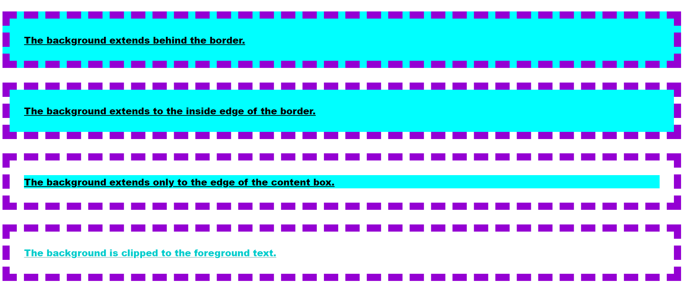
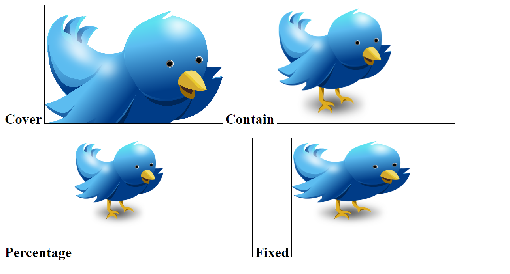
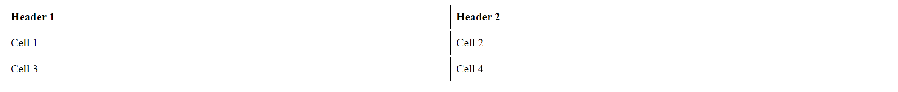
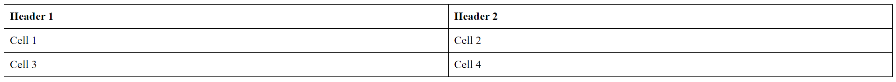
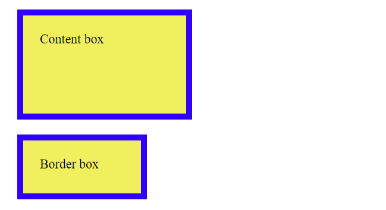

## Class 1: Introduction to CSS and Text Formatting

### Part 1: Introduction to CSS

**Definition:**
CSS stands for Cascading Style Sheets. It is a language used to describe the presentation of web pages, including their layout, colors, fonts, and more. CSS allows you to control the visual appearance of HTML elements on a webpage.


**Implementation:**
CSS can be applied to HTML elements using three different methods: Inline, Internal, and External.


1. **Inline CSS:**
   Inline CSS is applied directly to an HTML element using the `style` attribute. It's useful for making small, specific style changes.

   ```html
   <p style="color: blue;">This is a blue text.</p>
   ```

2. **Internal CSS:**
   Internal CSS is placed within the `<style>` element in the HTML document's `<head>`. It affects elements throughout the document.

   ```html
   <head>
     <style>
       p {
         color: red;
       }
     </style>
   </head>
   ```

3. **External CSS:**
   External CSS is stored in a separate `.css` file and linked to the HTML document using the `<link>` element. This method is best for maintaining consistent styles across multiple pages.

   ```html
   <head>
     <link rel="stylesheet" type="text/css" href="styles.css" />
   </head>
   ```

### Part 2: Tags vs IDs vs Classes

**Tags:**
HTML tags represent different elements on a webpage, like headings (`<h1>`, `<h2>`, ...), paragraphs (`<p>`), links (`<a>`), etc. You can target these tags in your CSS to apply styles.

**IDs:**
An ID is a unique identifier given to an HTML element using the `id` attribute. IDs are used to target specific elements for styling and JavaScript interactions.

**Classes:**
A class is a reusable identifier applied to one or more HTML elements using the `class` attribute. Classes allow you to apply the same styles to multiple elements.

**Implementation:**

```html
<!DOCTYPE html>
<html>
  <head>
    <link rel="stylesheet" type="text/css" href="styles.css" />
  </head>
  <body>
    <h1>This is a heading</h1>
    <p id="unique-paragraph">This is a unique paragraph with an ID.</p>
    <p class="common-paragraph">This is a common paragraph with a class.</p>
  </body>
</html>
```

| Characteristic | Class                    | ID                      |
|----------------|--------------------------|-------------------------|
| Syntax         | .class-name              | #id-name                 |
| Selectivity    | Less specific            | More specific           |
| Usage          | Multiple elements        | Unique to one element   |
| Application    | Multiple instances       | Unique identifier      |
| Styling        | Shared styles among      | Specific styles for     |
|                | multiple elements        | one element             |
| JavaScript     | Can be used multiple      | Should be unique       |
|                | times in the document     | within the document     |
| Examples       | .button, .container      | #header, #footer        |


1. **Syntax:**
   - Class: Defined with a period (`.`) followed by the class name (e.g., `.button`).
   - ID: Defined with a hash (`#`) followed by the ID name (e.g., `#header`).

2. **Selectivity:**
   - Class: Less specific, applies to multiple elements with the same class.
   - ID: More specific, unique to a single element within the document.

3. **Usage:**
   - Class: Can be used for multiple elements throughout the document.
   - ID: Should be unique, used for a specific element on a page.

4. **Application:**
   - Class: Applied to multiple instances of elements that share common styles.
   - ID: Used for a unique identifier, typically for a specific element with distinctive styles or functionality.

5. **Styling:**
   - Class: Shared styles among multiple elements with the same class.
   - ID: Specific styles applied to a single element with a unique ID.

6. **JavaScript:**
   - Class: Can be used multiple times in the document, suitable for selecting and manipulating groups of elements.
   - ID: Should be unique within the document, commonly used when selecting a specific element for JavaScript interactions.

7. **Examples:**
   - Class: Examples include `.button`, `.container`, applied to multiple instances of buttons or containers.
   - ID: Examples include `#header`, `#footer`, used for unique elements like a header or footer.


### Part 3: CSS Text Formatting

1. **Color:**
   The `color` property is used to change the text color. Colors can be specified in various ways, such as color names, HEX codes, RGB values, etc.

   ```css
   p {
     color: blue;
   }
   ```

2. **Font Family:**
   The `font-family` property defines the typeface for text. You can specify multiple font families, and the browser will use the first available font.

   ```css
   body {
     font-family: Arial, sans-serif;
   }
   ```

3. **Font Style:**
   The `font-style` property is used to apply styles like italic or oblique to text.

   ```css
   em {
     font-style: italic;
   }
   ```

4. **Font Size:**
   The `font-size` property sets the size of the font. It can be specified in various units like pixels (`px`), ems (`em`), or percentages (`%`).

   ```css
   h1 {
     font-size: 24px;
   }
   ```

5. **Using Google Fonts:**
   Google Fonts provides a wide range of free, web-safe fonts that you can use in your projects. To use Google Fonts, you need to link to the font stylesheet in your HTML.

   ```html
   <head>
     <link
       rel="stylesheet"
       href="https://fonts.googleapis.com/css?family=Roboto"
     />
   </head>
   ```

   ```css
   body {
     font-family: "Roboto", sans-serif;
   }
   ```

**Notes:**

- CSS is used to style HTML elements.
- There are three ways to apply CSS: Inline, Internal, and External.
- Tags, IDs, and Classes are used to target specific elements for styling.
- You can format text using properties like color, font family, font style, and font size.
- Google Fonts provides a wide variety of fonts for web use.


## CSS `background` Property Components and Values

### 1. `background-attachment`

This property specifies whether the background image scrolls with the content or remains fixed.

**Possible Values:**

- `scroll`: The background image scrolls with the content.
- `fixed`: The background image remains fixed in place.
- `local`: The background image scrolls with the element's content, ignoring the parent element's scrolling.

**Example:**

```css
.element {
  background-image: url("image.jpg");
  background-attachment: fixed;
}
```

**Example for all:**

```html
<p class="border-box">The background extends behind the border.</p>
<p class="padding-box">
  The background extends to the inside edge of the border.
</p>
<p class="content-box">
  The background extends only to the edge of the content box.
</p>
<p class="text">The background is clipped to the foreground text.</p>
```

```css
p {
  border: 0.8em darkviolet;
  border-style: dashed;
  margin: 1em 0;
  padding: 1.4em;
  background: linear-gradient(60deg, red, yellow, red, yellow, red);
  font: 900 1.2em sans-serif;
  text-decoration: underline;
}

.border-box {
  background-clip: border-box;
}
.padding-box {
  background-clip: padding-box;
}
.content-box {
  background-clip: content-box;
}

.text {
  background-clip: text;
  -webkit-background-clip: text;
  color: rgba(0, 0, 0, 0.2);
}
```

### 2. `background-clip`

This property determines the portion of the background that should be visible based on the element's padding box, border box, or content box.

**Possible Values:**

- `border-box`: The background extends beneath the border.
- `padding-box`: The background extends beneath the padding.
- `content-box`: The background is confined to the content area.

**Example:**

```css
.element {
  background-color: #f2f2f2;
  background-clip: padding-box;
}
```

### 3. `background-color`

This property sets the background color of an element.

**Possible Values:**

- Any valid color value (e.g., color names, HEX codes, RGB values, etc.).

**Example:**

```css
.element {
  background-color: lightblue;
}
```

### 4. `background-image`

This property specifies one or more background images for the element.

**Possible Values:**

- `none`: No background image.
- URL to an image file.

**Example:**

```css
.element {
  background-image: url("pattern.png");
}
```

### 5. `background-origin`

This property defines the origin of the background positioning area.

**Possible Values:**

- `border-box`: Origin is the border box.
- `padding-box`: Origin is the padding box.
- `content-box`: Origin is the content box.

**Example:**

```css
.element {
  background-image: url("image.jpg");
  background-origin: padding-box;
}
```

### 6. `background-position`

This property sets the initial position of the background image(s).

**Possible Values:**

- Keywords: `top`, `bottom`, `left`, `right`, `center`
- Percentages: Relative to the element's size.
- Length values: In pixels, ems, rems, etc.

**Example:**

```css
.element {
  background-image: url("image.jpg");
  background-position: right bottom;
}
```

### 7. `background-repeat`

This property determines how the background image(s) should repeat or not repeat.

**Possible Values:**

- `repeat`: Repeat both horizontally and vertically.
- `repeat-x`: Repeat only horizontally.
- `repeat-y`: Repeat only vertically.
- `no-repeat`: Do not repeat.
- `space`: Repeat as much as possible without clipping, adding space between images.

**Example:**

```css
.element {
  background-image: url("pattern.png");
  background-repeat: no-repeat;
}
```

### 8. `background-size`

This property specifies the size of the background image(s).

**Possible Values:**

- `auto`: Default size of the image.
- `cover`: Resize the image to cover the entire element while maintaining aspect ratio.
- `contain`: Resize the image to fit inside the element while maintaining aspect ratio.
- `Length values`: In pixels, ems, rems, etc.

**Example:**


The `background-size` property in CSS is used to control the size of the background image within an element. Here's an explanation of the differences between `cover`, `contain`, and `100%`:

1. **`background-size: cover;`**

   When you set `background-size: cover;`, the background image is scaled to cover the entire content area of the element while maintaining its aspect ratio. This means that the image will be enlarged (if necessary) to completely cover the element, potentially cropping parts of the image if it doesn't fit exactly.
   Basically It maksure that the image will cover all the parts of the element, no gaps are there, but sometimes the image will cropout.


2. **`background-size: contain;`**

   With `background-size: contain;`, the background image is scaled to fit within the element's content area while also maintaining its aspect ratio. This ensures that the entire image is visible, and it might leave empty space around the image if the aspect ratios don't match.


3. **`background-size: 100%;`**

   Setting `background-size: 100%;` means that the background image will be scaled to completely cover the element's content area, regardless of its original aspect ratio. This can lead to the image being stretched or distorted if its proportions are not the same as the element's proportions.


```html
<!DOCTYPE html>
<html lang="en">
<head>
    <meta charset="UTF-8">
    <meta name="viewport" content="width=device-width, initial-scale=1.0">
    <style>
        .container {
            width: 300px;
            height: 200px;
            background-image: url('https://cdn.pixabay.com/photo/2013/06/07/09/53/twitter-117595_1280.png');
            background-repeat: no-repeat;
            border: 1px solid black;
        }

        /* Different background-size values */
        .cover {
            background-size: cover; /* Cover the entire container */
        }

        .contain {
            background-size: contain; /* Fit the entire background image within the container */
        }

        .percentage {
            background-size: 50% 75%; /* Set background size to 50% width and 75% height of the container */
        }

        .fixed {
            background-size: 200px 150px; /* Fixed size of 200px width and 150px height */
        }
    </style>
    <title>Background Size Example</title>
</head>
<body>
    <h2>Cover</h2>
    <div class="container cover"></div>

    <h2>Contain</h2>
    <div class="container contain"></div>

    <h2>Percentage</h2>
    <div class="container percentage"></div>

    <h2>Fixed</h2>
    <div class="container fixed"></div>
</body>
</html>
```



## CSS Box Model

The CSS Box Model describes the layout and rendering of elements in a web page. It consists of four main parts:

1. **Content:** The actual content of the element, such as text, images, or other media.
2. **Padding:** Space between the content and the border.
3. **Border:** A line that surrounds the padding and content.
4. **Margin:** Space outside the border, between the element and other elements.

### Content

- **`width`**: Specifies the width of the content area.
  - Value: Length (e.g., `px`, `em`, `%`), auto.
- **`height`**: Specifies the height of the content area.
  - Value: Length (e.g., `px`, `em`, `%`), auto.

### Padding

- **`padding-top`**, **`padding-right`**, **`padding-bottom`**, **`padding-left`**: Specifies the padding on each side of the element.
  - Value: Length (e.g., `px`, `em`, `%`), auto.
- **`padding`**: Shorthand for setting all padding sides simultaneously.
  - Value: Length (e.g., `px`, `em`, `%`), auto.

### Border

- **`border-width`**: Specifies the width of the border.
  - Value: Length (e.g., `px`, `em`, `%`).
- **`border-style`**: Specifies the style of the border.
  - Values: `none`, `hidden`, `dotted`, `dashed`, `solid`, `double`, `groove`, `ridge`, `inset`, `outset`.
- **`border-color`**: Specifies the color of the border.
  - Value: Color name, hex code, RGB, RGBA.
- **`border`**: Shorthand for setting border width, style, and color simultaneously.
  - Value: Width, style, color.

  >  Example :- border: 10px solid red;

### `border-collapse`

- **Explanation**: Determines whether table borders should be collapsed into a single border or separated as distinct borders.
- **Values**: 
  - `collapse`: Borders are collapsed into a single border.
  - `separate`: Borders are displayed separately for each cell.
  
**Example**:

```html
<!DOCTYPE html>
<html lang="en">
<head>
    <meta charset="UTF-8">
    <meta name="viewport" content="width=device-width, initial-scale=1.0">
    <style>
        table {
            width: 100%;
            border-collapse: collapse;
        }
        th, td {
            border: 1px solid black;
            padding: 8px;
            text-align: left;
        }
    </style>
    <title>border-collapse Example</title>
</head>
<body>
    <table>
        <tr>
            <th>Header 1</th>
            <th>Header 2</th>
        </tr>
        <tr>
            <td>Cell 1</td>
            <td>Cell 2</td>
        </tr>
        <tr>
            <td>Cell 3</td>
            <td>Cell 4</td>
        </tr>
    </table>
</body>
</html>
```
With border-collapse:separate;


With border-collapse: collapse;


### `border-radius`

- **Explanation**: Specifies the radius of the corners of an element's border.
- **Values**: Length value, percentage value, multiple values for individual corners (top-left, top-right, bottom-right, bottom-left).

**Example**:

```html
<!DOCTYPE html>
<html lang="en">
<head>
    <meta charset="UTF-8">
    <meta name="viewport" content="width=device-width, initial-scale=1.0">
    <style>
        .box {
            width: 200px;
            height: 200px;
            background-color: lightblue;
            border: 2px solid black;
            border-radius: 20px; /* Applies same radius to all corners */
        }
    </style>
    <title>border-radius Example</title>
</head>
<body>
    <div class="box"></div>
</body>
</html>
```

### `border-spacing`

- **Explanation**: Specifies the distance between the borders of adjacent cells in a table.
- **Values**: Length value or multiple length values for horizontal and vertical spacing.

**Example**:

```html
<!DOCTYPE html>
<html lang="en">
<head>
    <meta charset="UTF-8">
    <meta name="viewport" content="width=device-width, initial-scale=1.0">
    <style>
        table {
            border-collapse: separate;
            border-spacing: 10px 5px; /* Horizontal spacing: 10px, Vertical spacing: 5px */
        }
        th, td {
            border: 1px solid black;
            padding: 8px;
            text-align: left;
        }
    </style>
    <title>border-spacing Example</title>
</head>
<body>
    <table>
        <tr>
            <th>Header 1</th>
            <th>Header 2</th>
        </tr>
        <tr>
            <td>Cell 1</td>
            <td>Cell 2</td>
        </tr>
        <tr>
            <td>Cell 3</td>
            <td>Cell 4</td>
        </tr>
    </table>
</body>
</html>
```


### Margin

- **`margin-top`**, **`margin-right`**, **`margin-bottom`**, **`margin-left`**: Specifies the margin on each side of the element.
  - Value: Length (e.g., `px`, `em`, `%`), auto.

The margin shorthand property in CSS allows you to set all four margins (top, right, bottom, and left) in a single declaration. Here's the syntax and explanation of the margin shorthand property:

### Syntax
```css
margin: [top] [right] [bottom] [left];
```

You can define the margin values in different ways:

### Example

```css
/* One value */
.element {
    margin: 10px; /* All margins set to 10px */
}

/* Two values */
.element {
    margin: 10px 20px; /* Top and bottom margins set to 10px, right and left margins set to 20px */
}

/* Three values */
.element {
    margin: 10px 20px 30px; /* Top margin set to 10px, right and left margins set to 20px, bottom margin set to 30px */
}

/* Four values */
.element {
    margin: 10px 20px 30px 40px; /* Top margin set to 10px, right margin set to 20px, bottom margin set to 30px, left margin set to 40px */
}
```


## Example

```html
<!DOCTYPE html>
<html lang="en">
<head>
    <meta charset="UTF-8">
    <meta name="viewport" content="width=device-width, initial-scale=1.0">
    <style>
        .box {
            width: 200px;
            height: 200px;
            padding: 20px;
            border-width: 2px;
            border-style: solid;
            border-color: black;
            margin: 20px;
        }
    </style>
    <title>CSS Box Model Example</title>
</head>
<body>
    <div class="box">
        This is the content.
    </div>
</body>
</html>
```


| Margin                                             | Padding                                      |
|----------------------------------------------------|----------------------------------------------|
| Margin provides the space between the border and nearby elements.   | Padding provides the space between the border and the content of the element.    |
| It is the space outside of the border       | it is the space inside the space the border.         |
| You can set margin values to be negative if you want element to overlap. | padding value can only be positive. |
| When you set the margin values the element size doesnot change, only the space arong it. | When you set padding values, the size of that element increses. |


### Box-sizing

- Box-sizing property defines how the width and height gets applied on an element.
- Box sizing is of 2 types
    - content-box
    - border-box

+ Default value of box-sizing is `content-box`, in this case the actual width of the box
will be equal to the border and padding and width of the box <p>( Actual width : width + border + padding ).</p>

+ In case when box-sizing is set to be` border-box`, then the actual width will be equal
to the width of the box itself. Means if we will increase the padding or border of
the box then it will not increase the width of the box.

```html
<div class="content-box">Content box</div>
<br>
<div class="border-box">Border box</div>
```

```css
div {
width: 160px;
height: 80px;
padding: 20px;
border: 8px solid rgb(47, 0, 255);
background: rgb(240, 240, 95);
}
.content-box{
box-sizing: content-box;
}
.border-box {
box-sizing: border-box;
}
```



## Display Property


The `display` property in CSS specifies how an element is displayed on the web page. There are various display property values, each with its own behavior. Let's go through each display property value along with examples:

1. **`block`**: 
   - The element generates a block-level box, which means it starts on a new line and takes up the full width available.
   - Examples: `<div>`, `<p>`, `<h1>`-`<h6>`, `<ul>`, `<ol>`, `<li>`.
   ```css
   div {
       display: block;
   }
   ```

2. **`inline`**: 
   - The element generates an inline-level box, which means it does not start on a new line and only takes up as much width as necessary.
   - Examples: `<span>`, `<a>`, `<strong>`, `<em>`.
   ```css
   span {
       display: inline;
   }
   ```

3. **`inline-block`**: 
   - The element generates an inline-level box, but it behaves like a block-level element in terms of layout.
   - It allows for setting width, height, margins, and padding, but it does not start on a new line.
   ```css
   .button {
       display: inline-block;
   }
   ```

4. **`none`**: 
   - The element is completely removed from the document flow and does not take up any space on the page. It's effectively invisible.
   - Useful for hiding elements dynamically with JavaScript or CSS.
   ```css
   .hidden {
       display: none;
   }
   ```

5. **`flex`**: 
   - The element becomes a flex container and its children become flex items.
   - It allows for flexible layouts where elements can grow and shrink based on available space.
   ```css
   .container {
       display: flex;
   }
   ```

6. **`grid`**: 
   - The element becomes a grid container and its children become grid items.
   - It allows for creating complex layouts with rows and columns.
   ```css
   .container {
       display: grid;
   }
   ```

7. **`table`**, **`table-row`**, **`table-cell`**, **`table-row-group`**, **`table-header-group`**, **`table-footer-group`**, **`table-column`**, **`table-column-group`**:
   - These values are used for creating table layouts, mimicking the behavior of HTML tables.
   - They specify different parts of the table structure.
   ```css
   .table {
       display: table;
   }
   ```

8. **`inherit`**: 
   - The element inherits its display value from its parent element.
   - It allows for maintaining the display behavior of the parent element.
   ```css
   .child {
       display: inherit;
   }
   ```

9. **`initial`**: 
   - The element takes on its initial display value as defined by the CSS specification.
   - It sets the display value to the default value for that element type.
   ```css
   .element {
       display: initial;
   }
   ```

10. **`unset`**: 
   - The element behaves as `inherit` if its parent has a computed value of `display` other than `initial`. Otherwise, it behaves as `initial`.
   - It sets the display value to either inherit or initial depending on the parent's display value.
   ```css
   .element {
       display: unset;
   }
   ```


The `position` property in CSS determines how an element is positioned within its containing element or the document flow. There are five main position property values:

1. **`static`**:
   - Elements are positioned according to the normal flow of the document.
   - This is the default value.
   - The `top`, `right`, `bottom`, `left`, and `z-index` properties have no effect on statically positioned elements.
   - Example:

   ```html
   <!DOCTYPE html>
   <html lang="en">
   <head>
       <meta charset="UTF-8">
       <meta name="viewport" content="width=device-width, initial-scale=1.0">
       <style>
           .static {
               position: static;
               border: 1px solid black;
           }
       </style>
       <title>Static Position Example</title>
   </head>
   <body>
       <div class="static">Static Position</div>
   </body>
   </html>
   ```

2. **`relative`**:
   - Elements are positioned relative to their normal position in the document flow.
   - It allows you to adjust an element's position without affecting the layout of other elements.
   - Example:

   ```html
   <!DOCTYPE html>
   <html lang="en">
   <head>
       <meta charset="UTF-8">
       <meta name="viewport" content="width=device-width, initial-scale=1.0">
       <style>
           .relative {
               position: relative;
               top: 20px;
               left: 30px;
               border: 1px solid black;
           }
       </style>
       <title>Relative Position Example</title>
   </head>
   <body>
       <div class="relative">Relative Position</div>
   </body>
   </html>
   ```

3. **`absolute`**:
   - Elements are positioned relative to the nearest positioned ancestor.
   - If no positioned ancestor is found, it's positioned relative to the initial containing block (usually the `<html>` element).
   - Example:

   ```html
   <!DOCTYPE html>
   <html lang="en">
   <head>
       <meta charset="UTF-8">
       <meta name="viewport" content="width=device-width, initial-scale=1.0">
       <style>
           .container {
               position: relative;
               width: 300px;
               height: 200px;
               border: 1px solid black;
           }

           .absolute {
               position: absolute;
               top: 20px;
               left: 30px;
               border: 1px solid black;
           }
       </style>
       <title>Absolute Position Example</title>
   </head>
   <body>
       <div class="container">
           <div class="absolute">Absolute Position</div>
       </div>
   </body>
   </html>
   ```

4. **`fixed`**:
   - Elements are positioned relative to the viewport (browser window), so they remain in the same position even when the page is scrolled.
   - Example:

   ```html
   <!DOCTYPE html>
   <html lang="en">
   <head>
       <meta charset="UTF-8">
       <meta name="viewport" content="width=device-width, initial-scale=1.0">
       <style>
           .fixed {
               position: fixed;
               top: 20px;
               left: 30px;
               border: 1px solid black;
           }
       </style>
       <title>Fixed Position Example</title>
   </head>
   <body>
       <div class="fixed">Fixed Position</div>
       <p>Lorem ipsum dolor sit amet, consectetur adipiscing elit. Suspendisse ac commodo quam.</p>
   </body>
   </html>
   ```

5. **`sticky`**:
   - Elements are positioned based on the user's scroll position. It acts like a combination of `relative` and `fixed` positioning.
   - Initially, it's positioned according to the normal flow of the document, but it becomes fixed when the viewport scrolls to a specific point.
   - Example:

   ```html
   <!DOCTYPE html>
   <html lang="en">
   <head>
       <meta charset="UTF-8">
       <meta name="viewport" content="width=device-width, initial-scale=1.0">
       <style>
           .sticky {
               position: sticky;
               top: 20px;
               background-color: lightgray;
               padding: 10px;
           }
       </style>
       <title>Sticky Position Example</title>
   </head>
   <body>
       <p>Scroll down to see the sticky element.</p>
       <div class="sticky">Sticky Position</div>
       <p>Lorem ipsum dolor sit amet, consectetur adipiscing elit. Suspendisse ac commodo quam.</p>
       <!-- Add more content here to enable scrolling -->
   </body>
   </html>
   ```


Certainly! Let's explore the differences between `position: absolute` and `position: relative`, as well as between `position: sticky` and `position: fixed`, along with examples for each.

### Difference between `position: absolute` and `position: relative`:

**`position: absolute`**:
- The element is positioned relative to its nearest positioned ancestor.
- If there is no positioned ancestor, it's positioned relative to the initial containing block (usually the `<html>` element).
- The element is removed from the normal document flow, meaning it does not affect the layout of other elements.
- Example:

```html
<!DOCTYPE html>
<html lang="en">
<head>
    <meta charset="UTF-8">
    <meta name="viewport" content="width=device-width, initial-scale=1.0">
    <style>
        .container {
            position: relative;
            width: 300px;
            height: 200px;
            border: 1px solid black;
        }

        .absolute {
            position: absolute;
            top: 20px;
            left: 30px;
            border: 1px solid black;
        }
    </style>
    <title>Absolute Position Example</title>
</head>
<body>
    <div class="container">
        <div class="absolute">Absolute Position</div>
    </div>
</body>
</html>
```

**`position: relative`**:
- The element is positioned relative to its normal position in the document flow.
- It does not affect the layout of other elements.
- Example:

```html
<!DOCTYPE html>
<html lang="en">
<head>
    <meta charset="UTF-8">
    <meta name="viewport" content="width=device-width, initial-scale=1.0">
    <style>
        .relative {
            position: relative;
            top: 20px;
            left: 30px;
            border: 1px solid black;
        }
    </style>
    <title>Relative Position Example</title>
</head>
<body>
    <div class="relative">Relative Position</div>
</body>
</html>
```

### Difference between `position: sticky` and `position: fixed`:

**`position: sticky`**:
- The element is positioned based on the user's scroll position.
- Initially, it's positioned according to the normal flow of the document.
- It becomes fixed when the viewport scrolls to a specific point.
- Example:

```html
<!DOCTYPE html>
<html lang="en">
<head>
    <meta charset="UTF-8">
    <meta name="viewport" content="width=device-width, initial-scale=1.0">
    <style>
        .sticky {
            position: sticky;
            top: 20px;
            background-color: lightgray;
            padding: 10px;
        }
    </style>
    <title>Sticky Position Example</title>
</head>
<body>
    <p>Scroll down to see the sticky element.</p>
    <div class="sticky">Sticky Position</div>
    <p>Lorem ipsum dolor sit amet, consectetur adipiscing elit. Suspendisse ac commodo quam.</p>
    <!-- Add more content here to enable scrolling -->
</body>
</html>
```

**`position: fixed`**:
- The element is positioned relative to the viewport (browser window), so it remains in the same position even when the page is scrolled.
- Example:

```html
<!DOCTYPE html>
<html lang="en">
<head>
    <meta charset="UTF-8">
    <meta name="viewport" content="width=device-width, initial-scale=1.0">
    <style>
        .fixed {
            position: fixed;
            top: 20px;
            left: 30px;
            border: 1px solid black;
        }
    </style>
    <title>Fixed Position Example</title>
</head>
<body>
    <div class="fixed">Fixed Position</div>
    <p>Lorem ipsum dolor sit amet, consectetur adipiscing elit. Suspendisse ac commodo quam.</p>
</body>
</html>
```


### Z-index
`z-index` is a CSS property that controls the stacking order of positioned elements along the z-axis (depth) of the document. It determines which elements are displayed in front of or behind other elements on the web page.

### Key Points:
- **Definition**: `z-index` specifies the stacking order of positioned elements.
- **Values**: 
  - It accepts integer values, where higher values bring elements closer to the front (closer to the user) and lower values send elements further back.
  - It can also accept the `auto` value, which indicates that the stacking order is determined automatically based on the document flow.
- **Usage**:
  - `z-index` only applies to elements with a `position` property set to `relative`, `absolute`, or `fixed`.
  - It affects the stacking order of elements within the same stacking context.
  - Elements with higher `z-index` values appear in front of elements with lower `z-index` values.
- **Default Value**: `auto`.
- **Example**:


## CSS Position Properties

CSS provides several values for the `position` property, which controls the positioning of an element within its containing element. The `position` property is often used in conjunction with other properties like `top`, `right`, `bottom`, and `left`.

1. **`position: static;`**

   This is the default value for the `position` property. It means the element follows the normal flow of the document and is not affected by the `top`, `right`, `bottom`, and `left` properties.

   **Implementation:**

   ```css
   .element {
     position: static;
   }
   ```

2. **`position: relative;`**

   When an element has `position: relative;`, it's positioned relative to its normal position in the document flow. The `top`, `right`, `bottom`, and `left` properties can be used to offset the element from its normal position.

   **Implementation:**

   ```css
   .element {
     position: relative;
     top: 20px;
     left: 10px;
   }
   ```

3. **`position: absolute;`**

   Elements with `position: absolute;` are positioned relative to their nearest positioned ancestor (or the initial containing block if there is no positioned ancestor). This allows precise positioning within a parent element.

   **Implementation:**

   ```css
   .parent {
     position: relative;
   }

   .child {
     position: absolute;
     top: 50px;
     left: 20px;
   }
   ```

4. **`position: fixed;`**

   Elements with `position: fixed;` are positioned relative to the viewport. They do not move when the user scrolls. It's often used for creating fixed navigation bars or headers.

   **Implementation:**

   ```css
   .element {
     position: fixed;
     top: 0;
     left: 0;
   }
   ```

5. **`position: sticky;`**

   Elements with `position: sticky;` are positioned based on the user's scroll position. They act like `position: relative;` until a certain offset threshold is reached, after which they behave like `position: fixed;`.

   **Implementation:**

   ```css
   .element {
     position: sticky;
     top: 20px;
   }
   ```

**Notes:**

- The `position` property is used to control the positioning of elements within their containing elements.
- The values are: `static` (default), `relative`, `absolute`, `fixed`, and `sticky`.
- `position: static;` follows the normal flow.
- `position: relative;` allows for offsets from normal position.
- `position: absolute;` is positioned relative to nearest positioned ancestor.
- `position: fixed;` is positioned relative to the viewport and doesn't move with scrolling.
- `position: sticky;` is positioned based on scroll position.

**Difference between relative and absolute:**

Both `position: relative` and `position: absolute` are CSS positioning properties, but they have different effects on the positioning of an element.

1. `position: relative`: When an element is set to `position: relative`, it is positioned relative to its normal position in the document flow. It allows you to modify the position of the element using the `top`, `bottom`, `left`, and `right` properties. However, the element still occupies its original space in the document flow, meaning it can affect the layout of other elements. If no `top`, `bottom`, `left`, or `right` values are specified, the element remains in its normal flow position.

2. `position: absolute`: With `position: absolute`, the element is positioned relative to its closest positioned ancestor (an ancestor with a position value other than `static`). If there is no positioned ancestor, it is positioned relative to the initial containing block, which is usually the viewport. The element is taken out of the normal document flow, so it doesn't affect the layout of other elements. You can use `top`, `bottom`, `left`, and `right` properties to specify the exact position of the element.

In summary:

- `position: relative` positions the element relative to its normal position, and it still occupies space in the document flow.
- `position: absolute` positions the element relative to its closest positioned ancestor or the viewport, and it is taken out of the document flow.

Both `position: relative` and `position: absolute` can be used together with `top`, `bottom`, `left`, and `right` properties to precisely control the position of elements on a web page.

**Difference between sticky and fixed:**

Both `position: sticky` and `position: fixed` are CSS positioning properties, but they behave differently.

1. `position: sticky`: This value allows an element to "stick" to a specific position within its containing element based on the user's scroll position. It behaves as relative positioning until the element reaches a specified threshold, and then it becomes fixed to that position. When the user scrolls beyond that threshold, the element resumes its normal flow. It is like a hybrid of `position: relative` and `position: fixed`.

2. `position: fixed`: This value positions an element relative to the browser window, regardless of scrolling. The element remains fixed at its specified position, even if the page is scrolled. It does not affect the layout of other elements on the page, and it will overlap them if necessary.

In summary:

- `position: sticky` becomes fixed only when the user scrolls to a certain point, and then it reverts to its normal position when scrolling beyond that point.
- `position: fixed` remains fixed at the specified position regardless of scrolling, overlapping other elements.

It's important to note that `position: sticky` is not supported in some older browsers, while `position: fixed` is widely supported.


## CSS `filter` Property

The `filter` property in CSS allows you to apply various visual effects to elements. It's often used to modify the appearance of images or other content on a web page. You can use multiple filter functions in a single `filter` property declaration.

### Filter Functions

1. **`blur()`**

   Applies a Gaussian blur to the element.

   Example:
   ```css
   .element {
       filter: blur(5px);
   }
   ```

2. **`brightness()`**

   Adjusts the brightness of the element.

   Example:
   ```css
   .element {
       filter: brightness(150%);
   }
   ```

3. **`contrast()`**

   Adjusts the contrast of the element.

   Example:
   ```css
   .element {
       filter: contrast(150%);
   }
   ```

4. **`drop-shadow()`**

   Applies a drop shadow effect to the element.

   Example:
   ```css
   .element {
       filter: drop-shadow(5px 5px 5px rgba(0, 0, 0, 0.5));
   }
   ```

5. **`grayscale()`**

   Converts the element to grayscale (black and white).

   Example:
   ```css
   .element {
       filter: grayscale(100%);
   }
   ```

6. **`hue-rotate()`**

   Rotates the hue of the element.

   Example:
   ```css
   .element {
       filter: hue-rotate(90deg);
   }
   ```

7. **`invert()`**

   Inverts the colors of the element.

   Example:
   ```css
   .element {
       filter: invert(100%);
   }
   ```

8. **`opacity()`**

   Adjusts the opacity (transparency) of the element.

   Example:
   ```css
   .element {
       filter: opacity(50%);
   }
   ```

9. **`saturate()`**

   Adjusts the saturation of the element.

   Example:
   ```css
   .element {
       filter: saturate(200%);
   }
   ```

10. **`sepia()`**

    Applies a sepia tone to the element.

    Example:
    ```css
    .element {
        filter: sepia(100%);
    }
    ```

### Example

```html
<!DOCTYPE html>
<html lang="en">
<head>
    <meta charset="UTF-8">
    <meta name="viewport" content="width=device-width, initial-scale=1.0">
    <style>
        .image {
            width: 300px;
            height: 200px;
            background-image: url("image.jpg");
            background-size: cover;
            filter: grayscale(100%);
        }
    </style>
    <title>Filter Example</title>
</head>
<body>
    <div class="image"></div>
</body>
</html>
```

In this example, the `.image` element has the `filter` property set to `grayscale(100%)`, which makes the background image appear in grayscale. You can replace `grayscale(100%)` with other filter functions to apply different visual effects.

Remember that the `filter` property might not be supported in older browsers, so it's a good practice to provide fallback styles for compatibility.


## CSS `float` Property

The `float` property is used to control the positioning of an element along the left or right side of its containing element. It's commonly used for creating layouts with multiple columns or arranging images within text.

### Values

- **`left`**: The element is floated to the left.
- **`right`**: The element is floated to the right.
- **`none`**: The element is not floated (default behavior).

### Implementation

```css
.float-left {
    float: left;
}

.float-right {
    float: right;
}

.no-float {
    float: none;
}
```
```html
<html>
<head>
<style>
img {
  float: left;
}
</style>
</head>
<body>

<h2>Float Right</h2>

<p>In this example, the image will float to the right in the paragraph, and the text in the paragraph will wrap around the image.</p>

<p>
Lorem ipsum dolor sit amet, consectetur adipiscing elit. Phasellus imperdiet, nulla et dictum interdum, nisi lorem egestas odio, vitae scelerisque enim ligula venenatis dolor. Maecenas nisl est, ultrices nec congue eget, auctor vitae massa. Fusce luctus vestibulum augue ut aliquet. Mauris ante ligula, facilisis sed ornare eu, lobortis in odio. Praesent convallis urna a lacus interdum ut hendrerit risus congue. Nunc sagittis dictum nisi, sed ullamcorper ipsum dignissim ac. In at libero sed nunc venenatis imperdiet sed ornare turpis. Donec vitae dui eget tellus gravida venenatis. Integer fringilla congue eros non fermentum. Sed dapibus pulvinar nibh tempor porta. Cras ac leo purus. Mauris quis diam velit.</p>

</body>
</html>
```


## CSS `clear` Property

The `clear` property specifies whether an element should be moved below floating elements that come before it. It prevents an element from aligning beside floated elements.

### Values

- **`left`**: The element clears elements that are floated to the left.
- **`right`**: The element clears elements that are floated to the right.
- **`both`**: The element clears both left and right floated elements.
- **`none`**: The element does not clear any floated elements (default behavior).

### Implementation

```html
<!DOCTYPE html>
<html>
<head>
<style>
.div1 {
  float: left;
  padding: 10px;
  border: 3px solid #73AD21;
}

.div2 {
  padding: 10px;
  border: 3px solid red;
}

.div3 {
  float: right;
  padding: 10px;  
  border: 3px solid #73AD21;
}

.div4 {
  padding: 10px;
  border: 3px solid red;
  clear: right;
}
</style>
</head>
<body>

<h2>Without clear</h2>
<div class="div1">div1</div>
<div class="div2">div2 - Notice that div2 is after div1 in the HTML code. However, since div1 floats to the left, the text in div2 flows around div1.</div>
<br><br>

<h2>With clear</h2>
<div class="div3">div3</div>
<div class="div4">div4 - Here, clear: left; moves div4 down below the floating div3. The value "left" clears elements floated to the left. You can also clear "right" and "both".</div>

</body>
</html>

```


## CSS List Styling Properties

1. **`list-style-type`**

   This property defines the marker style for list items.

   - Values: `none`, `disc`, `circle`, `square`, `decimal`, `decimal-leading-zero`, `lower-roman`, `upper-roman`, `lower-alpha`, `upper-alpha`

   **Implementation:**

  ```css
  <html>
<head>
<style>
ul.a {list-style-type: circle;}
ul.b {list-style-type: square;}
ol.c {list-style-type: upper-roman;}
ol.d {list-style-type: lower-alpha;}
</style>
</head>
<body>

<h1>The list-style-type Property</h1>

<p>Example of unordered lists:</p>

<ul class="a">
  <li>Coffee</li>
  <li>Tea</li>
  <li>Coca Cola</li>
</ul>

<ul class="b">
  <li>Coffee</li>
  <li>Tea</li>
  <li>Coca Cola</li>
</ul>

<p>Example of ordered lists:</p>

<ol class="c">
  <li>Coffee</li>
  <li>Tea</li>
  <li>Coca Cola</li>
</ol>

<ol class="d">
  <li>Coffee</li>
  <li>Tea</li>
  <li>Coca Cola</li>
</ol>

</body>
</html>
  ```

2. **`list-style-image`**

   This property sets an image as the marker for list items.

   **Implementation:**

   ```css
   ul {
     list-style-image: url("bullet.png");
   }
   ```

3. **`list-style-position`**

   This property defines the position of the list marker.

   - Values: `inside` (marker inside the list item), `outside` (marker outside the list item, default)

   

   **Implementation:**

```html
<html>
<head>
<style>
ul.a {
  list-style-position: outside;
}
ul.b {
  list-style-position: inside;
}
</style>
</head>
<body>

<h1>The list-style-position Property</h1>

<h2>list-style-position: outside (default):</h2>
<ul class="a">
  <li>Coffee - A brewed drink prepared from roasted coffee beans, which are the seeds of berries from the Coffea plant</li>
  <li>Tea - An aromatic beverage commonly prepared by pouring hot or boiling water over cured leaves of the Camellia sinensis, an evergreen shrub (bush) native to Asia</li>
  <li>Coca Cola - A carbonated soft drink produced by The Coca-Cola Company. The drink's name refers to two of its original ingredients, which were kola nuts (a source of caffeine) and coca leaves</li>
</ul>

<h2>list-style-position: inside:</h2>
<ul class="b">
  <li>Coffee - A brewed drink prepared from roasted coffee beans, which are the seeds of berries from the Coffea plant</li>
  <li>Tea - An aromatic beverage commonly prepared by pouring hot or boiling water over cured leaves of the Camellia sinensis, an evergreen shrub (bush) native to Asia</li>
  <li>Coca Cola - A carbonated soft drink produced by The Coca-Cola Company. The drink's name refers to two of its original ingredients, which were kola nuts (a source of caffeine) and coca leaves</li>
</ul>

</body>
</html>
   ```

4. **`list-style`**

   This is a shorthand property that combines `list-style-type`, `list-style-position`, and `list-style-image`.

   **Implementation:**

   ```css
   ul {
     list-style: circle inside url("bullet.png");
   }
   ```

The above properties are typically applied to `<ul>` (unordered lists) and `<ol>` (ordered lists) elements. You can customize the appearance of list markers using these properties to match your design preferences.

Here's an example that demonstrates the usage of some of these properties:

```html
<!DOCTYPE html>
<html lang="en">
  <head>
    <meta charset="UTF-8" />
    <meta name="viewport" content="width=device-width, initial-scale=1.0" />
    <style>
      ul {
        list-style-type: square;
        list-style-image: url("bullet.png");
        list-style-position: inside;
      }
    </style>
    <title>List Styling Example</title>
  </head>
  <body>
    <ul>
      <li>Item 1</li>
      <li>Item 2</li>
      <li>Item 3</li>
    </ul>
  </body>
</html>
```

In this example, an unordered list is styled with square markers, an image bullet, and the marker position set to inside the list items.

Remember that you can adjust these properties to achieve the desired appearance for your lists based on your design requirements.


## CSS Properties for Styling HTML Tables

1. **`border-collapse`**

   This property controls how table borders collapse or separate.

   - Values: `collapse` (borders collapse into a single border), `separate` (borders remain separate, default)

   **Implementation:**
   ```css
   table {
       border-collapse: collapse;
   }
   ```

2. **`border-spacing`**

   This property sets the spacing between adjacent cell borders.

   **Implementation:**
   ```css
   table {
       border-spacing: 10px;
   }
   ```

3. **`caption-side`**

   This property specifies the placement of the table caption.

   - Values: `top`, `bottom` (default)

   **Implementation:**
   ```css
   table {
       caption-side: top;
   }
   ```

4. **`empty-cells`**

   This property controls the display of borders and backgrounds for empty cells.

   - Values: `show` (show borders/backgrounds for empty cells), `hide` (hide borders/backgrounds for empty cells, default)

   **Implementation:**
```html
<html lang="en">
<head>
    <meta charset="UTF-8">
    <meta name="viewport" content="width=device-width, initial-scale=1.0">
    <style>
        table {
            width: 100%;
            empty-cells: hide; /* Try changing this to 'hide' */
        }
        
        table, th, td {
            border: 1px solid #333;
            padding: 8px;
        }
    </style>
    <title>Empty Cells Example</title>
</head>
<body>
    <table>
        <tr>
            <th>Header 1</th>
            <th>Header 2</th>
        </tr>
        <tr>
            <td>Cell 1</td>
            <td></td> <!-- This cell is empty -->
        </tr>
        <tr>
            <td></td> <!-- This cell is empty -->
            <td>Cell 2</td>
        </tr>
        <tr>
            <td></td> <!-- This cell is empty -->
            <td></td> <!-- This cell is empty -->
        </tr>
    </table>
</body>
</html>

```

5. **`table-layout`**

   This property defines the algorithm used to layout the table cells, rows, and columns.

   - Values: `auto` (table layout algorithm automatically), `fixed` (table layout algorithm based on column widths)

   **Implementation:**
   ```css
   table {
       table-layout: fixed;
   }
   ```

6. **`width`**

   This property sets the width of the table.

   **Implementation:**
   ```css
   table {
       width: 100%;
   }
   ```

7. **`text-align`**

   This property aligns the content horizontally within table cells.

   - Values: `left`, `right`, `center`

   **Implementation:**
   ```css
   th, td {
       text-align: center;
   }
   ```

8. **`vertical-align`**

   This property aligns the content vertically within table cells.

   - Values: `top`, `bottom`, `middle`

   **Implementation:**
   ```css
   th, td {
       vertical-align: middle;
   }
   ```

9. **`background-color`**

   This property sets the background color for table elements.

   **Implementation:**
   ```css
   th, td {
       background-color: lightgray;
   }
   ```

These are just a few of the key properties for styling HTML tables. By experimenting with these properties and their different values, you'll gain a better understanding of how to customize the appearance of tables in your web design.


### FLEXBOX

Flexbox (Flexible Box Layout) is a powerful layout model in CSS that allows you to design complex layouts and distribute space and alignment of items within a container. It is particularly useful for creating responsive and flexible designs, where the arrangement of elements can adapt to different screen sizes and orientations.

Flexbox introduces a parent-child relationship between a flex container (the parent) and its flex items (the children). The main idea behind flexbox is to provide an efficient way to distribute space and control alignment along a single axis (the main axis) and, optionally, a perpendicular axis (the cross axis).

Here are the key properties of the Flexbox layout model, along with their definitions and implementation examples:

1. **`display: flex;`**

   This property is used to create a flex container. It enables the Flexbox layout for the specified container.

   **Implementation:**

   ```css
   .container {
     display: flex;
   }
   ```

2. **`flex-direction`**

   This property defines the direction of the main axis along which the flex items are laid out.

   **Values:**

   - `row`: Items are placed horizontally in a row (default).
   - `row-reverse`: Items are placed horizontally in a reverse order.
   - `column`: Items are placed vertically in a column.
   - `column-reverse`: Items are placed vertically in a reverse order.

   **Implementation:**

   ```css
   .container {
     display: flex;
     flex-direction: row;
   }
   ```

3. **`flex-wrap`**

   This property controls whether the flex items should wrap to multiple lines if they cannot fit in a single line.

   **Values:**

   - `nowrap`: Items are not wrapped (default).
   - `wrap`: Items wrap onto multiple lines.
   - `wrap-reverse`: Items wrap onto multiple lines in reverse order.

   **Implementation:**

   ```css
   .container {
     display: flex;
     flex-wrap: wrap;
   }
   ```

4. **`justify-content`**

   This property aligns flex items along the main axis.

   **Values:**

   - `flex-start`: Items are packed at the start of the container (default).
   - `flex-end`: Items are packed at the end of the container.
   - `center`: Items are centered along the main axis.
   - `space-between`: Items are evenly distributed with space between them.
   - `space-around`: Items are evenly distributed with space around them.

   **Implementation:**

   ```css
   .container {
     display: flex;
     justify-content: center;
   }
   ```

5. **`align-items`**

   This property aligns flex items along the cross axis (perpendicular to the main axis).

   **Values:**

   - `stretch`: Items are stretched to fill the container's cross-axis (default).
   - `flex-start`: Items are aligned at the start of the cross axis.
   - `flex-end`: Items are aligned at the end of the cross axis.
   - `center`: Items are centered along the cross axis.
   - `baseline`: Items are aligned based on their baseline.

   **Implementation:**

   ```css
   .container {
     display: flex;
     align-items: center;
   }
   ```

6. **`align-content`**

   This property aligns the entire flex container's contents along the cross axis when there's extra space in the container.

   **Values:**

   - `flex-start`: Contents are packed at the start of the cross axis (default).
   - `flex-end`: Contents are packed at the end of the cross axis.
   - `center`: Contents are centered along the cross axis.
   - `space-between`: Contents are evenly distributed with space between them.
   - `space-around`: Contents are evenly distributed with space around them.
   - `stretch`: Contents are stretched to fill the container's cross-axis.

   **Implementation:**

   ```css
   .container {
     display: flex;
     align-content: space-between;
   }
   ```

7. **`order`**

   This property specifies the order of a flex item within its flex container.

   **Values:**

   - Integer values (e.g., `0`, `1`, `2`, ...).

   **Implementation:**

   ```css
   .item {
     order: 2;
   }
   ```

8. **`flex-grow`**

   This property determines how flex items grow to occupy available space on the main axis.

   **Values:**

   - Numeric values (e.g., `0`, `1`, `2`, ...).

   **Implementation:**

   ```css
   .item {
     flex-grow: 1;
   }
   ```

   Example:

   ```css
   <!DOCTYPE html>
   <html lang="en">
   <head>
    <meta charset="UTF-8">
    <meta name="viewport" content="width=device-width, initial-scale=1.0">
    <style>
        .container {
            display: flex;
            flex-wrap: wrap;
            height: 500px;
            border: 2px solid #333;
            align-content: space-between;
            /* align-content: space-between; */
        }

        .item {
            height: 100px;
            border: 1px solid #666;
            margin: 5px;
            display: flex;
            justify-content: center;
            align-items: center;
            font-size: 16px;
        }


    </style>
    <title>align-content Example</title>
   </head>
   <body>
    <div class="container">
        <div class="item" style="flex-grow: 1;">Item 1</div>
        <div class="item" style="flex-grow: 1;">Item 2</div>
        <div class="item" style="flex-grow: 3;">Item 3</div>
        <div class="item" style="flex-grow: 1;">Item 4</div>
        <div class="item" style="flex-grow: 1;">Item 5</div>
        <div class="item" style="flex-grow: 1;">Item 6</div>
        <div class="item" style="flex-grow: 1;">Item 6</div>
        <div class="item" style="flex-grow: 1;">Item 6</div>
        <div class="item" style="flex-grow: 1;">Item 6</div>

    </div>
   </body>
   </html>
   ```

9. **`flex-shrink`**

   This property determines how flex items shrink if they don't have enough space on the main axis.

   **Values:**

   - Numeric values (e.g., `0`, `1`, `2`, ...).

   **Implementation:**

   ```css
   .item {
     flex-shrink: 0;
   }
   ```

10. **`flex-basis`**

    This property defines the initial size of a flex item on the main axis before it's distributed within the flex container.

    **Values:**

    - Length values (e.g., `100px`, `50%`).
    - `auto`: Default size of the item (content size).

    **Implementation:**

    ```css
    .item {
      flex-basis: 200px;
    }
    ```

11. **`align-self`**

    This property overrides the `align-items` value for a specific flex item.

    **Values:**

    - `auto`: Use the value of `align-items` (default).
    - `flex-start`: Align the item at the start of the cross axis.
    - `flex-end`: Align the item at the end of the cross axis.
    - `center`: Center the item along the cross axis.
    - `baseline`: Align the item based on its baseline.
    - `stretch`: Stretch the item to fill the container's cross axis.

    **Implementation:**

    ```css
    .item {
      align-self: flex-end;
    }
    ```

Flexbox is a powerful tool for creating responsive and dynamic layouts. By combining these properties and values, you can create complex and adaptable designs with ease. Remember that the flexibility and convenience of flexbox make it an excellent choice for many layout scenarios.

### Examples of flex properties:

```css
<!DOCTYPE html>
<html lang="en">
<head>
    <meta charset="UTF-8">
    <meta name="viewport" content="width=device-width, initial-scale=1.0">
    <style>
        .container {
            display: flex;
            flex-wrap: wrap;
            height: 500px;
            border: 2px solid #333;
            align-content: space-between;
            /* align-content: space-between; */
        }

        .item {
            flex:1 0 200px;
            height: 100px;
            border: 1px solid #666;
            margin: 5px;
            display: flex;
            justify-content: center;
            align-items: center;
            font-size: 16px;
        }


    </style>
    <title>align-content Example</title>
</head>
<body>
    <div class="container">
        <div class="item">Item 1</div>
        <div class="item">Item 2</div>
        <div class="item">Item 3</div>
        <div class="item">Item 4</div>
        <div class="item">Item 5</div>
        <div class="item">Item 6</div>
        <div class="item">Item 6</div>
        <div class="item">Item 6</div>
        <div class="item">Item 6</div>

    </div>
</body>
</html>
```

The line `flex: 1 0 100px;` is a shorthand property that combines three individual properties related to flex layout: `flex-grow`, `flex-shrink`, and `flex-basis`.

Here's what each part of `flex: 1 0 100px;` means:

1. **`flex-grow`**: This value controls how much the flex item can grow relative to other flex items within the same container if there's extra space along the main axis.

   - Value: `1` means the item can grow equally along with other items.
   - Value: `0` means the item won't grow if there's extra space.

2. **`flex-shrink`**: This value controls how much the flex item can shrink relative to other flex items if there's not enough space along the main axis.

   - Value: `0` means the item won't shrink if there's limited space.

3. **`flex-basis`**: This value sets the initial size of the flex item before it's distributed within the flex container along the main axis.

   - Value: `100px` sets the initial size of the item to 100 pixels.

So, `flex: 1 0 100px;` indicates that the flex item can grow (but not shrink), and its initial size is set to 100 pixels. The value `1` for `flex-grow` indicates that the item can take up additional space, and the value `0` for `flex-shrink` indicates that the item won't shrink if there's not enough space.

This shorthand property is quite handy when you want to control the behavior of a flex item's growth, shrinkage, and initial size in a compact way.