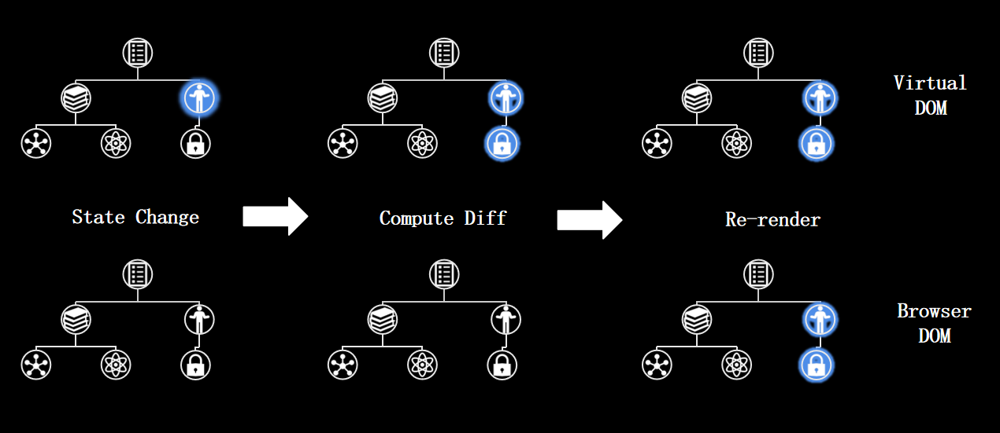
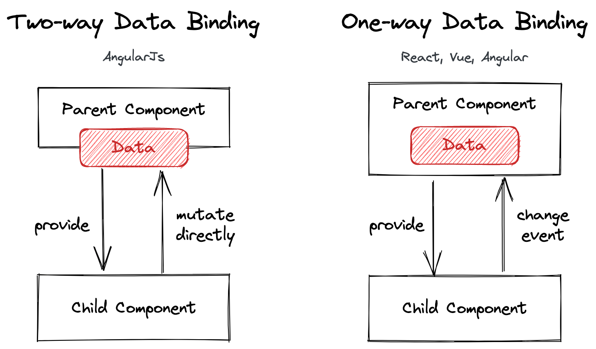
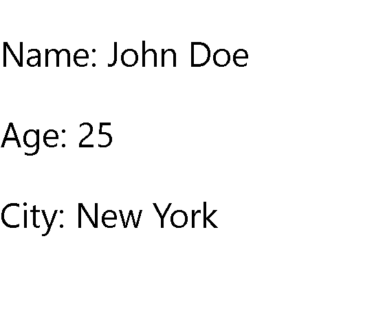
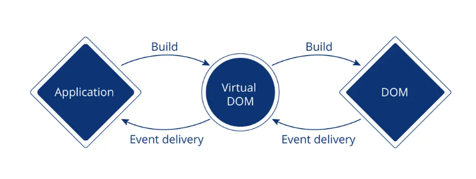
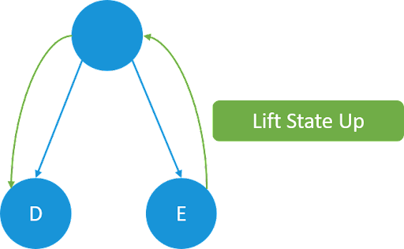
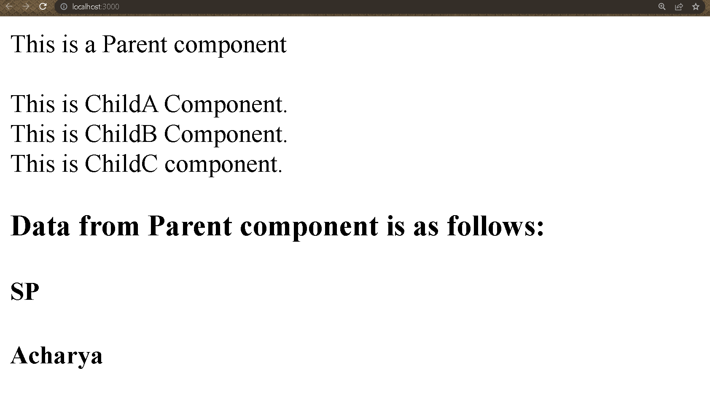
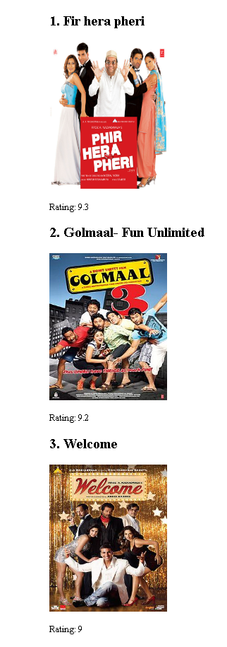

# Topics

1. React Introduction
    * What is React
    * React vs Vue vs Angular
    * How to create React application and file structure
2. React Features
    * [Virtual Dom](#virtual-dom)
    * SPA,JSX,Bebel
    * One way data binding
    * Components
    * [Class Components](#class-components)
    * Functional component
    * Named and default export
    * Communiny support
    * Web and mobile

3. Class and functional component
    * Components and props
    * Is there any reason to still use react class components?
    * Functional components vs class components in react
    * Migrate class components to functional components with Hooks in react

4. State and Props
    * How to use props 
    * Pass props in both class and functional component
    * How to update state from props
    * How to pass data from parent to child and vice versa
    * Putting props to usestate

5. Conditional rendering
    * How to perform
    * Different techniques for conditional rendering

6. Rendering
    * [Life Cycle Methods](#life-cycle-methods)

           @Mounting
              constructor()
              render()
              componentDidMount()
           @Updating
              shouldComponentUpdate()
              render()
              componentDidUpdate()
           @Unmounting
              componentWillUnmount()

7. Lists and keys
      * List components in react 
      * Why do we need the key props"

8.  Events Handling events in react 
      * Synthetic events
      * React event handler
9. [Higher Order Compoent](#higher-order-compoent)

10. HOOKS

      * [UseState](#usestate)
      * useEffect
      * useRef
      * React.memo()
      * [useMemo](#usememo)
      * UseCallback
      * [useReducer](#usereducer)
      * useParams hook
      * How to make Custom Hooks

11. [Routing](#routing)

      * How to perform routing
      * Brower router
      * Routes
      * Route
      * Link
      * [Dynamic params in Routing](#dynamic-params-in-routing)
      * [useNavigate](#usenavigate)
      * [useLocation](#uselocation)

12. [Props drilling](#props-drilling)
13. State uplifting
14. [Context API](#context-api)
    
15. [Axio Vs Fetch](#axio-vs-fetch)
      * Get, post, put,delete
      * Fetch json file and show it in the screen
      * Create own API and Fetch it and show on the screen
      * Difference between axio and fetch
16. State management
      * [REDUX Toolkit](#redux-toolkit)
      * perform CURD operation in redux
      * Redux thunk 
      * Redux saga vs Thunk


# **REACT NOTES** 

## DAY-1

## What is React.JS?

* React.js is a popular **open-source JavaScript library** used to build user interfaces for web applications. It was developed by `Facebook` and has been widely adopted by the web development community for its simplicity, speed, and flexibility.

* In a nutshell, React allows developers to create reusable UI components that can be combined to form complex user interfaces. Each component encapsulates its own logic and state, making it easier to reason about the behavior of the application.

* React is based on a concept called the **virtual DOM**, which is a lightweight representation of the actual DOM (Document Object Model). 
* When a user interacts with a React component, the virtual DOM is updated to reflect the changes, and then React efficiently updates only the necessary parts of the actual DOM to reflect those changes. This results in better performance and a smoother user experience.

**There are two kinds of programming,**
* Declarative Programming
* Imperative Programming

*Declarative Programming:*<br>
Its main goal is to get desired output without describing how to get it .
*Imperative Programming:*<br>
Its main goal is to describe how to get output or accomplish it
**React is Declarative in nature.**

* Finally, React can be used with other popular front-end libraries and frameworks, such as Redux for managing state and React Router for routing. It also has a large and active community, which provides helpful resources and support for developers.


## React Vs Angular Vs Vue


| Feature    | React     | Vue      | Angular    |
| :----------| :---------| :--------|:---------- |
| `Created by`      | Facebook | Evan You |Google|
| `Initial Release`      | 2013 | 2014. |2010 |
| `Architecture`      | Component-based | Component-based |Component-based |
| `Learning Curve`      | Low | Low |High |
| `Performance`      | High | High. |High |
| `Data Binding`      | One-way | Two-way | Two-way |
| `Templating`      | JSX | Html-based |Html-based |
| `State Management`      | Redux, Context API | Vuex |RxJS, ngrx |
| `Ecosystem`      | Large | Growing |Large |


## How to Install and File structure

When you create a new React app using `create-react-app`, it sets up a default project structure to help you get started quickly. The file structure is designed to organize your code in a scalable and maintainable way. Here's a brief explanation of the key files and directories:

### **1. `node_modules`:**
   - This directory contains all the dependencies and libraries that your React app requires. You don't need to manually manage this folder, as it's created and maintained by npm.
   - `npm` stands for Node Package Manager. It's a library and registry for JavaScript software packages. npm also has command-line tools to help you install the different packages and manage their dependencies.

### **2. `public`:**
   - This directory contains static assets that don't need to go through the build process, like images or the `index.html` file.

   - **`index.html`:**
     - The main HTML file that serves as the entry point for your React application. It includes a div with the id "root," where your React app will be rendered.

   - **`favicon.ico`:**
     - The icon that appears in the browser tab.

### **3. `src` (Source Code):**
   - This is where your React application's source code lives.

   - **`index.js`:**
     - The JavaScript file that is the main entry point for your React application. It renders the root component into the HTML `div` with the id "root" from `index.html`.

   - **`App.js` (or `App.jsx`):**
     - The main component of your application. It's usually the parent component that contains other components.

   - **`App.css` (or `App.scss`):**
     - The styles specific to the `App` component.

   - **`index.css` (or `index.scss`):**
     - Global styles that are applied to the entire application.

### **4. Configuration Files:**
   - **`package.json`:**
     - Contains metadata about the project, including dependencies, scripts, and other configurations.

   - **`package-lock.json`:**
     - Lock file that helps ensure that the same dependencies are installed on all machines.

   - **`README.md`:**
     - A readme file containing information about the project, how to set it up, and other relevant details.

### **5. `public` and `src` Level Files:**
   - **`public/favicon.ico`:**
     - The favicon for your app.

   - **`public/manifest.json`:**
     - A manifest file that provides metadata about your application, such as its name, description, and icons.

   - **`src/serviceWorker.js`:**
     - A service worker file used for progressive web app functionality.

   - **`src/setupTests.js`:**
     - A setup file for running tests.

### **6. `public` and `src` Level Directories:**
   - **`public/images`:**
     - A directory where you can store images.

   - **`src/components`:**
     - A directory to organize your React components.

   - **`src/assets`:**
     - A directory for static assets like images, fonts, etc.

### **7. Hidden Files:**
   - **`.gitignore`:**
     - A file that specifies intentionally untracked files to be ignored by Git.

   - **`.env`:**
     - An environment variable file for setting environment-specific configurations.

   - **`.eslint*` and `.prettierrc`:**
     - Configuration files for ESLint and Prettier, tools used for code linting and formatting.

### **8. `yarn.lock` (or `npm-shrinkwrap.json`):**
   - Lock files that help ensure consistent dependencies across different environments.


### -> Package.json: 
The `package.json` file in a React project contains metadata about the project, including information about its dependencies, scripts, and other configurations. Let's break down the common dependencies you might find in a typical `package.json` file generated by `create-react-app`:

```json
{
  "name": "your-react-app",
  "version": "0.1.0",
  "private": true,
  "dependencies": {
    "react": "^17.0.2",
    "react-dom": "^17.0.2",
    "react-scripts": "4.0.3",
    "web-vitals": "^1.0.1"
  },
  "scripts": {
    "start": "react-scripts start",
    "build": "react-scripts build",
    "test": "react-scripts test",
    "eject": "react-scripts eject"
  },
  // ...
}
```

### **1. `react` and `react-dom`:**
   - These are the core libraries for building React applications. `react` contains the functionality for creating and managing React components, while `react-dom` provides methods for interacting with the DOM, such as rendering React components.

### **2. `react-scripts`:**
   - `react-scripts` is a set of scripts and configurations that abstracts away the complex configuration for build tools like Webpack and Babel. It includes scripts for starting the development server (`start`), building the production version of your app (`build`), running tests (`test`), and ejecting from `create-react-app` for more customization (`eject`).

### **3. `web-vitals`:**
   - `web-vitals` is a library for measuring web vitals, which are metrics related to the performance and user experience of a web page. These metrics include things like page load time, responsiveness, and visual stability.

### **4. `dependencies` Object:**
   - This section lists the dependencies required for your React app to function. The versions specified with the `^` symbol indicate that your app can use newer patch releases (backward-compatible updates) of these dependencies.

### **5. `scripts` Object:**
   - This section defines scripts that you can run using `npm` or `yarn`. Common scripts include:
     - **`start`**: Launches the development server.
     - **`build`**: Creates a production build of your app.
     - **`test`**: Runs tests using the testing framework configured for your app.
     - **`eject`**: Ejects from `create-react-app`, exposing the configuration files for customization.

### **6. Other Fields:**
   - **`name` and `version`**: These fields provide information about the name and version of your project.

   - **`private`**: This field is set to `true` to prevent accidental publication of your code as a public package.

### **7. `devDependencies` Section (Not Shown):**
   - When you eject from `create-react-app` or add additional packages, you might see a `devDependencies` section in your `package.json`. This section includes packages needed only during development, such as testing libraries, build tools, or code formatting tools.

Remember that the actual content of your `package.json` might vary based on the tools and libraries you've added to your React project. Dependencies can be added using the `npm install` or `yarn add` commands, and their versions are typically managed automatically using lock files (`yarn.lock` or `package-lock.json`).

# React features

## 1. React: The Virtual Dom
### DOM: 
DOM stands for Document Object Model. 
Normally, whenever a user requests a webpage, the browser receives an HTML document for that page from the server. The browser then constructs a logical, tree-like structure from the HTML to show the user the requested page in the client.

This tree-like structure is called the Document Object Model, also known as the DOM. It is a structural representation of the web document as nodes and objects, in this case, an HTML document.


### The problem with Dom

> DOM manipulation is the heart of the modern, interactive web. Unfortunately, it is also a lot slower than most JavaScript operations.
> This slowness is made worse by the fact that most JavaScript frameworks update the DOM much more than they have to.
## Virtual Dom 

* React contains a lightweight representation of real DOM in the memory called Virtual DOM.  
* DOM gets created whenever any React application gets loaded on the screen for the first time, Whenever React components gets mounted on the screen for the first time.
* Now when any user makes any changes on the screen like button click, then the changes will not directly go to Real Dom.
* So, we are having two virtual doms, one VDOM gets created at the time of mounting of react component so it is a copy of your real DOM.
* Another VDOM is the dom which contains the new changes, updated state variables values.
* Now these two virtual DOMs will get compared with each other and will check for the new changes this complete procedure is known as **`diffing algorithm.`**
* Now the new changes will be updated in your Real DOM, this procedure is known as **`Recoinciliation`**
This makes a big difference! React can update only the necessary parts of the DOM. React’s reputation for performance comes largely from this innovation.





In summary, here’s what happens when you try to update the DOM in React:

1. he entire virtual DOM gets updated.
2. The virtual DOM gets compared to what it looked like before you updated it. React figures out which objects have changed.
3. The changed objects, and the changed objects only, get updated on the real DOM.
4. Changes on the real DOM cause the screen to change.

## 2. SPA
 * A single-page application (SPA) is a type of web application that loads a single HTML page and dynamically updates the content as the user interacts with the application. In a traditional web application, clicking on a link or submitting a form would typically result in a request to the server, which would respond with a new HTML page to be rendered in the browser. In contrast, a SPA loads all the necessary HTML, CSS, and JavaScript files upfront and then communicates with the server in the background to fetch or update data as needed.

* React is a popular JavaScript library for building SPAs. React allows developers to create reusable UI components that can be composed together to create complex user interfaces. React components are declarative, meaning they describe what should be rendered on the page rather than how it should be rendered. This makes it easier to reason about the code and to make changes without introducing bugs.

* In a React SPA, the initial HTML page typically only contains a single "div" element, which serves as the entry point for the React application. When the page loads, React renders the initial UI based on the state of the application. As the user interacts with the application, React updates the UI in response to events such as button clicks or form submissions.

* To handle server requests, a React SPA typically uses an API (Application Programming Interface) to communicate with the server. The API provides a set of endpoints that the client-side code can use to fetch or update data. The client-side code sends requests to the server using the Fetch API or other libraries such as Axios or jQuery. When the server responds, the client-side code updates the state of the application and rerenders the UI as needed.


> One advantage of using a React SPA is that it can provide a smoother and more responsive user experience compared to traditional web applications, since the page does not need to reload every time the user interacts with it. However, SPAs can be more complex to build and maintain, since they require more client-side code and may require additional server-side infrastructure to support the API.

## 3. JSX and Babel
JSX is a syntax extension for JavaScript that allows developers to write HTML-like code within their JavaScript code. It was developed by Facebook as part of the React library and is used extensively in React applications.

With JSX, developers can write code that looks like HTML, but is actually a combination of JavaScript and HTML. For example, instead of creating a DOM element using plain JavaScript like this:

```javascript

const element = document.createElement('div');
element.innerText = 'Hello, world!';
```
In JSX, the same code can be written as:

```javascript
const element = <div>Hello, world!</div>;
```
> JSX is not a separate language, but a syntax extension that is transformed into plain JavaScript by a compiler such as **Babel.**
### Babel:
Babel is a JavaScript compiler that allows developers to use modern JavaScript syntax and features while still supporting older browsers that do not support these features. Babel can compile JSX code into plain JavaScript code that can be run in any modern web browser.

In addition to transforming JSX code, Babel can also transform other modern JavaScript features such as arrow functions, template literals, and classes into code that can run in older browsers. Babel does this by analyzing the code and replacing any unsupported features with equivalent code that can be run by older browsers.

Overall, JSX and Babel are important tools in the React ecosystem, allowing developers to write modern, expressive code that can be run on a wide range of web browsers.

## 4. One Way Binding
* One-way data binding is a data flow mechanism in which the data flows only in one direction, from the data source to the UI element. This means that when the data changes, the UI element that is bound to the data is automatically updated to reflect the new data, but the reverse is not true.


* In one-way data binding, changes made to the UI element do not update the data source. If the user changes a value in the UI, the change is not automatically propagated back to the data source. Instead, the developer must explicitly update the data source based on the new value in the UI.
> One advantage of one-way data binding is that it can simplify the code and reduce the risk of unintended consequences. Since the data flow is unidirectional, it is easier to reason about the code and to track the source of changes. Additionally, one-way data binding can improve performance by reducing the number of updates that need to be made to the UI.

Example: 

```javascript
import React, { useState } from 'react';

function Example() {
  const [count, setCount] = useState(0);

  return (
    <div>
      <p>You clicked {count} times.</p>
      <button onClick={() => setCount(count + 1)}>
        Click me
      </button>
    </div>
  );
}
```
This is an example of one-way data binding, as the value of count flows from the state variable to the UI element (the paragraph element), but changes made to the UI element do not affect the state variable.

If we were using two-way data binding, we would need to define an event handler for the paragraph element to update the state variable when the user changes the text. However, in one-way data binding, the paragraph element is only used to display the current value of the 'count' variable, and does not update the variable when clicked or changed.

## 5. Component based
* Component-based architecture: React allows developers to build complex UIs by breaking them down into small, reusable components. Each component is responsible for rendering a small part of the UI, and can be composed together to create larger, more complex UIs.
* There are two types of components in React 
1. Class based components
2. Functional based components

## 6. Named export and default export
A named export allows you to export multiple values from a module, and each of those values can be imported individually by their name. A default export, on the other hand, allows you to export a single value from a module, and that value can be imported using any name.

Here's an example of a module with named exports:

```javascript
// math.js
export const add = (a, b) => a + b;
export const subtract = (a, b) => a - b;
```
In this example, the math.js module exports two functions: add and subtract. These functions can be imported individually like this:

```javascript
import { add, subtract } from './math.js';
console.log(add(2, 3)); // Output: 5
console.log(subtract(5, 2)); // Output: 3
```
> Note that when importing named exports, you need to use the curly braces and specify the names of the exports you want to import.

Now, let's take a look at an example of a module with a default export:

```javascript
// greeting.js
const greeting = name => `Hello, ${name}!`;
export default greeting;
```
In this example, the greeting.js module exports a single function called greeting. This function can be imported using any name like this:

```javascript
import sayHello from './greeting.js';
console.log(sayHello('John')); // Output: Hello, John!
```
> Note that when importing a default export, you don't need to use curly braces and can specify any name for the import.

In summary, named exports allow you to export multiple values from a module, and default exports allow you to export a single value from a module.

## 7. Community support
React has a significant advantage of community support, which is one of the reasons for its popularity among developers. The React community is very active and passionate about the technology, and there are many resources available to help developers learn and solve problems.

Here are some ways in which the React community provides support:

*Documentation*: React has comprehensive documentation that is regularly updated with new features and changes. The documentation is clear and easy to follow, making it an excellent resource for both beginners and experienced developers.

*Online forums and communities*: There are many online forums and communities where developers can ask questions, share knowledge, and discuss best practices related to React. These communities include Stack Overflow, Reddit, GitHub, and more.

*Third-party libraries and tools*: The React community has created many third-party libraries and tools that can help developers work more efficiently with React. These include libraries for state management, routing, styling, testing, and more.

*Conferences and meetups*: There are many conferences and meetups dedicated to React, where developers can attend talks, workshops, and networking events. These events provide an opportunity to learn from experts in the field and connect with other developers.

*Open-source contributions*: React is an open-source project, which means that anyone can contribute to its development. The React community has a strong culture of open-source contributions, and many developers have contributed code, bug fixes, and documentation to the project.

## 8. Web and Mobile 
React is effective for both web and mobile development because it allows developers to write reusable code that can be shared between different platforms.

React Native, a mobile framework built on top of React, allows developers to write mobile applications using the same programming language and development concepts as web applications. This makes it easier for developers to transition between web and mobile development, and to build applications that work seamlessly across both platforms.

Some of the features that make React effective for both web and mobile development include:

*Cross-platform compatibility*: React's focus on reusable components and virtual DOM makes it possible to write code that works on both web and mobile platforms. This reduces development time and cost, and makes it easier to maintain code across multiple platforms.

*Third-party libraries and tools*: The React community has developed many third-party libraries and tools that can be used to build web and mobile applications. These tools include libraries for state management, routing, styling, testing, and more, which can help developers work more efficiently and effectively.

# Components
## Class Components

In React, class-based components are a type of component that is defined using a JavaScript class. They are an older method of defining components, and have largely been replaced by functional components in modern React development. However, they are still commonly used in legacy code and in some specialized cases.

Class-based components are defined using the class keyword, and they extend the React.Component class. They define a render() method that returns a React element, which describes the UI that should be rendered to the screen.

Here is an example of a class-based component:

```javascript
import React from 'react';

class ExampleComponent extends React.Component {
  render() {
    return (
      <div>
        <h1>Hello, world!</h1>
      </div>
    );
  }
}
```
> In this example, we define a class-based component called `ExampleComponent`. It extends the `React.Component` class and defines a `render`() method that returns a `div` element containing an `h1` element.

Class-based components have a few advantages over functional components, such as the ability to define state and lifecycle methods. However, they also have some disadvantages, such as being more verbose and harder to understand for beginners.

In general, functional components are preferred for modern React development, as they are easier to write and maintain, and provide better performance. However, class-based components are still a valuable tool in the React developer's toolbox, and can be useful in some specialized cases.

### what is constructor and super key word?
**constructor** are used for 2 purposes : <br>
In React class components to initialize the component's state and to bind event handlers.<br>

**super()** is used to call the constructor of its parent class. If we would like to set a property or access this inside the constructor we need to call super() method. 

> It is not necessary to have a constructor in every component.

> It is necessary to call super() within the constructor. To set property or use 'this' inside the constructor it is mandatory to call super().


### React Component with Constructor
```javascript

import React from 'react'; 
import ReactDOM from 'react-dom'; 
class Main extends React.Component { 
  constructor() { 
    super(); 
    this.state = { 
      planet: "Earth" 
    } 
  } 
  render() { 
    return ( 
      < h1 >Hello {this.state.planet}!</h1> 
    ); 
  } 
} 
ReactDOM.render(<Main />, document.getElementById('root')); 
```
output:
```
Hello Earth          
```
<!-- In this example, we define a class-based component called `ExampleComponent`. We define a `constructor` method that calls the `super` method to initialize the component's `props` and sets the component's initial state to an object with two properties, `name` and `age`. We then use the `name` and `age` state properties in the `render` method to display a message on the screen. -->

This is a very basic example, but it demonstrates how the constructor and super keywords are used to initialize a React class component's state.

### React Component without Constructor 
```javascript
import React from 'react'; 
import ReactDOM from 'react-dom'; 
class Main extends React.Component { 
  state = { 
    planet: "Mars" 
  } 
  render() { 
    return ( 
      < h1 >Hello {this.state.planet}!</h1> 
    ); 
  } 
} 
ReactDOM.render(<Main />, document.getElementById('root')); 
```
output:
```
Hello Mars! 
```

## Functional component
In React, function-based components are a newer and more lightweight way to define components than class-based components. They are defined using JavaScript functions and can be considered as pure functions that take in props and return a React element.

Here is an example of a function-based component:

```javascript
import React from 'react';

function ExampleComponent() {
  return (
    <div>
      <h1>Hello World!</h1>
    </div>
  );
}
```

In the below example i initialize some values with the help of variable. 

```javascript
import React from 'react';

const FunComp = () => {
  const count=0;
  const name="SP";
  const arr=[1,2,3,4,5];

  return (
    <>
      <div>WELCOME!</div>
      <h1>{count}</h1> 
      <h1>{name}</h1> 
      <h1>{arr}</h1> 
    </>
  );
}

export default FunComp;
```


In React, JavaScript objects cannot be directly rendered within JSX because JSX can only render primitive data types like strings, numbers, or arrays. If you want to render the content of an object, you need to access its properties or convert the object to a string using a method like `JSON.stringify`.

Heres how you can render an objects properties or the whole object as a string:

### Render object properties:
If you want to access and render specific properties of the object, you can do it like this:

```javascript
import React from 'react';

const FunComp = () => {
  const obj = { name: "sp" };

  return (
    <>
      <div>WELCOME!</div>
      <h1>{obj.name}</h1> {/* Rendering the name property */}
    </>
  );
}

export default FunComp;
```

### Render the entire object as a string:

If you want to render the entire object as a string (useful for debugging or displaying data), use `JSON.stringify`:

```jsx
import React from 'react';

const ClassComp = (props) => {
  const obj = { name: "sp" };

  return (
    <>
      <div>ClassComp, {props.name}, {props.age}</div>
      <h1>{JSON.stringify(obj)}</h1> {/* Convert the object to a string */}
    </>
  );
}

export default ClassComp;
```

In this case, `JSON.stringify(obj)` will display the object as a string like `{"name":"sp"}`.


Function-based components have several **advantages** over class-based components:

* They are simpler and more lightweight than class-based components, which makes them easier to read, write, and maintain.

* They are less verbose than class-based components, which means less boilerplate code.

* They are easier to test because they are just plain functions that take in props and return a React element.

* They are faster than class-based components, because they don't have the overhead of a class instance and lifecycle methods.

In summary, function-based components are a simpler and more lightweight way to define components in React. They are easier to read, write, and maintain, and provide better performance than class-based components. For these reasons, they have become the preferred way to define components in modern React development.

### Q. Is there any reason to still use react class components?

Yes, there are still some reasons to use React class components, although function components are now the preferred way of writing components in React.

Here are a few reasons why you might still choose to use React class components:

1. Legacy Codebase: If you are working on a legacy codebase that uses class components, it might be more efficient to continue using class components rather than rewriting all of your code.

2. Lifecycle Methods: React class components have access to a number of lifecycle methods that are not available to function components. If you need to use one of these lifecycle methods, such as componentDidMount or componentDidUpdate, you will need to use a class component.

3. More Explicit: Some developers prefer the more explicit nature of class components. With class components, everything is defined in one place, making it easier to see what's going on in your code.

That being said, function components are generally considered the better choice for new React projects, as they offer better performance, simpler syntax, and easier testing. However, there are still some cases where class components might be the better option.

## Functional component Vs Class component


|     | Functional Components |	Class Components |
| :---| :---------------------| :----------------|
|`Definition`|	Defined as a JavaScript function |	Defined as a JavaScript class|
|`Stat-Management` |	Uses useState and useEffect hooks to manage state and lifecycle methods|	Uses state and lifecycle methods inside the class|
|`Props`|	Passed in as an argument to the function | Passed in as a property to the class|
|`Lifecycle-Methods`|	Uses useEffect hook to manage component lifecycle	|Has access to lifecycle methods such as componentDidMount and componentDidUpdate|
|`Performance`|	Generally faster because they do not have to create an instance of the component|	Slightly slower because they have to create an instance of the component|
|`Syntax`|	Simpler and easier to read and understand|	More verbose and complex|
|`Code-Reusability`|	Can be easily reused in other components	|Cannot be easily reused in other components|
|`Testing`|	Easier to test because they are pure functions|	More difficult to test because they have state and lifecycle methods|
|`Refs`|	Cannot use refs directly inside the component|	Can use refs directly inside the component|


## *DAY-2*


# State and Props
## State:
* In React, a "state" is an object that represents the internal data of a component. It is used to manage the component's dynamic behavior and to render the component with updated information.
* The data is passed within the components only.State can be modified. State can be used only in class component. 

* State can be changed by using the **setState()** method, which is provided by the React framework. When a component's state changes, React automatically re-renders the component with the updated information.

* State is typically used to handle user input, control component behavior, and store component-specific data.

* It's important to note that state is meant to be used only within the component it belongs to. It should not be passed down to child components as props, as this can make the code harder to maintain and debug.

## Props:
* React is a component-based library that divides the UI into little reusable pieces. In some cases, those components need to communicate (send data to each other) and the way to pass data between components is by using props.

* “Props” is a special keyword in React, which stands for properties and is being used for passing data from one component to another.

* But the important part here is that data with props are being passed in a uni-directional flow. (one way from parent to child)

* Furthermore, props data is read-only, which means that data coming from the parent should not be changed by child components.

### Props in class component
In a class component in React, props can be accessed via the this.props object. Here's an example of how to use props in a class component:

*#Greeting.js*
```javascript
import React from 'react';

class Greeting extends React.Component {
  render() {
    return <h1>Hello, {this.props.name}!</h1>;
  }
}

export default Greeting;
```
In this example, the `Greeting` class extends React.Component and defines a `render` method that returns a greeting message with the value of the name `prop` passed to it.

When the Greeting component is used in another component, the name prop can be passed as an attribute, like this:

*#App.js*
```javascript
import React from 'react';
import Greeting from './Greeting';

class App extends React.Component {
  render() {
    return (
      <div>
        <Greeting name="Alice" />
        <Greeting name="Bob" />
      </div>
    );
  }
}

export default App;
```
In this example, the App class extends React.Component and renders two instances of the Greeting component, each with a different name prop passed to it. When the Greeting component is rendered, it accesses the value of the name prop via this.props.name and uses it to render the greeting message.

### Props in functional component
Here's an example of how to use props in a functional component:

*#Greeting.js*
```javascript
import React from 'react';

function Greeting(props) {
  return <h1>Hello, {props.name}!</h1>;
}

export default Greeting;
```
In this example, the Greeting component is a simple functional component that receives a name prop and uses it to render a greeting message.

When the Greeting component is used in another component, the name prop can be passed as an attribute, like this:

*#App.js*

```javascript
import React from 'react';
import Greeting from './Greeting';

function App() {
  return (
    <div>
      <Greeting name="Alice" />
      <Greeting name="Bob" />
    </div>
  );
}

export default App;
```

In this example, the `App` component is rendering two instances of the `Greeting` component, each with a different name prop. When the Greeting component is rendered, it will receive the name prop as an argument to its function, and the value of the name prop will be used to render the greeting message.


### How to pass data from parent to child through Props ? 

In React, you can pass data from a parent component to a child component using props. 

*#Parent Component:*

```javascript
import React from 'react';
import ChildComponent from './ChildComponent';

function ParentComponent() {
  const data = {
    name: 'John Doe',
    age: 25,
    city: 'New York',
  };

  return (
    <div>
      <ChildComponent data={data} />
    </div>
  );
}

export default ParentComponent;
```

*#Child Component:*

```javascript
import React from 'react';

function ChildComponent(props) {
  const { data } = props;

  return (
    <div>
      <p>Name: {data.name}</p>
      <p>Age: {data.age}</p>
      <p>City: {data.city}</p>
    </div>
  );
}
export default ChildComponent;
```

Output:

In this example, the ParentComponent passes the data object to the ChildComponent as a prop. The ChildComponent then receives the data object as a prop, and can access its properties using dot notation (data.name, data.age, data.city) within the function body.


## Difference between State and Props

|Property|	State|	Props|
| :------| :-----| :-----|
|`Source`|	Defined and managed within a component|	Passed from a parent component to a child|
|`Mutability`|	Mutable and can be changed within a component	|Read-only and cannot be modified|
|`Ownership`|	Owned by the component that defines it|	Owned by the parent component|
|`Usage`|	Used to manage data within a component|	Used to pass data down the component tree|
|`Updates`|	Changes trigger a re-render of the component	|Changes trigger a re-render of the component|
|`DefaultValues`|	Must be initialized by the component itself	|Can have default values defined by the parent|
|`Scope`|	Should only be accessed and modified within component|	Can be accessed by child components|

## Update State and props using class component
1. Updating State:

* To update the state, you need to call the `setState` method.
* setState method accepts an object that contains the new values of the state properties you want to update.
* It's important to note that setState is asynchronous, so you should not rely on the current state or props values when updating state.


Here's an example:


```javascript
class MyComponent extends React.Component {
  constructor(props) {
    super(props);
    this.state = {
      count: 0,
    };
  }

  handleClick = () => {
    this.setState({ count: this.state.count + 1 });
  };

  render() {
    return (
      <div>
        <p>Count: {this.state.count}</p>
        <button onClick={this.handleClick}>Increment</button>
      </div>
    );
  }
}
```
2. Updating Props:

* Props are read-only and cannot be directly modified by the component that receives them.
* However, you can pass new props to a component by re-rendering it with new prop values.
* To update props, you need to call the `setState` method of the parent component that passed the props to the child component.
* When the parent component updates its state, it triggers a re-render of the child component with the new prop values.


Here's an example:


```javascript
class ParentComponent extends React.Component {
  constructor(props) {
    super(props);
    this.state = {
      name: "John",
    };
  }

  handleClick = () => {
    this.setState({ name: "Mary" });
  };

  render() {
    return (
      <div>
        <ChildComponent name={this.state.name} />
        <button onClick={this.handleClick}>Change Name</button>
      </div>
    );
  }
}

function ChildComponent(props) {
  return <p>Hello {props.name}</p>;
}
```


In summary, to update state, you call the setState method with the new state values. To update props, you update the parent component's state, which triggers a re-render of the child component with the new prop values.


## Update State and props using functional component

<b>1. Update State:</b>


* To update state in functional components, you need to use the useState hook provided by React.
* The useState hook returns an array with two values: the current state value and a function that can be used to update the state value.
* To update the state value, you call the function returned by the useState hook with the new state value.

Here's an example:

```javascript
import React, { useState } from "react";

function MyComponent() {
  const [count, setCount] = useState(0);

  const handleClick = () => {
    setCount(count + 1);
  };

  return (
    <div>
      <p>Count: {count}</p>
      <button onClick={handleClick}>Increment</button>
    </div>
  );
}
```


  <b>2. Updating Props: </b>

To update `props` from a parent component to a child component in React, the common pattern is that the parent passes props down to the child, and if the child needs to update the parent’s state, it can call a function passed from the parent as a prop. 

### Example of Parent-Child Communication and Updating Props

#### 1. **Parent Component (`Parent.jsx`)**:
In the parent component, we'll define some state and a function that updates the state. This function will be passed as a prop to the child component.

```jsx
// Parent.jsx
import React, { useState } from 'react';
import Child from './Child';

const Parent = () => {
  const [name, setName] = useState('John');

  // Function to update the name
  const updateName = (newName) => {
    setName(newName);
  };

  return (
    <div>
      <h1>Parent Component</h1>
      <p>Current Name: {name}</p>
      
      {/* Passing the name and update function as props to the Child */}
      <Child name={name} updateName={updateName} />
    </div>
  );
};

export default Parent;
```

#### 2. **Child Component (`Child.jsx`)**:
In the child component, we will use the `props` received from the parent. The child can trigger the `updateName` function to update the parent state.

```jsx
// Child.jsx
import React from 'react';

const Child = ({ name, updateName }) => {

  // This function will be called when the button is clicked
  const handleChangeName = () => {
    const newName = prompt('Enter a new name:');
    if (newName) {
      // Call the parent function to update the name
      updateName(newName);
    }
  };

  return (
    <div>
      <h2>Child Component</h2>
      <p>Received Name from Parent: {name}</p>
      
      {/* Button to change the parent's name */}
      <button onClick={handleChangeName}>Change Parent Name</button>
    </div>
  );
};

export default Child;
```

### How It Works:
1. **Parent Component (`Parent.jsx`)**:
   - Defines a piece of state (`name`) with the initial value `"John"`.
   - The `updateName` function is passed to the `Child` component as a prop.
   - The `name` value is also passed as a prop to the `Child`.

2. **Child Component (`Child.jsx`)**:
   - Receives `name` and `updateName` as props.
   - Displays the `name` received from the parent.
   - When the "Change Parent Name" button is clicked, it prompts the user to enter a new name, then calls `updateName(newName)` to update the parent's state.

### Outcome:
- Initially, the parent displays `"John"` as the name.
- When the user clicks the "Change Parent Name" button in the child component and enters a new name, the parent component updates its state, causing both the parent and child to re-render and display the updated name.


### >How to pass data from child to parent? 
In React, you can pass data from a child component to a parent component by using callback functions. 


1. **Define a Callback Function in the Parent Component:**
   In the parent component, define a function that will receive data from the child component.

```javascript
   // ParentComponent.js
   import React, { useState } from 'react';
   import ChildComponent from './ChildComponent';

   const ParentComponent = () => {
     const [childData, setChildData] = useState('');

     // Callback function to receive data from the child
     const receiveDataFromChild = (dataFromChild) => {
       setChildData(dataFromChild);
     };

     return (
       <div>
         <h2>Parent Component</h2>
         <p>Data from Child: {childData}</p>
         <ChildComponent sendDataToParent={receiveDataFromChild} />
       </div>
     );
   };

   export default ParentComponent;
   ```

2. **Call the Callback Function in the Child Component:**
   In the child component, receive the callback function as a prop and call it when you want to pass data to the parent.

   ```jsx
   // ChildComponent.js
   import React, { useState } from 'react';

   const ChildComponent = ({ sendDataToParent }) => {
     const [childInput, setChildInput] = useState('');

     const handleChange = (e) => {
       setChildInput(e.target.value);
     };

     const sendDataToParentOnClick = () => {
       // Call the callback function with the data
       sendDataToParent(childInput);
     };

     return (
       <div>
         <input type="text" value={childInput} onChange={handleChange} />
         <button onClick={sendDataToParentOnClick}>Send Data to Parent</button>
       </div>
     );
   };

   export default ChildComponent;
   ```

In this example, the `ParentComponent` passes the `receiveDataFromChild` function to the `ChildComponent` as the prop `sendDataToParent`. When the user enters data in the input field in the `ChildComponent` and clicks the button, the `sendDataToParentOnClick` function is called, and it invokes the callback function provided by the parent, passing the data from the child to the parent.


## Conditional Rendering
* Conditional rendering is a technique in React that allows you to render different content or components based on certain conditions. 
* It's a powerful way to make your components more dynamic and responsive to user input.

```javascript

import React, { useState } from 'react';

function Example() {
  const [showText, setShowText] = useState(false);

  const handleClick = () => {
    setShowText(!showText);
  };

  return (
    <div>
      <button onClick={handleClick}>Toggle Text</button>
      {showText && <p>Some text to show when button is clicked</p>}
    </div>
  );
}
export default Example;
```
Output:
.png)

* In this example, we use the useState hook to create a boolean state variable called `showText`. The initial value is false, which means the text won't be shown initially.

* We also define a function called `handleClick` that toggles the value of `showText` between true and false.

* In the return statement, we render a button with an `onClick` event listener that calls handleClick when clicked. 
* We also use a conditional statement to render the text only when `showText` is true. If `showText` is false, the text won't be rendered.

* When the user clicks the button, the handleClick function is called, which toggles the value of showText. This causes the component to re-render, and the text will be shown or hidden based on the new value of showText.

Note that the conditional statement used here is a shorthand way to write an if statement. The expression { showText && `<p>`Some text to show when button is clicked`</p>` } means "if showText is true, render the `<p>` element; otherwise, render nothing".

**There are several techniques for performing conditional rendering in React:**

1. If statements: You can use regular if statements to conditionally render content. For example:

```javascript
function MyComponent(props) {
  if (props.isLoggedIn) {
    return <p>Welcome back!</p>;
  } else {
    return <p>Please log in.</p>;
  }
}
```
2. Ternary operator: You can use a ternary operator to create a more concise if/else statement. For example:

```javascript
function MyComponent(props) {
  return (
    <div>
      {props.isMember ? <p>Welcome, member!</p> : <p>Please sign up.</p>}
    </div>
  );
}
```
3. Logical && operator: You can use the logical && operator to conditionally render content. For example:

```javascript
function MyComponent(props) {
  return (
    <div>
      {props.hasData &&
        <ul>
          {props.data.map(item => <li key={item.id}>{item.name}</li>)}
        </ul>
      }
    </div>
  );
}
```
4. Switch statement: If you have multiple conditions to check, you can use a switch statement to conditionally render content. For example:

```javascript
function MyComponent(props) {
  switch (props.status) {
    case 'loading':
      return <p>Loading...</p>;
    case 'error':
      return <p>Error: {props.errorMessage}</p>;
    case 'success':
      return <p>Success!</p>;
    default:
      return null;
  }
}
```
### Conditional rendering in a class component

```jsx
import React, { Component } from "react";

class ConditionalRenderingExample extends Component {
  constructor() {
    super();
    this.state = {
      isLoggedIn: false
    };
  }

  render() {
    // Example of conditional rendering
    if (this.state.isLoggedIn) {
      return <p>Welcome, User!</p>;
    } else {
      return <p>Please log in.</p>;
    }
  }
}

export default ConditionalRenderingExample;
```

In this example, the `ConditionalRenderingExample` class component has a state property `isLoggedIn` that is initially set to `false`. The `render` method uses an `if` statement to conditionally render different content based on the value of `isLoggedIn`. If `isLoggedIn` is `true`, it renders a welcome message; otherwise, it renders a login prompt.

You can also use the ternary operator for more concise syntax:

```jsx
import React, { Component } from "react";

class ConditionalRenderingExample extends Component {
  constructor() {
    super();
    this.state = {
      isLoggedIn: false
    };
  }

  render() {
    return this.state.isLoggedIn ? <p>Welcome, User!</p> : <p>Please log in.</p>;
  }
}

export default ConditionalRenderingExample;
```

In this case, the ternary operator is used to achieve the same result as the `if` statement in a more compact way.

## *DAY-4*

# Life Cycle Methods

In React, lifecycle methods are special methods that allow you to perform actions at specific stages in a component's lifecycle. These methods are called automatically by React at different points in the component's life.

There are three phases in the React component lifecycle: mounting, updating, and unmounting. Each of these phases has its own set of lifecycle methods.
1. **Mounting:** The component is ready to mount in the browser DOM. This phase covers initialization from
The phase covers initialization from
* constructor()
* render()
* componentDidMount()
2. **Updating:** In this phase, the component gets updated by, sending the new props and updating the state from setState()
This phase covers initialization From
The phase covers initialization from
* shouldComponentUpdate()
* render()
* componentDidUpdate()
3. **Unmounting:** In this phase, the component is not needed and gets unmounted from the browser DOM.
The phase covers initialization from
* componentWillUnmount()

## Mounting:
The mounting means to put elements into the DOM. React uses virtual DOM to put all the elements into the memory. It has four built-in methods to mount a component namely.
1. Constructor()
2. render()
3. componentDidMount()

**Constructor()**
method is called when the component is initiated and it’s the best place to initialize our state. The constructor method takes props as an argument and starts by calling super(props) before anything else.
```javascript
import React, { Component } from 'react'

export default class App extends Component {
  constructor(props){
    super(props)
    this.state = {
      name: 'Constructor Method'
    }
  }
  render() {
    return (
      <div>
       <p> This is a {this.state.name}</p>
      </div>
    )
  }
}
```
**render()**
* The render() function does not modify the component state, it returns the same result each time it’s invoked and is
responsible for describing the view to be rendered to the browser window.
* render() is called by React at various app stages, generally when the React component is first instantiated, or when there is a new update to the component state.

> Note : render() will not be invoked if shouldComponentUpdate() returns false.

**componentDidMount()**
The most common and widely used lifecycle method is componentDidMount. This method is called after the component is rendered.

```javascript
import React, { Component } from 'react'

export default class componentDidMountMethod extends Component {
  constructor(props){
    super(props)
    this.state = {
      name: 'This name will change in 5 sec'
    }
  }
  componentDidMount() {
    setTimeout(() => {
      this.setState({name: "This is a componentDidMount Method"})
    }, 5000)

  }
  render() {
    return (
      <div>
       <p>{this.state.name}</p>
      </div>
    )
  }
}
```
output:
```
This is a componentDidMount Method 
```
The above example will print This is a componentDidMount Method after 5 sec. This proves that the method is called after the component is rendered.

## Updating
This is the second phase of the React lifecycle. A component is updated when there is a change in state and props React basically has five built-in methods that are called while updating the components.
1. shouldComponentUpdate()
2. render()
3. componentDidUpdate()

**shouldComponentUpdate()**
 is used when you want your state or props to update or not. This method returns a boolean value that specifies whether rendering should be done or not. The default value is true.
 ```javascript
 import React, { Component } from 'react'

export default class shouldComponentUpdateMethod extends Component {
  constructor(props){
    super(props)
    this.state = {
      name: 'shouldComponentUpdate Method'
    }
  }
  shouldComponentUpdate() {
    return false; //Change to true for state to update
  }

  componentDidMount(){
    setTimeout(() => {
      this.setState({name: "componentDidMount Method"})
    }, 5000)
  }
  render() {
    return (
      <div>
       <p>This is a {this.state.name}</p>
      </div>
    )
  }
}
```
**componentDidUpdate** method is called after the component is updated in the DOM. This is the best place in updating the DOM in response to the change of props and state.

```javascript
import React, { Component } from 'react'

export default class componentDidUpdateMethod extends Component {
    constructor(props){
        super(props)
        this.state = {
            name: 'from previous state'
        }
    }
    componentDidMount(){
        setTimeout(() => {
            this.setState({name: "to current state"})
          }, 5000)
    }
    componentDidUpdate(prevState){
        if(prevState.name !== this.state.name){
            document.getElementById('statechange').innerHTML = "Yes the state is changed"
        }
    }
    render() {
        return (
            <div>
                State was changed {this.state.name}
                <p id="statechange"></p>
            </div>
        )
    }
}
```
In the above example, you will notice that first I have initialized the name state inside the constructor method and after that changed state using setState inside `componentDidMount` method. So basically the name state should be changed from "`shouldComponentUpdate` Method" to `“componentDidMount` Method” after `5` seconds but it didn’t change because of `shouldComponentUpdate` set to `false`, If you change that true the state will be updated.

**componentDidUpdate()**<br>
The componentDidUpdate method is called after the component is updated in the DOM. This is the best place in updating the DOM in response to the change of props and state.

```javascript
import React, { Component } from 'react'

export default class componentDidUpdateMethod extends Component {
    constructor(props){
        super(props)
        this.state = {
            name: 'from previous state'
        }
    }
    componentDidMount(){
        setTimeout(() => {
            this.setState({name: "to current state"})
          }, 5000)
    }
    componentDidUpdate(prevState){
        if(prevState.name !== this.state.name){
            document.getElementById('statechange').innerHTML = "Yes the state is changed"
        }
    }
    render() {
        return (
            <div>
                State was changed {this.state.name}
                <p id="statechange"></p>
            </div>
        )
    }
}
```
In the above example, I have set the name state to to current state So React will render the `name` state from State was changed from previous state to State was changed to current state after `5` seconds. Using the conditional checking of the current state with the previous state **prevState.name !== this.state.name** inside the `componentDidUpdate` method, we are updating the value of the id `statechange` to `Yes the state is changed .`


**componentWillUnmount()**<br>
If there are any cleanup actions like canceling API calls or clearing any caches in storage you can perform that in the componentWillUnmount method. You cannot use setState inside this method as the component will never be re-rendered.

```javascript

import React, { Component } from 'react'

export default class componentWillUnmount extends Component {
    constructor(props){
        super(props)
            this.state = {
                show: true,
            } 
    }
    render() {
        return (
            <>
              <p>{this.state.show ? <Child/> : null}</p>
               <button onClick={() => {this.setState({show: !this.state.show})}}>Click me to toggle</button>
            </>
        )
    }
}

export class Child extends Component{
    componentWillUnmount(){
        alert('This will unmount')
    }
    render(){
        return(
            <>
            I am a child component
            </>
        )
    }
}
```
In the above example, I have created a simple toggle button which will show our `Child component` if the state is set to true. 

So after clicking on the button an alert will popup displaying `This will unmount` The alert will popup because the component is about to be removed from the DOM which in our case is the Child component.


## *DAY-5*

## List and keys

### 1. Lists and Keys:

In React, a **list** is a collection of elements rendered with a map function. Each element in the list is assigned a unique identifier known as a **key**. Keys are crucial for React to efficiently update and reconcile the virtual DOM when the list changes.

### 2. List Components in React:

Let's consider a scenario where we want to render a list of items in React. We can create a component for the list and map over the items to generate the list dynamically.

**List Component Example:**
```jsx
import React from 'react';

const ListComponent = ({ items }) => {
  return (
    <ul>
      {items.map((item) => (
        <li key={item.id}>{item.name}</li>
      ))}
    </ul>
  );
};

export default ListComponent;
```

### 3. Why Do We Need the `key` Prop:

#### Purpose of Keys:
- **Uniqueness:** Keys help React identify which items have changed, are added, or are removed. They should be unique among siblings in the list.
- **Reconciliation:** React uses keys to optimize the process of updating the virtual DOM. When items in a list change, React can efficiently determine which elements need to be modified, added, or removed.

#### Example Explained:

Consider a list of items with unique identifiers (IDs) and names:

```jsx
const items = [
  { id: 1, name: 'Item 1' },
  { id: 2, name: 'Item 2' },
  { id: 3, name: 'Item 3' },
];
```

In the `ListComponent` example:
- The `map` function is used to iterate over each item in the `items` array.
- Each `li` element has a `key` prop set to the unique `id` of the item.
- This key allows React to efficiently track changes in the list.

**Usage of ListComponent:**
```jsx
import React from 'react';
import ListComponent from './ListComponent';

const App = () => {
  const items = [
    { id: 1, name: 'Item 1' },
    { id: 2, name: 'Item 2' },
    { id: 3, name: 'Item 3' },
  ];

  return (
    <div>
      <h1>List Component Example</h1>
      <ListComponent items={items} />
    </div>
  );
};

export default App;
```

**Key Takeaways:**
- Always provide a unique `key` prop when rendering lists in React.
- Use a property that remains consistent and unique for each item, such as an ID.
- Keys assist React in optimizing the rendering process and efficiently updating the DOM when the list changes.


## *DAY-6*

## Events in react
<p>Event handling essentially allows the user to interact with a webpage and do something specific when a certain event like a click or a hover happens. </p>
<p>When the user interacts with the application, events are fired, for example, mouseover, key press, change event, and so on.</p>



The actions to which JavaScript can respond are called events. Handling events with react is very similar to handling events in DOM elements.

Below are some general events that you would see in and out when dealing with React-based websites:  

* Clicking an element  
* Submitting a form 
* Scrolling page 
* Hovering an element  
* Loading a webpage 
* Input field change 
* User stroking a key 
* Image loading 

### DIFFERENCE BETWEEN HTML AND REACT EVENT HANDLING :
React event handling is similar to HTML with some changes in syntax, such as:

React uses camelCase for event names while HTML uses lowercase.

Instead of passing a string as an event handler, we pass a function in React.

Example:
In HTML:
```
<button onclick="clickHandler()">
  Clicked
</button>
```
In React js
```
<button onClick={clickHandler}>
  Clicked
</button>
```
Also, like in HTML, we cannot return false to prevent default behavior; we need to use preventDefault to prevent the default behavior.

In HTML
```
<form onsubmit="console.log('clicked'); 
   return false">
  <button type="submit">Submit</button>
</form>
```
In React js
```javascript
function Form() {
  function handleClick(e) {
    e.preventDefault();
    console.log('Clicked');
  }

  return (
    <form onSubmit={handleClick}>
      <button type="submit">Submit</button>
    </form>
  );
}
```
Here, e is a synthetic event. React events do not work exactly the same as native events. See the SyntheticEvent reference guide to learn more.

When using React, you generally don’t need to call addEventListener to add listeners to a DOM element after it is created. Instead, just provide a listener when the element is initially rendered.

**Changing state in onClick event listener:**

```javascript
function EventBind() {
  const [steps, setSteps] = useState(0);
  const clickHandler = () => {
    setSteps(steps + 1);
  };
  return (
    <>
      <div>{steps}</div> 
      <button onClick = {clickHandler}> Click </button>
    </>
  );
}
export default EventBind
```
**Let’s see some of the event attributes:**   

* onmouseover: The mouse is moved over an element 
* onmouseup: The mouse button is released 
* onmouseout: The mouse  is moved off an element 
* onmousemove: The mouse is moved 
* Onmousedown: mouse button is pressed  
* onload: A image is done loading 
* onunload: Existing the page  
* onblur: Losing Focus  on element  
* onchange: Content of a field changes 
* onclick: Clicking an object  
* ondblclick: double clicking an object  
* onfocus element getting a focus  
* Onkeydown: pushing a keyboard key 
* Onkeyup: keyboard key is released 
* Onkeypress: keyboard key is pressed  
* Onselect: text is selected 


## What are synthetic events in ReactJS ?

In order to work as a cross-browser application, React has created a wrapper same as the native browser in order to avoid creating multiple implementations for multiple methods for multiple browsers, creating common names for all events across browsers. Another benefit is that it increases the performance of the application as React reuses the event object.

It pools the event already done hence improving the performance.


 > `e.preventDefault()` prevents all the default behavior by the browser.

> `e.stopPropagation()` prevents the call to the parent component whenever a child component gets called.

Note: **Here ‘e’ is a synthetic event**, a cross-browser object. It is made with a wrapper around the actual event of the browser. 


# Pure Component

Pure components in React are a type of component that only re-renders when its props or state change. They are also referred to as “stateless components” or “dumb components”. Pure components are a way to optimize the performance of your React application by reducing unnecessary re-renders.

```javascript
import React, { PureComponent } from 'react'

export default class PureComp extends PureComponent {

    constructor(){
        super();
        this.state={
            count:0
        }
    }
  render() {
    console.log("Component is called")
    return (
      <div>
       <h1> {this.state.count}</h1>
        <button onClick={()=>this.setState({count:this.state.count+1})}>Click</button>
      </div>
    )
  }
}

```


# Higher Order Component


In React, a Higher-Order Component (HOC) is a function that takes a component as an input and returns a new component with additional functionality. Essentially, it's a way to reuse component logic and share it between different components.

To use a HOC, you simply pass your component as an argument to the function that defines the HOC. The function returns a new component with the added functionality.

So in this below example im going to create one counter and hover counter basically , whenever i hover over the text the counter should be updated by one. 


App.js 
```javascript
import React from "react";
import ClickCounter from "./ClickCounter";
import HoverComp from "./HoverComp";

const App = () => {
  return (
    <div>
      <ClickCounter />
      <HoverComp />
    </div>
  );
};

export default App;

```
ClickCounter.js 
```javascript
import React from "react";
import UpdatedComp from "./UpdatedComp";

const ClickCounter = ({ count, incrementCount }) => {
  console.log(incrementCount);
  return <button onClick={incrementCount}> Count {count} Times </button>;
};

export default UpdatedComp(ClickCounter);

```
HoverComp.js 
```javascript 
import React from "react";
import UpdatedComp from "./UpdatedComp";

const HoverComp = ({ count, incrementCount }) => {
  console.log(incrementCount);
  return <h2 onMouseOver={incrementCount}> Hovered {count} Times </h2>;
};

export default UpdatedComp(HoverComp);

```
UpdatedComp.js
```javascript
import React, { useState } from "react";

const UpdatedComp = (OriginalComponent) => {
  const NewComponent = () => {
    const [count, setCount] = useState(0);

    const incrementCount = () => {
      setCount(count + 1);
    };

    return <OriginalComponent count={count} incrementCount={incrementCount} />;
  };

  return NewComponent;
};

export default UpdatedComp;

```
Output:
.png)
So after hovering over the text and click on the button the counter will update by one.
.png)

In this code, the UpdatedComp function is the higher-order component. It takes a component as its argument and returns a new component with an added state `count` and a method `incrementCount` that updates the count. The OriginalComponent is rendered inside the NewComponent, and the count and `incrementCount` props are passed to it.

Both ClickCounter and HoverComp components are wrapped in the UpdatedComp higher-order component to enhance them with the count state and `incrementCount` method. Therefore, they have access to the count and `incrementCount` props, which they can use to update their state and re-render.

In summary, the higher-order component in this code is the UpdatedComp function that takes a component as an argument and returns a new component with added functionality. It is used to enhance the ClickCounter and HoverComp components with state and methods.

## *DAY-8*

# **HOOKS**

* In React, Hooks are functions that allow developers to use state and other React features in functional components without the need for class components. 

* Hooks were introduced in React version 16.8 to provide a simpler and more flexible way to manage state and side effects in React components.

* In class component we use different Life cycle methods but in functional components we use hooks instead.

* Hooks allows to use state and other features without writing a class. 

**Benefits of using Hooks and Why Hooks was introduced ?**

● In react class component, we split our work into different life-cycle methods like componentDidMount,
componentDidUpdate and componentWillUnmount, but in hooks, we can do everything in a single hook called useEffect.

● In the class component, we have to use this keyword and also we have to bind event listeners, which increases
complexity. This is prevented in react functional components.

**There is 2 rules to use Hooks.** 
1. Only call Hooks at the top level:-<p>
 Do not call hooks inside loops, conditions or nexted functions. Hooks should always be used at the top level of the react functions.

2. Only call hooks from React functions:- <p>
You can't call hooks from regular js functions instead you can call hooks from React functional component. 

There are several types of hooks in React such as: 
  * UseState
  * useEffect
  * useMemo
  * useRef
  * UseReducer
  * UseCallback
  * useContext
  * useParams 
  * useHistory 


## UseState
-> usestate hooks allows us to track state in a functional component.<p>
-> State generally refers to data or properties that need to be tracking in an application.<p>
-> usestate can be used to toggle between 2 values, usually true and false.

**How to use it**

first we have to import
```
import {usestate} from 'react'
```
then inside a function write
```
const[count.setCount]=usestate(0);
        |         |
        |         |
     (current    (Update the 
      state)     counter's state)
```
Example
```javascript
import React ,{useState} from "react";

function App() {
    const[Count,setCount]= useState(0);

    return(
        <>
        <h1> count:{Count}</h1>
        <button onClick={()=>setCount(Count+1)}>Click</button>
        </>
    )    
}
 export default App
```

In this example, we declare a state variable called count using the `useState` hook and initialize it to 0. We also declare a function called `setCount` which will be used to update the `count` state variable.

**MultiCounter Applicarion**

```javascript
import React from 'react'
import { useState } from 'react';

const Function = () => {

  const[count,setCount]   =  useState([0,0])
  
  const increment=(index)=>{
    setCount((prevCount)=>{
      const newCount = [...prevCount]
      console.log(newCount);
      newCount[index] += 1
      return newCount
    })
  }
  const decrement=(index)=>{
    setCount((prevCount)=>{
      const newCount = [...prevCount]
      newCount[index] -= 1
      return newCount
    })
  }

  console.log(count)
return (
  <div>
    {count.map((counter,index)=>(
      <div key={index}>
      <h1> count:{counter}</h1>
      <button onClick={()=>increment(index)}>increment</button>
      <button onClick={()=>decrement(index)}>decrement</button>
      </div>
))}
  </div>
)
}


export default Function
```


## useEffect
**->** The Effect Hook allows us to perform side effects (an action) in the function components. It does not use components lifecycle methods which are available in class components.

**->** In other words, Effects Hooks are equivalent to componentDidMount(), componentDidUpdate(), and componentWillUnmount() lifecycle methods.

**->** useEffect allows you to run side effects after the component has rendered, and also provides a way to clean up any side effects when the component is unmounted or updated. Here is an example of how to use useEffect:

Side effects have common features which the most web applications need to perform, such as:

* Updating the DOM,
* Fetching and consuming data from a server API,
* subscribing to events.

-> useEffect accepts 2 arguments (callback,[dependency])

> **The dependency array** is passed as the second argument to useEffect, and can contain one or more values. If the array is empty, the effect will only run once, when the component is mounted. If the array contains any values, the effect will re-run whenever one of those values changes.

```javascript
function App() {
    const[Count,setCount]= useState(0);
    const [num,setNum]= useState(0);

    useEffect(()=>{
        alert("clicked")
    })

    return(
        <>
        <h1> count:{Count}</h1>
        <button onClick={()=>setCount(Count+1)}>Click</button>
        <h1> Number:{num}</h1>        
        <button onClick={()=>setNum(num+1)}>Click</button>
        </>
    )    
}
export default App
```
Output:
.png)

Here we declare 2 states `setCount` and `setNum`. and add counter to both of them . And we use useeffect and alert. so when one user click on the both buttons in every render one alert will appear. 

Now lets use empty dependency
```javascript
  useEffect(()=>{
        alert("clicked")
    },[])
```
So we just add empty array dependency, now when ever the page is reload for the first time it will show alert. Then whenever we click on both buttons the alert will not popup.

```javascript
 useEffect(()=>{
        alert("clicked")
    },[num])
```    
Here we pass num state in the dependency.Now when we click on count state button the alert will not popup but whenever we click on num state button the alert will popup everytime we click on the button and simontaniouly the increment will occure.


### UseEffect with cleanup method and Api fetching

```javascript
import React from 'react'
import { useState, useEffect } from 'react';

const Function = () => {

  const[data,setData]   =  useState([])

  //componentDidMount(runs once after the initial render)
  useEffect(()=>{
    console.log("component did mount")
    const fetchData= async()=>{
     const result =  await fetch('https://jsonplaceholder.typicode.com/users')
     const json = await result.json();
    //  console.log(json);
     setData(json);
    }
    fetchData();

    //component willunmount
    return()=>{
      console.log("component will unmount")
    }
  },[]);

  //component DidUpdate (runs on every render,but can be controlled with dependancies)
  useEffect(()=>{
    console.log(data,"update data")
  },[data])//this effect runs ehwnever 'data' chnages

  console.log("render")

return (
  <div>
    <ul>
      {data.map(item =>(
        <li key={item.id}> {item.name}</li>
      ))}
    </ul>
  </div>
  )
}


export default Function
```


The `useEffect` hook is crucial in React for managing side effects in functional components. A **side effect** refers to anything that affects something outside the scope of the function, such as fetching data, updating the DOM, or setting timers. The `useEffect` hook runs after every render by default, but it can also be controlled to run only when specific values change, making it highly useful for various scenarios.

Here are some **unique and good examples** of using the `useEffect` hook:

---

### 1. **Fetching Data from an API**
Fetching data from an external API is one of the most common use cases for `useEffect`. The hook helps you trigger an API call when the component mounts, ensuring that data is loaded as soon as the component is rendered.

```jsx
import React, { useState, useEffect } from 'react';

const DataFetching = () => {
  const [data, setData] = useState(null);
  const [loading, setLoading] = useState(true);

  useEffect(() => {
    // Simulate fetching data from an API
    fetch('https://jsonplaceholder.typicode.com/posts/1')
      .then((response) => response.json())
      .then((json) => {
        setData(json);
        setLoading(false);
      });
  }, []); // Empty dependency array ensures this runs only once after the initial render

  return (
    <div>
      {loading ? <p>Loading...</p> : <p>Data: {JSON.stringify(data)}</p>}
    </div>
  );
};

export default DataFetching;
```

#### Why `useEffect` is important here:
- **Without `useEffect`**, the API call would happen every time the component renders, potentially causing an infinite loop.
- With `useEffect`, the API call happens only **once**, after the initial render, which makes it efficient and prevents unnecessary network requests.

---

### 2. **Set and Clear a Timer**
This example demonstrates how you can use `useEffect` to create a timer (e.g., for a countdown or a clock) and clean up the timer when the component is unmounted.

```jsx
import React, { useState, useEffect } from 'react';

const Timer = () => {
  const [seconds, setSeconds] = useState(0);

  useEffect(() => {
    const interval = setInterval(() => {
      setSeconds((prevSeconds) => prevSeconds + 1);
    }, 1000);

    // Cleanup function to clear the interval when the component unmounts
    return () => clearInterval(interval);
  }, []); // Empty dependency array ensures this runs only once

  return <h1>Timer: {seconds} seconds</h1>;
};

export default Timer;
```

#### Why `useEffect` is important here:
- `useEffect` is used to **set up** a timer when the component is mounted.
- The **cleanup function** (`return () => clearInterval(interval)`) ensures that the timer is properly cleared when the component is unmounted, preventing memory leaks.

---

### 3. **Update the Document Title Based on State**
You can use `useEffect` to dynamically update the document title based on a piece of state. This is useful for improving the user experience, like showing unread messages or notifications in the tab title.

```jsx
import React, { useState, useEffect } from 'react';

const TitleUpdater = () => {
  const [count, setCount] = useState(0);

  useEffect(() => {
    document.title = `You clicked ${count} times`;
  }, [count]); // Only runs when `count` changes

  return (
    <div>
      <h1>{count} clicks</h1>
      <button onClick={() => setCount(count + 1)}>Click me</button>
    </div>
  );
};

export default TitleUpdater;
```

#### Why `useEffect` is important here:
- Every time the state `count` changes, the `useEffect` hook ensures that the document title is updated.
- It is efficient because `useEffect` only runs when the dependency (`count`) changes, preventing unnecessary updates.

---

### 4. **Detecting Window Resize**
This example demonstrates how to track and react to window size changes. `useEffect` is used to add and remove an event listener on the `window` object.


```javascript
import React from 'react'
import { useState, useEffect } from 'react';

const WindowResize=()=>{
  const[widthCount,setWidthCount] = useState(window.screen.width)
  console.log(widthCount)

const updatedWidth = ()=>{
  console.log(window.innerWidth);
  setWidthCount(window.innerWidth)
}

useEffect(()=>{
  window.addEventListener('resize',updatedWidth)

  return()=>{
    window.removeEventListener('resize',updatedWidth)
  }
})
  return(
    <>
      <p>The actual size of the window:</p>
      <h1>{widthCount}</h1>
    </>
  )
}

export default WindowResize
```


#### Why `useEffect` is important here:
- The hook allows you to **set up** a window resize event listener only when the component mounts.
- The cleanup ensures that the event listener is **removed** when the component unmounts, preventing memory leaks.

---

### 5. **Dark Mode Toggle with Local Storage**
This example shows how `useEffect` can be used to **persist state** across page reloads by syncing it with `localStorage`.

```jsx
import React, { useState, useEffect } from 'react';

const DarkModeToggle = () => {
  const [darkMode, setDarkMode] = useState(false);

  useEffect(() => {
    const savedMode = localStorage.getItem('darkMode') === 'true';
    setDarkMode(savedMode);
  }, []); // Runs once to load the initial value from localStorage

  useEffect(() => {
    // Sync dark mode state with localStorage
    localStorage.setItem('darkMode', darkMode);
  }, [darkMode]); // Runs whenever `darkMode` changes

  return (
    <div style={{ background: darkMode ? '#333' : '#fff', color: darkMode ? '#fff' : '#000' }}>
      <h1>{darkMode ? 'Dark Mode' : 'Light Mode'}</h1>
      <button onClick={() => setDarkMode(!darkMode)}>
        Toggle Dark Mode
      </button>
    </div>
  );
};

export default DarkModeToggle;
```

#### Why `useEffect` is important here:
- The first `useEffect` runs only once to **load the saved dark mode setting** from `localStorage` when the component mounts.
- The second `useEffect` **syncs the state** with `localStorage` whenever `darkMode` changes, ensuring that the dark mode preference is saved between sessions.

---

### Why is `useEffect` important in these examples?

- **Side Effects Management**: React's rendering model is pure, meaning functions should only return UI. Side effects (like fetching data, setting timers, or interacting with browser APIs) need to be managed separately, and `useEffect` is designed for this purpose.
- **Dependency Control**: By specifying dependencies, `useEffect` can be controlled to run only when necessary, making the app more efficient and preventing unnecessary re-renders or actions.
- **Cleanup Logic**: `useEffect` allows you to **clean up** after side effects, like removing event listeners, clearing timers, or canceling API requests. This is crucial for preventing memory leaks or performance issues in React apps.


## useRef

The useRef hook in React is a powerful tool that allows you to create a reference to a DOM element. This reference can be used to read or modify properties of the DOM element, effectively allowing you to manipulate the DOM directly from your React code.

1. useRef is a React hook that allows you to create a *mutable variable, which will not re-render of your component.

> A mutable variable is a variable that can change its value or state during a program.

 It returns an object with a single property, `current`, which initially holds the value passed as argument (or undefined if no argument is provided). We can modify the `current` property without triggering a re-render of the component. This makes it useful for managing mutable values and for accessing the underlying DOM elements.

Example-1:

```javascript
import React, { useEffect, useRef, useState } from 'react'

const UseRefHook = () => {
    
    const[input,setInput] = useState("");
    // const[count,setCount] = useState(0)
    const count = useRef(0) ;
    console.log(count);

    useEffect(()=>{
        console.log("render");
        // setCount(count+1);
        count.current = count.current+1
    })

  return (
    <div>
        <input type='text' value={input} onChange={(e)=>setInput(e.target.value)}/>
        <h1>Render count:{count.current}</h1>
    </div>
  )
}

export default UseRefHook
```
Output:
.png)
In the example,
The component has a local state variable called `inputValue` that is initialized with an empty string using useState. `setInputValue` is a function used to update the value of `inputValue` state variable when the input field changes.

The component also has a count variable initialized with a value of 0 using the `useRef` hook. count is used to keep track of the number of times the component has been rendered.

The useEffect hook is used to update the value of count variable whenever the component is rendered. The useEffect hook runs after the component has been rendered, and it updates the count variable by incrementing it by 1.

The component returns two elements: an input field and an h1 element that displays the current value of count. Whenever the input field is changed, the setInputValue function is called, which updates the inputValue state variable and causes the component to re-render. When the component is re-rendered, the useEffect hook runs and updates the value of count to reflect the new render count.


Example-2:

2. used to access a DOM element directly

```javascript


import React, { useEffect, useRef, useState } from 'react'

const UseRefHook = () => {
    
    const[input,setInput] = useState("");
    const count = useRef(0) ;
    console.log(count);

    const changeStyle=()=>{
        console.log(count.current)
        count.current.style.backgroundColor = "cyan";
    }

  return (
    <div>
        <input type='text' ref={count} value={input} onChange={(e)=>setInput(e.target.value)}/>
        <button onClick={changeStyle}>Change Color</button>
    </div>
  )
}

export default UseRefHook
```


Example-3:

```javascript
import React, { useRef } from 'react';

const VideoPlayer = () => {
  const videoRef = useRef(null); // useRef to access the video element

  const playVideo = () => {
    videoRef.current.play();  // Play the video using the DOM reference
  };

  const pauseVideo = () => {
    videoRef.current.pause();  // Pause the video using the DOM reference
  };

  return (
    <div>
      <video
        ref={videoRef}
        width="600"
        controls
        src="https://www.w3schools.com/html/mov_bbb.mp4"
      />
      <div>
        <button onClick={playVideo}>Play</button>
        <button onClick={pauseVideo}>Pause</button>
      </div>
    </div>
  );
};

export default VideoPlayer;
```


In simple terms, useRef can be used to store values that don't change often and are not used for rendering purposes, such as DOM elements, timers, or any other mutable value.


## React.memo()

In software development, we’re generally obsessed with performance gains and how to make our applications perform faster to give users a better experience.

### What is memoization?
In simple terms, memoization is a process that allows us to cache the values of recursive/expensive function calls so that the next time the function is called with the same argument(s), the cached value is returned rather than having to re-compute the function.

This ensures that our applications run faster because we avoid the time it would usually take to re-execute the function by returning a value that’s already stored in memory.

### What is React.memo()?
React.memo() was released with React v16.6. While class components already allowed you to control re-renders with the use of PureComponent or shouldComponentUpdate, React 16.6 introduced the ability to do the same with functional components.
```javascript
//Parent.js

import React, { useState } from 'react'
import DisplayTodo from './DisplayTodo';

const Parent = () => {
    console.log("parent component rendered")
    const [todo,setTodo] = useState([
        {id:1,content:"walking"},
        {id:2,content:"coding"}
    ]);

    const[text,setText] = useState("")

    const handleTodo=()=>{
        let newTodo = {
            id:3, content: text
        };
        setTodo([...todo,newTodo])
    }

  return (
    <div>
        <input type='text' value={text} onChange={(e)=>setText(e.target.value)}/>
        <button onClick={handleTodo}>Add </button>
        <DisplayTodo todo ={todo}/> 
    </div>
  )
}

export default Parent
```
```javascript
//DisplayTodo.js

import React from 'react'
import TodoItem from './TodoItem'

const DisplayTodo = React.memo(({todo}) => {
    console.log("display todo rendered")
  return (
    
        <>
        <ul>
        {todo.map((item)=>(
            <TodoItem key={item.id} item={item}/>
        ))}
        </ul>
        </>
  )
})

export default DisplayTodo
```
```javascript
//TodoItem.js
import React from 'react'

const TodoItem = React.memo(({item}) => {
    console.log("Todo item rendered")
  return <li>{item.content}</li>
})

export default TodoItem
```

In this code 
- `React.memo` is used in `DisplayTodo` and `TodoItem` to optimize performance by preventing unnecessary re-renders if the props haven't changed.
- Unique keys are provided to each todo item when mapping through the array in `DisplayTodo` to help React efficiently update the virtual DOM.

In summary, this React application allows users to add todo items through a form in the `Parent` component, and the added items are displayed in a list through the `DisplayTodo` component, with each item rendered by the `TodoItem` component. The use of React memoization helps optimize the rendering performance of the components.


import React, { useState } from 'react';

// Child component wrapped with React.memo to prevent unnecessary re-renders
const ChildComponent = React.memo(({ value }) => {
  console.log('Child re-rendered');
  return <div>Child Value: {value}</div>;
});

function ParentComponent() {
  const [count, setCount] = useState(0);
  const [otherValue, setOtherValue] = useState(0);

  console.log('Parent re-rendered');

  return (
    <div>
      <p>Count: {count}</p>
      <button onClick={() => setCount(count + 1)}>Increment Count</button>

      <p>Other Value: {otherValue}</p>
      <button onClick={() => setOtherValue(otherValue + 1)}>Increment Other Value</button>

      {/* Child component receives otherValue as prop */}
      <ChildComponent value={otherValue} />
    </div>
  );
}

export default ParentComponent;


## useMemo()

useMemo is a React hook that allows you to memoize the result of a function, and recompute the result only when the dependencies of the function have changed.

In simple terms, useMemo can be used to optimize the performance of your React components by avoiding unnecessary re-renders.


Let's go over an example to clarify how `useMemo` works and how it prevents unnecessary re-renders and recalculations. I'll walk you through step by step with and without `useMemo`.

### Scenario:

You have a function that performs an **expensive calculation**, like squaring a large number. You want to display the result in a component, but you don't want to re-calculate it unless the input changes. Without `useMemo`, this expensive calculation will happen on every render, but with `useMemo`, it will only happen when necessary.

### Example 1: Without `useMemo`

```jsx
import React, { useState } from 'react';

function App() {
  const [number, setNumber] = useState(0);
  const [otherValue, setOtherValue] = useState(0);

  // Simulate an expensive calculation
  const expensiveCalculation = (num) => {
    console.log('Running expensive calculation...');
    for (let i = 0; i < 1000000000; i++) {}  // Time-consuming task
    return num * num;
  };

  // Calculate result every time component renders
  const result = expensiveCalculation(number);

  console.log("Component re-rendered");

  return (
    <div>
      <p>Number: {number}</p>
      <p>Expensive Calculation Result: {result}</p>
      <button onClick={() => setNumber(number + 1)}>Increment Number</button>
      <button onClick={() => setOtherValue(otherValue + 1)}>Increment Other Value</button>
    </div>
  );
}

export default App;
```

#### What Happens Without `useMemo`:
1. Every time you click either button ("Increment Number" or "Increment Other Value"), the **entire component re-renders**, and the **expensive calculation runs again** even if `number` hasn't changed.
2. You will see `"Running expensive calculation..."` in the console on every render.
3. **Even when you click the "Increment Other Value" button**, which doesn’t change `number`, the expensive calculation still runs.

### Performance Issue:
This is a performance issue because the calculation is **expensive** (i.e., takes a lot of time), but it is being recalculated on every render, even when it's not necessary.

---

### Example 2: With `useMemo`

Now let's use `useMemo` to avoid recalculating the expensive result unless `number` changes:

```jsx
import React, { useState, useMemo } from 'react';

function App() {
  const [number, setNumber] = useState(0);
  const [otherValue, setOtherValue] = useState(0);

  // Simulate an expensive calculation
  const expensiveCalculation = (num) => {
    console.log('Running expensive calculation...');
    for (let i = 0; i < 1000000000; i++) {}  // Time-consuming task
    return num * num;
  };

  // Use useMemo to cache the result unless `number` changes
  const result = useMemo(() => expensiveCalculation(number), [number]);

  console.log("Component re-rendered");

  return (
    <div>
      <p>Number: {number}</p>
      <p>Expensive Calculation Result: {result}</p>
      <button onClick={() => setNumber(number + 1)}>Increment Number</button>
      <button onClick={() => setOtherValue(otherValue + 1)}>Increment Other Value</button>
    </div>
  );
}

export default App;
```

### What Happens With `useMemo`:
1. The **expensive calculation** (`expensiveCalculation(number)`) will only run when `number` changes.
2. When you click the "Increment Number" button, `number` changes, so `useMemo` will recalculate the result.
3. **When you click the "Increment Other Value" button**, `number` doesn't change, so `useMemo` will return the cached result and **skip the expensive calculation**.
4. The component will still re-render when you click either button, but the **calculation only happens when needed**.

---

### Let's Analyze:

#### Without `useMemo`:
1. Every time the component re-renders, the expensive calculation runs, even when the value of `number` hasn't changed.
2. This is inefficient because the result of the expensive calculation is the same until `number` changes, yet it's being recalculated unnecessarily.

#### With `useMemo`:
1. The expensive calculation only runs when the dependency (`number`) changes.
2. The component still re-renders, but `useMemo` ensures that the expensive calculation is skipped when it's not needed.

---

### Testing and Observing Behavior:

#### Step-by-Step for Testing:
1. **Open the browser console (F12)** and go to the **Console** tab.
2. **Run the app** and observe:
   - When you click **"Increment Number"**, both `"Component re-rendered"` and `"Running expensive calculation..."` will appear in the console.
   - When you click **"Increment Other Value"**, only `"Component re-rendered"` will appear, but the **expensive calculation is skipped** because the value of `number` hasn't changed.

#### Visual Explanation of Avoiding Recalculations:
- Without `useMemo`, every button click triggers the expensive calculation, even when the calculation isn't needed.
- With `useMemo`, the expensive calculation only runs when `number` changes, significantly improving performance.

---

### Summary of Key Differences:

| With/Without `useMemo`      | **Calculation Behavior**                                      | **Component Behavior**                   |
|-----------------------------|---------------------------------------------------------------|------------------------------------------|
| **Without `useMemo`**        | Expensive calculation runs on **every render**                | Component re-renders on state change     |
| **With `useMemo`**           | Expensive calculation only runs when the **dependency changes** (`number`) | Component re-renders, but recalculations are avoided if `number` is unchanged |


> In summary, useMemo is a React hook that can be used to memoize the result of a function and optimize the performance of your components. By avoiding unnecessary re-renders, you can create faster and more efficient React applications.

## useCallback

useCallback will return a memoized version of the callback that only changes if one of the dependencies has changed. This is useful when passing callbacks to optimized child components that rely on reference equality to prevent unnecessary renders.

In simple terms, useCallback can be used to optimize the performance of your React components by avoiding unnecessary re-renders of child components.
Certainly! Let's break down the **`useCallback`** hook, how it works, and how it differs from `useMemo`. I'll explain when to use it, provide an example, and show why it's useful for performance optimization in React.

### What is `useCallback`?

- **`useCallback`** is a React hook that **returns a memoized version of a function**.
- It only creates a **new function** if its dependencies change.
- **Purpose**: To avoid unnecessary re-creation of functions during re-renders, especially when passing callbacks to child components that could cause those components to re-render unnecessarily.

### Key Difference Between `useMemo` and `useCallback`:
- **`useMemo`**: Memoizes the result of a **computation**.
- **`useCallback`**: Memoizes the **function itself**.

---

### Scenario for `useCallback`:

Imagine a parent component that passes a function as a prop to a child component. Each time the parent re-renders, a **new instance** of that function is created, which could cause the child to unnecessarily re-render. `useCallback` helps prevent this by ensuring the same function instance is reused unless its dependencies change.

---

### Example: Without `useCallback`

Here’s an example of a parent component passing a function (`handleClick`) to a child component without using `useCallback`.

#### Parent Component (without `useCallback`):

```jsx
import React, { useState } from 'react';
import ChildComponent from './ChildComponent';

function ParentComponent() {
  const [count, setCount] = useState(0);
  const [otherValue, setOtherValue] = useState(0);

  // Function that gets passed to the child
  const handleClick = () => {
    console.log('Button clicked!');
  };

  console.log('Parent re-rendered');

  return (
    <div>
      <p>Count: {count}</p>
      <button onClick={() => setCount(count + 1)}>Increment Count</button>
      <button onClick={() => setOtherValue(otherValue + 1)}>Increment Other Value</button>
      <ChildComponent handleClick={handleClick} />
    </div>
  );
}

export default ParentComponent;
```

#### Child Component:

```jsx
import React from 'react';

function ChildComponent({ handleClick }) {
  console.log('Child re-rendered');

  return (
    <div>
      <button onClick={handleClick}>Click Me</button>
    </div>
  );
}

export default ChildComponent;
```

#### What Happens Without `useCallback`:
1. **Parent re-renders** when you click either the **"Increment Count"** or **"Increment Other Value"** buttons.
2. On every re-render, **`handleClick`** is recreated as a new function, even though the logic inside it doesn’t change.
3. Because the parent is passing a new instance of `handleClick` to the child, the **child component re-renders unnecessarily** every time the parent re-renders, even though the child's props haven't logically changed.
4. You'll see both **"Parent re-rendered"** and **"Child re-rendered"** logs in the console every time either button is clicked.

---

### Example: With `useCallback`

Now let's use `useCallback` to memoize the `handleClick` function so that the child only re-renders when `handleClick` truly changes.

#### Parent Component (with `useCallback`):

```jsx
import React, { useState, useCallback } from 'react';
import ChildComponent from './ChildComponent';

function ParentComponent() {
  const [count, setCount] = useState(0);
  const [otherValue, setOtherValue] = useState(0);

  // Memoize the handleClick function using useCallback
  const handleClick = useCallback(() => {
    console.log('Button clicked!');
  }, []);  // No dependencies, so the function is memoized once

  console.log('Parent re-rendered');

  return (
    <div>
      <p>Count: {count}</p>
      <button onClick={() => setCount(count + 1)}>Increment Count</button>
      <button onClick={() => setOtherValue(otherValue + 1)}>Increment Other Value</button>
      <ChildComponent handleClick={handleClick} />
    </div>
  );
}

export default ParentComponent;
```

#### What Happens With `useCallback`:
1. **`handleClick` is memoized**. It is created once and stored in memory.
2. Every time the parent re-renders (when either button is clicked), **`handleClick` remains the same** unless its dependencies change.
3. Since `handleClick` is the **same function instance** on re-renders, the **child component doesn’t re-render** unless `handleClick` or other props change.
4. In the console, you'll only see **"Child re-rendered"** on the initial render, but **not** when the parent re-renders due to changes in `count` or `otherValue`.

---

### Key Points About `useCallback`:

#### When to Use:
- Use `useCallback` when you are passing functions as props to child components and you want to avoid unnecessary re-renders.
- It's especially useful when the parent component frequently re-renders, but the function being passed down doesn’t change often.

#### How It Works:
- **`useCallback(() => fn, [dependencies])`** memoizes a function so that it is only re-created if its dependencies change.
- If the dependencies array is empty (`[]`), the function is only created once and reused on every re-render.

#### Avoiding Unnecessary Child Re-renders:
- Without `useCallback`, a new function is created on each re-render. If this function is passed to a child as a prop, the child will think its props have changed and will also re-render.
- With `useCallback`, the function remains the same instance across renders, preventing the child from unnecessarily re-rendering.


### Example: `useCallback` with Dependencies

Sometimes, the function might depend on a variable from the parent component's state. In this case, you pass that variable as a dependency to `useCallback`.

```jsx
const handleClick = useCallback(() => {
  console.log(`Button clicked! Count is ${count}`);
}, [count]);  // Now handleClick will change whenever `count` changes
```

- **Explanation**: The `handleClick` function depends on `count`. With `useCallback`, it will only be recreated when `count` changes. This ensures the child component only receives a new `handleClick` function when it's actually different.

---

### Summary of `useCallback`:

| With/Without `useCallback`    | **Function Behavior**                                   | **Component Behavior**                   |
|-------------------------------|--------------------------------------------------------|------------------------------------------|
| **Without `useCallback`**      | A new function is created **on every render**          | Child re-renders unnecessarily           |
| **With `useCallback`**         | The function is memoized and reused unless dependencies change | Child only re-renders when necessary      |

### When Should You Use `useCallback`?
- When a **function is passed as a prop** to a child component, and you want to avoid re-rendering the child unnecessarily.
- When you have **performance concerns** related to creating new functions on every render.


> In summary, useCallback is a React hook that can be used to memoize a function and optimize the performance of your components. By avoiding unnecessary re-creation of functions, you can create faster and more efficient React applications.


## useReducer
**useReducer** is a React hook that provides a way to manage complex state logic in functional components. It is an alternative to `useState` for managing state that involves multiple sub-values or when the next state depends on the previous one.
It does very similiar to setState, It's a different way to manage state using Redux Pattern. Instead of updating the state directly, we dispatch actions, that go to a reducer function, and this function figure out, how to compute the next state.

###  Uses of useReducer:

- **Managing Complex State Logic:** useReducer is particularly useful when the state logic becomes complex, involving multiple sub-values or requiring computation to determine the next state.

- **State Transitions:** It helps in handling more advanced state transitions by providing a function that takes the current state and an action, and returns the new state.

- **Local Component State:** While `useState` is often sufficient for local component state, useReducer can be more suitable when dealing with complex state management.


###  Difference Between useState and useReducer:

- **useState:**
  - Simple and straightforward for managing local component state.
  - Suitable for managing independent and atomic state variables.
  - Good for basic scenarios where state transitions are simple.

- **useReducer:**
  - More suitable for complex state logic and when state transitions involve multiple sub-values.
  - Reducer function takes the current state and an action, returns the new state.
  - Better for managing state in a more predictable and scalable way.

```javascript
import React,{useReducer} from 'react'

const initialState  = 0;

const reducer=(state,action)=>{
    if(action.type==="increment"){
        return state+1
    }
    if(action.type==="decrement"){
        return state-1
    }
    if(action.type==="reset"){
        return 0
    }
}

const Demo = () => {

    const[state,dispatch]  = useReducer(reducer,initialState)

  return (
    <div>
        <h1>{state}</h1>
        <button onClick={()=>dispatch({type:"increment"})}>INC</button>
        <button onClick={()=>dispatch({type:"decrement"})}>DEC</button>
        <button onClick={()=>dispatch({type:"reset"})}>Reset</button>
    </div>
  )
}

export default Demo

```

```javascript
import React, { useReducer } from 'react';

// Reducer function
const counterReducer = (state, action) => {
  switch (action.type) {
    case 'INCREMENT':
      return { count: state.count + 1 };
    case 'DECREMENT':
      return { count: state.count - 1 };
    case 'RESET':
      return { count: 0 };
    default:
      return state;
  }
};

const CounterComponent = () => {
  // useReducer returns current state and dispatch function
  const [state, dispatch] = useReducer(counterReducer, { count: 0 });

  const handleIncrement = () => {
    dispatch({ type: 'INCREMENT' });
  };

  const handleDecrement = () => {
    dispatch({ type: 'DECREMENT' });
  };

  const handleReset = () => {
    dispatch({ type: 'RESET' });
  };

  return (
    <div>
      <h2>Count: {state.count}</h2>
      <button onClick={handleIncrement}>Increment</button>
      <button onClick={handleDecrement}>Decrement</button>
      <button onClick={handleReset}>Reset</button>
    </div>
  );
};

export default CounterComponent;

```


```javascript
 function App() { 
  const initial = 0; 
  const reducer = (state, action) => { 
    switch (action) { 
      case "add": return state + 1; 
      case "sub": return state - 1; 
      case "reset": return 0; 
      default: return 0; 
    } 
  } 
  const [value, dispatch] = useReducer(reducer, initial) return ( 
    <div> 
    <h2>{value}</h2> 
    <button onClick={() => dispatch("add")}>Add</button> 
    <button onClick={() => dispatch("sub")}>subtract</button> 
    <button onClick={() => dispatch("reset")}>reset</button> 
    </div> 
    ); 
  }
```

.png)
In this example,
The component initializes a constant `initial` with a value of 0. This is the initial value for the state managed by the `useReducer` hook. The component also defines a *reducer function, which takes in the current state and an action object, and returns a new state based on the action.*

The reducer function used in this component has a switch statement that checks the type of action passed in, and returns the updated state based on the action. In this case, there are three possible actions: "add", "sub", and "reset". 

If the action is "add", the reducer returns the current state plus one. If the action is "sub", the reducer returns the current state minus one. If the action is "reset", the reducer returns the initial value of 0.

The `useReducer` hook is used to initialize a state variable called value with the initial value of 0, and a `dispatch` function that allows you to dispatch actions to the reducer. The `useReducer` hook takes two arguments: the reducer function and the initial state value.

The component returns a `div` that contains an `h2` element that displays the current value of `value`, and three buttons that dispatch the corresponding actions to the reducer when clicked. 

When the buttons are clicked, the `dispatch` function is called with the appropriate action object, and the useReducer hook updates the state based on the action. The h2 element is re-rendered with the updated value of value.


## How to make Custom Hooks?
In many cases, if you want to add a certain feature to your application, you can simply install a third-party library that is made to solve your problem. But if such a library or hook doesn't exist? Then it's important to learn the process of creating custom hooks to solve problems or add missing features within your own React projects.

## *useCustomCounter* Hook

```javascript
//useCustomCounter.js

import React ,{useEffect, useState} from 'react'

const useCustomCounter = (initialValue,componentName) => {
    const [counter,setCounter] = useState(initialValue)
    
    function counterApp(){
        setCounter(counter+1)
    }
    useEffect(()=>{
        console.log(componentName+"is clicked"+counter+"times")
    },[counter,componentName])

  return counterApp;
}

export default useCustomCounter;
```
```javascript
//FirstComponent.js
import React from 'react'
import useCustomCounter from './UseCustomCounter'

const FirstComponent = () => {

    const clickedOne = useCustomCounter(0,"FirstComponent")

  return (
    <div>
        <h2>This is my first component</h2>
        <button onClick={clickedOne}>Click</button>
    </div>
  )
}

export default FirstComponent
```

```javascript
// SecondComponent.js

import React from 'react'
import useCustomCounter from './UseCustomCounter'

const SecondComponent = () => {

    const counterTwo = useCustomCounter(2,"secondComponent") 
  return (
    <div>
        <h2>This is my second component</h2>
        <button onClick={counterTwo}>Click</button>
    </div>
  )
}

export default SecondComponent
```


## *DAY-9*

# Routing

## What is a React Router ?
* React Router is a powerful routing library built on top of React that helps to flow your application incredibly quickly, while
keeping the URL in sync with what's being displayed on the page.

* When a user types a specific URL into the browser, and if this URL path matches any 'route' inside the router file, the user
will be redirected to that particular route.

* React Router Dom is used to build applications that have many pages or components but the page is never refreshed
instead the content is dynamically fetched based on the URL

**Q.What is the difference between react-router and react-router-dom ?**

In React Router v4, the React Router was broken into two: react-router and react-router-dom. react-router is the core, and
react-router-dom is the core plus the React Router elements such as
`<BrowserRouter>` and `<NavLink>`
Since react-router-dom is like a super-set of react-router, you only need to import react-router-dom.

### **What is BrowserRouter ?**
BrowserRouter is responsible for understanding the url and then going ahead and ensuring that ui that we have or component we have is as per that particular url

Installation
```
npm i react-router-dom
```
### **What is Routes ?**
The Routes component is used to define the routes for your application. It takes one or more Route components as its children and renders the first Route that matches the current URL. If none of the Route components match the current URL, the Routes component renders nothing.

### **What is Route ?**

The Route component is used to define a single route in your application. It takes two props: path and element. The path prop specifies the URL pattern that the Route should match, and the element prop specifies the component that should be rendered when the Route matches.

### **What is path ?**

The path prop is used to specify the URL pattern that a Route should match. It can be a string or a regular expression that matches the desired URL pattern. For example, if you want to match the URL /about with a Route, you would set the path prop to "/about".

### **What is Link in React ?**
Link is a primary way to allow users to navigate around your application from page to another without loading
The difference between link and anchor tag is that

● anchor tag when we navigate to another page there is a loading happen

● Link when we navigate to another page through link the page will not load.

**How to use links in React ?**

Initially we are on Home page , on click of Home we move to about page and there is a change in url(localhost:3000/about)

## Types of Routing in React
React Router provides several types of routers for different use cases. The most commonly used routers are:

1. **BrowserRouter**
2. **HashRouter**
3. **MemoryRouter**
4. **StaticRouter** (used mostly for server-side rendering)
5. **NativeRouter** (used in React Native)


Here lets take one simple example how to perform routing .
We are taking 3 pages Home, About, Contact. And i place them in ul tag as a link so that whwnever we click on particular link it will redirect to that page.


*#index.js*

```javascript
import React from 'react';
import ReactDOM from 'react-dom/client';
import './index.css';
import App from './App';
import { BrowserRouter } from 'react-router-dom';

const root = ReactDOM.createRoot(document.getElementById('root'));
root.render(
  <React.StrictMode>
    <BrowserRouter>
    <App />
    </BrowserRouter>   
  </React.StrictMode>
);
```

*#App.js*
```javascript
import './App.css';
import Home from './component/Home';
import About from './component/About';
import Contact from './component/Contact';
import {Routes,Route,Link} from 'react-router-dom'

function App() {
  return (
    <>
     <ul>
    <li><Link to="/">Home</Link></li>
    <li><Link to="/about">About</Link></li>
    <li><Link to="/contact">Contact</Link></li>
    </ul>
  
    <Routes>
      <Route path="/"  element={<Home/>}/>
      <Route path="/about"  element={<About/>} />
      <Route path="/contact"  element={<Contact/>}/>
    </Routes>
    </>
  );
}
export default App;
```

*./component/Home.js*

```javascript
import React from "react"

const Home=()=>{
    return (
        <>
        Home
        </>
    )
}
```
export default Home

*./component/About.js*

```javascript
import React from "react"

const About=()=>{
    return (
        <>
        About
        </>
    )
}
export default About
```

*./component/Contact.js*

```javascript
import React from 'react'

const Contact = () => {
  return (
    <div>Contact</div>
  )
}

export default Contact
```
Output:
<span>
.png) .png) .png)
</span>


---

### 2. **HashRouter**

**HashRouter** uses the hash portion of the URL (the part after `#`) to keep track of routing. For example, the URL might look like `http://example.com/#/about`. Everything after `#` is handled client-side and not sent to the server.

#### Example of `HashRouter`:

```jsx
import React from "react";
import { HashRouter as Router, Routes, Route, Link } from "react-router-dom";
import Home from "./Home";
import About from "./About";
import Contact from "./Contact";

const App = () => {
  return (
    <Router>
      <nav>
        <ul>
          <li><Link to="/">Home</Link></li>
          <li><Link to="/about">About</Link></li>
          <li><Link to="/contact">Contact</Link></li>
        </ul>
      </nav>
      <Routes>
        <Route path="/" element={<Home />} />
        <Route path="/about" element={<About />} />
        <Route path="/contact" element={<Contact />} />
      </Routes>
    </Router>
  );
};

export default App;
```

- **Pros**: No need to configure the server; it works even if the server doesn’t handle client-side routes.
- **Cons**: The `#` in the URL can be less clean and not as SEO-friendly.

---

### 3. **MemoryRouter**

**MemoryRouter** keeps the URL history in memory (it doesn’t read or write to the address bar). This is useful for **non-browser environments** or testing purposes, or when the app doesn’t need to interact with the browser URL.

#### Example of `MemoryRouter`:

```jsx
import React from "react";
import { MemoryRouter as Router, Routes, Route, Link } from "react-router-dom";
import Home from "./Home";
import About from "./About";
import Contact from "./Contact";

const App = () => {
  return (
    <Router initialEntries={['/']}>
      <nav>
        <ul>
          <li><Link to="/">Home</Link></li>
          <li><Link to="/about">About</Link></li>
          <li><Link to="/contact">Contact</Link></li>
        </ul>
      </nav>
      <Routes>
        <Route path="/" element={<Home />} />
        <Route path="/about" element={<About />} />
        <Route path="/contact" element={<Contact />} />
      </Routes>
    </Router>
  );
};

export default App;
```

- **Pros**: Great for **unit tests** and **non-browser** environments.
- **Cons**: Does not affect the browser URL, so it’s not useful for typical web applications.

---

### 4. **StaticRouter**

**StaticRouter** is mainly used for **server-side rendering (SSR)**. It doesn’t change the URL and is generally used to render the app on the server before sending HTML to the client.

#### Example of `StaticRouter` (typically used in server-side environments):

```jsx
import React from "react";
import { StaticRouter as Router, Routes, Route } from "react-router-dom";
import Home from "./Home";
import About from "./About";
import Contact from "./Contact";

const App = ({ location }) => {
  return (
    <Router location={location}>
      <Routes>
        <Route path="/" element={<Home />} />
        <Route path="/about" element={<About />} />
        <Route path="/contact" element={<Contact />} />
      </Routes>
    </Router>
  );
};

export default App;
```

- **Pros**: Great for server-side rendering where the app is rendered to static HTML.
- **Cons**: Cannot be used in a client-side environment (i.e., it’s purely for server rendering).

---

### 5. **NativeRouter** (React Native)

If you are working with **React Native** (for mobile apps), you would use **NativeRouter** instead of `BrowserRouter` or `HashRouter`. It’s provided by `react-router-native` for mobile applications.

```jsx
import React from 'react';
import { NativeRouter, Routes, Route, Link } from 'react-router-native';
import { Text, View } from 'react-native';

const Home = () => <Text>Home Page</Text>;
const About = () => <Text>About Page</Text>;

const App = () => (
  <NativeRouter>
    <View>
      <Link to="/"><Text>Home</Text></Link>
      <Link to="/about"><Text>About</Text></Link>
      <Routes>
        <Route path="/" element={<Home />} />
        <Route path="/about" element={<About />} />
      </Routes>
    </View>
  </NativeRouter>
);

export default App;
```

- **Pros**: Works well with React Native’s navigation system.
- **Cons**: Limited to mobile apps (React Native only).

---

### Summary of Use Cases:

- **BrowserRouter**: Best for web apps where you want clean URLs without `#`. It requires server-side support.
- **HashRouter**: Good for apps where you can’t control the server (e.g., GitHub Pages).
- **MemoryRouter**: Used in testing or non-browser environments.
- **StaticRouter**: Great for server-side rendering (SSR).
- **NativeRouter**: Used in React Native apps for mobile navigation.


### a. **NavLink in React Router:**
`NavLink` is a component provided by React Router that is similar to `Link`, but it allows you to style the link based on whether it matches the current URL. It's commonly used for navigation menus where you want to highlight the active link.

#### Some of the key properties include:

1. **`isActive`**: Determines if the link is currently active (as we discussed before).
2. **`className`**: Dynamically sets the `className` of the `NavLink` based on whether it is active.
3. **`style`**: Dynamically sets the inline `style` of the `NavLink` based on whether it is active.
4. **`to`**: Specifies the target route for the link.
5. **`state`**: Passes extra state information to the route.

---

### 1. **`isActive`** (Automatically Passed as an Argument)

- **Purpose**: As we've seen, `isActive` is automatically passed to the `className` and `style` functions to help determine if the link is active.
  
Example (Recap):
```jsx
<NavLink
  to="/home"
  style={({ isActive }) => ({ color: isActive ? "yellow" : "white" })}
>
  Home
</NavLink>
```

---

### 2. **`className`**

- **Purpose**: You can dynamically set a CSS class based on whether the `NavLink` is active or not. This is similar to how `style` works but allows you to define more complex styling rules using external CSS.

Example:
```jsx
<NavLink
  to="/home"
  className={({ isActive }) => (isActive ? "active-link" : "inactive-link")}
>
  Home
</NavLink>
```

In your CSS file:
```css
.active-link {
  font-weight: bold;
  color: yellow;
}

.inactive-link {
  color: white;
}
```
Here, `active-link` will be applied when the route is active, and `inactive-link` will be applied when it's not.

---

### 3. **`style`**

- **Purpose**: You can directly apply inline styles based on whether the `NavLink` is active or not. We've seen this in earlier examples.

Example:
```jsx
<NavLink
  to="/about"
  style={({ isActive }) => ({
    textDecoration: isActive ? "underline" : "none",
    color: isActive ? "green" : "gray",
  })}
>
  About
</NavLink>
```

---

### 4. **`to`**

- **Purpose**: The `to` prop specifies the target route for the link. It can be a string representing the path or an object for more complex configurations (e.g., handling query parameters, hashes, etc.).

Examples:
```jsx
// Basic usage
<NavLink to="/profile">Profile</NavLink>

// Using an object with query and hash
<NavLink to={{ pathname: "/profile", search: "?name=John", hash: "#details" }}>
  Profile with Query and Hash
</NavLink>
```
In the second example, the URL would be `/profile?name=John#details`.

---

### 5. **`state`**

- **Purpose**: The `state` prop allows you to pass additional state data to the route you're navigating to. This data can be accessed by the target component through the `useLocation` hook.

Example:
```jsx
<NavLink to="/dashboard" state={{ from: "home" }}>
  Dashboard
</NavLink>
```
- In this example, when you navigate to the `/dashboard` route, you can retrieve the state (`{ from: "home" }`) using `useLocation` in the target component.

```jsx
import { useLocation } from 'react-router-dom';

const Dashboard = () => {
  const location = useLocation();
  console.log(location.state); // Output: { from: "home" }
  return <div>Dashboard Page</div>;
};
```

---

### Full Example Using Different `NavLink` Properties

```jsx
import React from 'react';
import { NavLink } from 'react-router-dom';
import './Navbar.css'; // Assume we have some CSS for active/inactive links

const Navbar = () => {
  return (
    <nav>
      <NavLink
        to="/"
        end
        className={({ isActive }) => (isActive ? "active-link" : "inactive-link")}
      >
        Home
      </NavLink>

      <NavLink
        to="/about"
        className={({ isActive }) => (isActive ? "active-link" : "inactive-link")}
        style={({ isActive }) => ({ fontWeight: isActive ? "bold" : "normal" })}
      >
        About
      </NavLink>

      <NavLink
        to="/contact"
        state={{ from: "navbar" }}
        className={({ isActive }) => (isActive ? "active-link" : "inactive-link")}
      >
        Contact
      </NavLink>

      <NavLink
        to="/profile"
        replace
        className={({ isActive }) => (isActive ? "active-link" : "inactive-link")}
      >
        Profile (Replace)
      </NavLink>
    </nav>
  );
};

export default Navbar;
```

### CSS (`Navbar.css`):

```css
.active-link {
  color: yellow;
  text-decoration: underline;
}

.inactive-link {
  color: white;
  text-decoration: none;
}
```

### What Happens in the Example:
1. **Home**: Will only be active on the exact `/` route because of the `end` prop.
2. **About**: If it's active, it will be bolded using the inline `style` prop.
3. **Contact**: Sends additional state `{ from: "navbar" }` to the `/contact` route.
4. **Profile (Replace)**: Navigating to `/profile` will replace the current history entry instead of pushing a new one.

### Summary:

- `isActive`: Used to conditionally style or apply classes based on whether the link is active.
- `end`: Ensures the link is only active for exact matches.
- `className` and `style`: Dynamically apply CSS classes or inline styles.
- `to`: Specifies the target path, and can handle complex URLs (e.g., with query parameters or hashes).
- `replace`: Replaces the current entry in history instead of pushing a new one.
- `state`: Passes additional state to the route, which can be accessed in the destination component.


### What is the `useParams()` Hook in React Router?

The `useParams()` hook is a part of **React Router** that allows you to **access URL parameters** in your components. URL parameters are dynamic values embedded in the URL, and `useParams()` enables you to extract and use them.

For example, in a URL like `/user/123`, `123` is a parameter that can represent a user ID. The `useParams()` hook lets you grab this dynamic value and use it within your component logic.

### When to Use `useParams()`:
- When you have **dynamic routes** and want to retrieve the **values of the dynamic parts** of the URL.
- Typically used in **detail pages**, where the page is designed to show details about a specific entity (e.g., user, product, post, etc.), based on its ID or slug in the URL.

### How to Use `useParams()`

#### 1. **Setting Up the Route:**
First, define a route in your `App.js` or router setup that includes **route parameters**.

```jsx
import { BrowserRouter as Router, Route, Routes } from 'react-router-dom';
import UserDetails from './UserDetails';

function App() {
  return (
    <Router>
      <Routes>
        {/* Dynamic route with a parameter `id` */}
        <Route path="/user/:id" element={<UserDetails />} />
      </Routes>
    </Router>
  );
}

export default App;
```

- **`:id`** in the route `/user/:id` represents a dynamic URL parameter. Whatever value is placed in the `id` part of the URL (e.g., `/user/123`) will be accessible inside the `UserDetails` component.

#### 2. **Using `useParams()` in the Component:**
In the component (e.g., `UserDetails.js`), use the `useParams()` hook to access the dynamic `id` from the URL.

```jsx
import React from 'react';
import { useParams } from 'react-router-dom';

function UserDetails() {
  // Extract the dynamic part of the URL
  const { id } = useParams();

  return (
    <div>
      <h1>User Details</h1>
      <p>User ID: {id}</p>
      {/* You can use the `id` to fetch user details from an API, etc. */}
    </div>
  );
}

export default UserDetails;
```

- `useParams()` returns an object where the keys correspond to the named parameters in the route (e.g., `id` in this case), and the values are the actual values from the URL.

### Example Walkthrough:

- If the URL is `/user/123`, the `useParams()` hook will return `{ id: '123' }`.
- You can now use `id` in the `UserDetails` component to display or fetch user-specific data (e.g., calling an API to fetch the user with ID `123`).

---

### Different Scenarios for Using `useParams()`

#### 1. **Multiple Parameters in the URL**
You can have multiple dynamic parameters in the URL, such as `/category/:categoryId/product/:productId`.

```jsx
import { useParams } from 'react-router-dom';

function ProductDetails() {
  const { categoryId, productId } = useParams();

  return (
    <div>
      <h1>Product Details</h1>
      <p>Category ID: {categoryId}</p>
      <p>Product ID: {productId}</p>
      {/* You can now use `categoryId` and `productId` to fetch data */}
    </div>
  );
}
```

- For a URL like `/category/electronics/product/456`, the `useParams()` hook will return:
  ```js
  { categoryId: 'electronics', productId: '456' }
  ```

#### 2. **Optional Parameters**
You can have optional parameters in the URL by adding a question mark (`?`) in the route definition, like `/post/:postId/:commentId?`. This means `commentId` is optional and might not be present in the URL.

```jsx
import { useParams } from 'react-router-dom';

function PostDetails() {
  const { postId, commentId } = useParams();

  return (
    <div>
      <h1>Post Details</h1>
      <p>Post ID: {postId}</p>
      {commentId ? <p>Comment ID: {commentId}</p> : <p>No comment selected</p>}
    </div>
  );
}
```

- URL `/post/123` will show only the post ID.
- URL `/post/123/456` will show both post ID and comment ID.

#### 3. **Fetching Data Using the URL Parameter**
You can use the dynamic parameters from `useParams()` to fetch data from an API. For example, fetching details of a user based on the `id` parameter.

```jsx
import React, { useEffect, useState } from 'react';
import { useParams } from 'react-router-dom';

function UserDetails() {
  const { id } = useParams();
  const [user, setUser] = useState(null);

  useEffect(() => {
    // Simulate API call
    fetch(`https://api.example.com/users/${id}`)
      .then((response) => response.json())
      .then((data) => setUser(data))
      .catch((error) => console.error('Error fetching user:', error));
  }, [id]);

  if (!user) {
    return <div>Loading...</div>;
  }

  return (
    <div>
      <h1>User Details</h1>
      <p>User ID: {id}</p>
      <p>Name: {user.name}</p>
      <p>Email: {user.email}</p>
    </div>
  );
}

export default UserDetails;
```

- When the user visits `/user/123`, the `useParams()` hook extracts the `id` (`123`), and then the app fetches the user details for that ID.

#### 4. **Handling Missing Parameters**
If a parameter is missing, you can handle it by checking whether `useParams()` returns `undefined` for that parameter.

```jsx
import { useParams } from 'react-router-dom';

function Page() {
  const { pageId } = useParams();

  if (!pageId) {
    return <div>No page ID provided!</div>;
  }

  return <div>Showing Page ID: {pageId}</div>;
}
```

- If the user visits `/page/`, the component will render `"No page ID provided!"`, as `pageId` will be `undefined`.

#### 5. **Handling Invalid or Unknown Parameters**
In some cases, you might want to validate the URL parameters or handle cases where the parameter is invalid. For example, if you expect a numeric ID but the user enters a string.

```jsx
import { useParams } from 'react-router-dom';

function UserDetails() {
  const { id } = useParams();

  if (isNaN(id)) {
    return <div>Invalid user ID!</div>;
  }

  return <div>Valid User ID: {id}</div>;
}
```

- If the user visits `/user/abc`, the component will render `"Invalid user ID!"` because `id` is not a valid number.

---

### Summary:

- **`useParams()`** is used to extract URL parameters from dynamic routes in **React Router**.
- It returns an object containing the parameters as key-value pairs.
- It’s useful in various scenarios like fetching data based on dynamic IDs, handling optional or multiple parameters, and ensuring parameters are valid.
  
### Key Scenarios:
1. **Single Parameter**: Extracting a single value from the URL (e.g., `/user/:id`).
2. **Multiple Parameters**: Handling routes with multiple dynamic parameters (e.g., `/category/:categoryId/product/:productId`).
3. **Optional Parameters**: Handling routes where some parameters are optional.
4. **Fetching Data**: Using URL parameters to fetch specific data from an API.
5. **Handling Missing or Invalid Parameters**: Safely dealing with cases where parameters are missing or invalid.

This makes `useParams()` a powerful and flexible hook for building dynamic and data-driven pages in your React apps.

## Dynamic params in Routing


### Example-1 

Dynamic parameters in routing refer to a feature in React Router that allows you to define URL patterns with variable segments. This is useful when you want to create routes that can handle a wide range of inputs without having to define a separate route for each one.


// App.js
```javascript
import { BrowserRouter as Router, Routes, Route } from 'react-router-dom';
import Home from './Home';
import User from './User';

function App() {
  return (
    <Router>
      <Routes>
        <Route path="/" element={<Home />} />
        <Route path="/users/:id" element={<User />} />
      </Routes>
    </Router>
  );
}

export default App;
```

// Home.js
```javascript
import { Link } from 'react-router-dom';

function Home() {
  return (
    <div>
      <h1>Home</h1>
      <ul>
        <li><Link to="/users/1">User 1</Link></li>
        <li><Link to="/users/2">User 2</Link></li>
        <li><Link to="/users/3">User 3</Link></li>
      </ul>
    </div>
  );
}

export default Home;
```

// User.js

```javascript

import { useParams } from 'react-router-dom';

function User() {
  const { id } = useParams();

  return (
    <div>
      <h1>User {id}</h1>
      <p>This is the page for User {id}.</p>
    </div>
  );
}

export default User;
```

In this example, we have three components:

* App: The top-level component that defines the routing for the app using Routes and Route.
* Home: A simple component that displays a list of links to different user pages.
* User: A component that displays information about a specific user, based on the dynamic parameter id in the URL.

When a user clicks on a link to a user page, React Router will match the URL to the Route for User and pass the id parameter as a prop. The User component then uses the useParams hook to extract the id parameter and render information specific to that user.


### Example-2 based on Fetching Data Using the URL Parameter

### Components Overview:
1. **App.js**: The main component with routing logic.
2. **UserList.js**: A component displaying a list of users (each with a link to their details page).
3. **UserDetails.js**: The component you've already provided that fetches user data based on the `id` URL parameter.
4. **Navbar.js**: A simple navigation bar for the app.
5. **Basic CSS** (optional): For styling.

---

### 1. **App.js** – Main Application with Routing

```jsx
import React from 'react';
import { BrowserRouter as Router, Routes, Route } from 'react-router-dom';
import UserList from './UserList';
import UserDetails from './UserDetails';
import Navbar from './Navbar';

function App() {
  return (
    <Router>
      <Navbar />
      <div style={{ padding: '20px' }}>
        <Routes>
          <Route path="/" element={<UserList />} />
          <Route path="/user/:id" element={<UserDetails />} />
        </Routes>
      </div>
    </Router>
  );
}

export default App;
```

- **Explanation**: 
  - The `App` component sets up the routes. When the path is `/`, it renders the `UserList` component. When the path is `/user/:id`, it renders the `UserDetails` component, where `:id` is the dynamic parameter.

---

### 2. **UserList.js** – Displays a List of Users

```jsx
import React from 'react';
import { Link } from 'react-router-dom';

const users = [
  { id: 1, name: 'John Doe' },
  { id: 2, name: 'Jane Smith' },
  { id: 3, name: 'Alice Johnson' },
];

function UserList() {
  return (
    <div>
      <h2>User List</h2>
      <ul>
        {users.map((user) => (
          <li key={user.id}>
            <Link to={`/user/${user.id}`}>
              {user.name}
            </Link>
          </li>
        ))}
      </ul>
    </div>
  );
}

export default UserList;
```

- **Explanation**: 
  - This component renders a list of users. Each user's name is wrapped in a `Link` component that routes to `/user/:id`, where `id` is the user's unique ID. Clicking the link will take the user to the `UserDetails` page for that specific user.

---

### 3. **UserDetails.js** – Fetches and Displays User Details

```jsx
import React, { useEffect, useState } from 'react';
import { useParams } from 'react-router-dom';

function UserDetails() {
  const { id } = useParams(); // Get the id from the URL
  const [user, setUser] = useState(null); // State to hold the user data

  useEffect(() => {
    // Simulate API call
    fetch(`https://jsonplaceholder.typicode.com/users/${id}`) // Using a placeholder API
      .then((response) => response.json())
      .then((data) => setUser(data)) // Set the fetched data to user state
      .catch((error) => console.error('Error fetching user:', error));
  }, [id]);

  if (!user) {
    return <div>Loading...</div>; // Show a loading message if the data is not yet loaded
  }

  return (
    <div>
      <h1>User Details</h1>
      <p><strong>User ID:</strong> {id}</p>
      <p><strong>Name:</strong> {user.name}</p>
      <p><strong>Email:</strong> {user.email}</p>
      <p><strong>Phone:</strong> {user.phone}</p>
      <p><strong>Website:</strong> {user.website}</p>
    </div>
  );
}

export default UserDetails;
```

- **Explanation**: 
  - The `useParams` hook extracts the `id` from the URL.
  - The component makes an API request to fetch the user details based on this `id`. (In this case, I'm using the `jsonplaceholder.typicode.com` API for sample data.)
  - While waiting for the data, the component displays a "Loading..." message.
  - Once the data is fetched, it displays the user details.

---

### 4. **Navbar.js** – A Simple Navigation Bar

```jsx
import React from 'react';
import { Link } from 'react-router-dom';

function Navbar() {
  return (
    <nav style={{ marginBottom: '20px', backgroundColor: '#f8f9fa', padding: '10px' }}>
      <Link to="/" style={{ marginRight: '10px' }}>
        Home
      </Link>
    </nav>
  );
}

export default Navbar;
```

- **Explanation**: 
  - This is a simple navigation bar with a link to the home page (which displays the list of users). You can expand it further as needed.

---

### Optional: **Basic Styling (App.css)**

```css
body {
  font-family: Arial, sans-serif;
}

nav {
  background-color: #333;
  color: white;
  padding: 10px;
}

nav a {
  color: white;
  text-decoration: none;
  margin-right: 10px;
}

nav a:hover {
  text-decoration: underline;
}

h1 {
  color: #2c3e50;
}

ul {
  list-style-type: none;
  padding: 0;
}

li {
  margin-bottom: 10px;
}

a {
  color: #3498db;
  text-decoration: none;
}

a:hover {
  text-decoration: underline;
}
```


## useNavigate

The `useNavigate` hook is a part of React Router and is used for programmatic navigation in a React application. It provides a function that allows you to navigate to different pages or paths in response to user actions, events, or other conditions in your application.

### Usecases of `useNavigate`:

1. **Handling Form Submissions:**
   You can use `useNavigate` to navigate to a different page after a form submission. For example, redirecting to a success page after a form is successfully submitted.

2. **Conditional Navigation:**
   Based on certain conditions or user interactions, you might want to navigate the user to different parts of your application. `useNavigate` is handy for such scenarios.

3. **Programmatic Redirects:**
   You can use `useNavigate` for programmatic redirects, where you want to take the user to a different route based on certain conditions in your application.

### Example:

Let's create a simple example where we have a form, and after submitting the form, we want to navigate to a success page.

**Routing.js:**
```jsx
import React from "react";
import FunctionCompo from "./FunctionCompo";
import Home from "./Home";
import ClassCompo from "./ClassCompo";
import { Routes, Route, Link, NavLink } from "react-router-dom";
import User from "./User";
import "./App.css";
import CardOne from "./CardOne";

const Routing = () => {
  return (
    <>
      <nav>
        <NavLink
          to="/"
          style={({ isActive }) => ({
            color: isActive ? "greenyellow" : "white",
          })}
        >
          Home
        </NavLink>
        <NavLink to="/about" activeClassName="active">
          About
        </NavLink>
        <NavLink to="/contact" activeClassName="active">
          Contact
        </NavLink>
      </nav>

      <Routes>
        <Route path="/" element={<Home />} />
        <Route path="/about" element={<FunctionCompo />} />
        <Route path="/contact" element={<ClassCompo />} />
        <Route path="/users/:id" element={<User />} />
        <Route path="/users/:id/CardOne" element={<CardOne />} />
      </Routes>
    </>
  );
};

export default Routing;

```

**User.js:**
```jsx

import { useParams ,useNavigate} from 'react-router-dom';

function User() {
  const { id } = useParams();
  console.log({id})
  const navigate = useNavigate();

  return (
    <div>
      <h1>User {id}</h1>
      <p>This is the page for User {id}.</p> 
      <button onClick={()=>navigate('./CardOne')}>Click</button>
    </div>
  );
}

export default User;
```

**CardOne.js:**
```jsx
import React from 'react'
import './App.css';

const CardOne = () => {
  return (
    <div>
        Cardone component 
    </div>
  )
}

export default CardOne
```

In this example:

- The `useNavigate` hook is used in the `Home` component.
- When the form is submitted, the `handleSubmit` function is called, and it uses `navigate('/success')` to navigate to the success page.
- The `Link` components in the navigation bar allow for manual navigation between the home and success pages.

When you run this application, you'll be able to see how `useNavigate` is employed to handle navigation based on a form submission.

## useLocation

The `useLocation` hook is a part of React Router, and it provides access to the current location object. The location object represents where the app is now, including information about the current URL, path, search parameters, and more. By using `useLocation`, you can access this information within your components.

### Details of `useLocation`:

- **Location Object:**
  The `useLocation` hook returns a location object that contains information about the current URL. The location object has several properties, including `pathname`, `search`, `hash`, `state`, and `key`.

- **pathname:**
  It represents the path of the URL.

- **search:**
  It represents the query string parameters of the URL.

- **hash:**
  It represents the URL fragment identifier.

- **state:**
  It represents the state object, which can be passed during navigation.

- **key:**
  A unique key for the location.

### Example:

Let's create an example where we display information about the current location in a React component.

**App.js:**
```jsx
import React from 'react';
import { BrowserRouter as Router, Route, Link } from 'react-router-dom';
import Home from './Home';

const App = () => (
  <Router>
    <nav>
      <Link to="/">Home</Link>
    </nav>

    <Route path="/" element={<Home />} />
  </Router>
);

export default App;
```

**Home.js:**
```jsx
import React from 'react';
import { useLocation } from 'react-router-dom';

const Home = () => {
  const location = useLocation();

  return (
    <div>
      <h2>Home</h2>
      <p>Current Path: {location.pathname}</p>
      <p>Query Parameters: {location.search}</p>
      <p>Hash: {location.hash}</p>
      <p>State: {location.state ? JSON.stringify(location.state) : 'None'}</p>
      <p>Location Key: {location.key}</p>
    </div>
  );
};

export default Home;
```


In this example:

- The `useLocation` hook is used in the `Home` component to get the current location.
- The component displays information such as the current path, query parameters, hash, state, and location key.
- The `Link` component allows you to navigate between pages.

When you navigate through the app, you'll see that the information about the current location is dynamically updated based on the URL changes. This can be useful for displaying dynamic content or handling navigation-related logic based on the current URL.

## State Uplifing

* Often there will be a need to share state between different components. The common approach to share state between two components is to move the state to common parent of the two components. This approach is called as lifting state up in React.js

* With the shared state, changes in state reflect in relevant components simultaneously. This is a single source of truth for shared state components.



## Props drilling

* It is the process by which you pass data from one component of the React Component tree to another by going through other components that do not need the data but only help in passing it around.

* In a React component hierarchy, props can be passed down from a parent component to its child component, and then to its child's child component, and so on. When a component deep down in the hierarchy needs to access data or functionality that is only available in a higher-level component, the data or functionality must be passed down through all the intermediate components via props. This process is known as **"props drilling".**


Example 1: (With Props drilling)
In this below example we are taking one Parent.js and we need to pass some datas from parent to ChildC. For that we need to pass data from parent to ChildA then ChildA to ChildB and then ChildB to ChildC.


// App.js

```javascript
import Parent from "./woUsecontext/Parent";
  
const App=()=> {
  return (
    <div className="App">
      <Parent />
    </div>
  );
}
export default App
```
// Parent.js
```javascript
import React, { useState } from "react";
import ChildA from "./ChildA";

const Parent = () => {
    const [fName, setfName] = useState("SP");
    const [lName, setlName] = useState("Acharya");
  return (
    <>
      <div>This is a Parent component</div>
      <br />
      <ChildA fName={fName} lName={lName} />
    </>
  )
}

export default Parent
```
//ChildA.js
```javascript
import React from 'react'
import ChildB from './ChildB';

function ChildA({ fName, lName }) {
    return (
      <>
        This is ChildA Component.
        <br />
        <ChildB fName={fName} lName={lName} />
      </>
    );
  }

export default ChildA
```
// ChildB.js
```javascript
import React from 'react'
import ChildC from './ChildC';

function ChildB({ fName, lName }) {
    return (
      <>
        This is ChildB Component.
        <br />
        <ChildC fName={fName} lName={lName} />
      </>
    );
  }

export default ChildB
```
//ChildC.js
```javascript
import React from 'react'

function ChildC({ fName, lName }) {
    return (
      <>
        This is ChildC component.
        <br />
        <h3> Data from Parent component is as follows:</h3>
        <h4>{fName}</h4>
        <h4>{lName}</h4>
      </>
    );
  }

export default ChildC
```
Output:



Demonstrating the Data initialized in Parent, Needed in last component(Child C) have to passed down each level known as Prop Drilling.

Props drilling can have several drawbacks, including:

1. Prop pollution: 

As props are passed down through multiple layers of components, it can result in the accumulation of unnecessary or irrelevant props in components that don't actually need them. This can make the code more complex and harder to maintain.

2. Tight coupling: 

Passing down props through multiple layers of components can lead to tight coupling between components. If a parent component needs to be modified, it may require changes to be made in all the child components that rely on its props. This can make it harder to refactor or modify the code in the future.

3. Performance: 

Passing down props through multiple layers of components can affect the performance of the application. If the application has a large component tree with many nested components, it can slow down the rendering process and affect the user experience.

To overcome these drawbacks, alternative state management solutions such as **context, Redux, or GraphQL** can be used to manage the state and data more efficiently and avoid excessive props drilling.

### Example 2: With Usecontext hook and Context API

## Context API

The problem with Prop Drilling is that whenever data from the Parent component will be needed, it would have to come from each level, Regardless of the fact that it is not needed there and simply needed in last.

A better alternative to this is using useContext hook. The useContext hook is based on Context API and works on the mechanism of Provider and Consumer. Provider needs to wrap components inside Provider Components in which data have to be consumed. Then in those components, using the useContext hook that data needs to be consumed.

// App.js

```javascript
import Parent from "./woUsecontext/Parent";
  
const App=()=> {
  return (
    <div className="App">
      <Parent />
    </div>
  );
}
export default App
```
//Parent.js

```javascript
import React, { useState, useContext } from "react";

let context = React.createContext(null);
function Parent() {
const [fName, setfName] = useState("SP");
const [lName, setlName] = useState("Acharya");
return (
	<context.Provider value={{ fName, lName }}>
	<div>This is a Parent component</div>
	<br />
	<ChildA />
	</context.Provider>
);
}

function ChildA() {
return (
	<>
	This is ChildA Component.
	<br />
	<ChildB />
	</>
);
}

function ChildB() {
return (
	<>
	This is ChildB Component.
	<br />
	<ChildC />
	</>
);
}

function ChildC() {
const { fName, lName } = useContext(context);
return (
	<>
	This is ChildC component.
	<br />
	<h3> Data from Parent component is as follows:</h3>
	<h4>{fName}</h4>
	<h4>{lName}</h4>
	</>
);
}

export default Parent;
```


Same output but this time instead of passing data through each level, It is directly consumed in the component required using useContext Hook.


## Dynamic Context Example 

**->** Here we are taking one simple example where in dynamic context we are using some movie names , images and rating.


//MovieContext.js

```javascript
import React from 'react';

const MovieContext = React.createContext();

export default MovieContext;
```
//MovieProvider.js

```javascript
import React, { useState } from 'react';
import MovieContext from './MovieContext';

const MovieProvider = (props) => {
  const [movies, setMovies] = useState([
    { name: "The Shawshank Redemption", image: "shawshank.jpg", rating: 9.3 },
    { name: "The Godfather", image: "godfather.jpg", rating: 9.2 },
    { name: "The Dark Knight", image: "darkknight.jpg", rating: 9.0 }
  ]);

  return (
    <MovieContext.Provider value={{ movies }}>
      {props.children}
    </MovieContext.Provider>
  );
}

export default MovieProvider;
```
//MovieList.js

```javascript
import React, { useContext } from 'react';
import MovieContext from './MovieContext';

const MovieList = () => {
  const { movies } = useContext(MovieContext);

  return (
    <div>
      {movies.map(movie => (
        <div key={movie.name}>
          
          <h2>{movie.name}</h2>
          <p>Rating: {movie.rating}</p>
        </div>
      ))}
    </div>
  );
}

export default MovieList;
```
//App.js

```javascript
import React from 'react';
import MovieProvider from './MovieProvider';
import MovieList from './MovieList';

const App = () => {
  return (
    <MovieProvider>
      <MovieList />
    </MovieProvider>
  );
}

export default App;
```

Output:



In this example, we create a separate file for each component.

The `MovieContext` component is responsible for creating the context object using the `React.createContext()` method.

The `MovieProvider` component defines the state variable movies and passes it down to its children components through the context object using the `MovieContext.Provider` component.

The `MovieList` component retrieves the movies data from the context object using the `useContext()` hook and maps over the array to render a list of movie items.

Finally, the App component renders the MovieProvider component as a parent of the MovieList component, so that the MovieList component can access the movies data from the context object.

### Pass data from child to parent in context api

```javascript
//parent.js

import React, { createContext, useState } from "react";
import ChildOne from "./ChildOne";

export const context = createContext();

const Parent = () => {
  const [name, setName] = useState("SP");

  const [month,setMonth] = useState("January")

  const monthData=(item)=>{
    console.log(item)
    setMonth(item)
  }

  return (
    <div>
      <context.Provider value={{name,monthData}}>
        <h1>{month}</h1>
        <p>This is parent component</p>
        <h1>{name}</h1>
        <ChildOne />
      </context.Provider>
    </div>
  );
};

export default Parent;

//childOne.js

import React,{useContext} from 'react'
import {context} from './Parent';

const ChildOne = () => {

    const{name,monthData} = useContext(context)
    const month = "December";

  return (
    <div>
        <p>This is ChildOne component</p>
        <h1>{name}</h1>
        <button onClick={()=>monthData(month)}>Click</button>
    </div>
  )
}

export default ChildOne
```


# Axio Vs Fetch

**Axios :**

* Axios is a popular JavaScript library for making HTTP requests. It supports various HTTP methods, including GET, POST, PUT, and DELETE, allowing you to interact with APIs and fetch or send data. Below, I'll provide examples for each HTTP method using Axios and explain when to use each method.

* Axios is a Javascript library used to make HTTP requests from node.js or XMLHttpRequests from the browser and it supports the Promise API that is native to JS ES6. 
* It can be used intercept HTTP requests and responses and enables client-side protection against XSRF. It also has the ability to cancel requests.   EX: axios.get('url') .then((response) => 

**Fetch:**

* The Fetch API provides a fetch() method defined on the window object. It also provides a JavaScript interface for accessing and manipulating parts of the HTTP pipeline (requests and responses). 
* The fetch method has one mandatory argument- the URL of the resource to be fetched. This method returns a Promise that can be used to retrieve the response of the request. EX:: fetch('path-to-the-resource-to-be-fetched') .then((response) => { 
  
### **Q. What is HTTP ?**
HTTP (Hypertext Transfer Protocol) is a protocol that is used to transfer hypertext from client end to server end .

**What are HTTP request Methods ?**
* Get: This method retrieves information from a given server using a given URL
* Post: Post method sends the data to server Example: need to update the phone number of user we will use post method
* Put: It is used to replace all current representations of target resources with uploaded content
* Delete: It is used to remove all the current representations of the target resource which is given by URL


  
|Axios |Fetch|
|:-----|:----|
|Axios has url in request object. |Fetch has no url in request object.|
|Axios is a stand-alone third party package that can be easily installed.| Fetch is built into most modern browsers; no installation is required as such.|
|Axios enjoys built-in XSRF protection.| Fetch does not. |
|Axios uses the data property. |Fetch uses the body property. |
|Axios’ data contains the object.| Fetch’s body has to be stringified.|
|Axios request is ok when status is 200 and statusText is ‘OK’. |Fetch request is ok when response object contains the ok property. |
|Axios performs automatic transforms of JSON data. |Fetch is a two-step process when handling JSON data- first, to make the actual request; second, to call the .json() method on the response. |
|Axios allows cancelling request and request timeout.| Fetch does not.|
|Axios has the ability to intercept HTTP requests. |Fetch, by default, doesn’t provide a way to intercept requests. |
|Axios has built-in support for download progress. |Fetch does not support upload progress.|


### axios and fetch are both used for making HTTP requests to servers, but they have some differences. Here are some of the main differences:

1. **Syntax:** axios uses a simple syntax and provides a higher level of abstraction over the XMLHttpRequest object. On the other hand, fetch uses a lower-level syntax and requires more configuration to use effectively.

2. **Error Handling:** axios handles errors better than fetch. In axios, any response code that falls outside the range of 2xx will trigger an error, which can be easily handled using a catch block. In fetch, a response with a 404 or 500 status code will still resolve successfully, requiring additional checking of the response status.

3. **Cross-Origin Requests:** axios automatically includes credentials and headers for cross-origin requests, whereas with fetch you need to manually set the mode and credentials to include.

Here's an example of how to use `axios` to make a GET request:

```javascript
import axios from 'axios';

axios.get('https://jsonplaceholder.typicode.com/todos/1')
  .then(response => {
    console.log(response.data);
  })
  .catch(error => {
    console.log(error);
  });
```

And here's an example of how to use `fetch` to make a GET request:

```javascript
fetch('https://jsonplaceholder.typicode.com/todos/1')
  .then(response => {
    if (!response.ok) {
      throw new Error('Network response was not ok');
    }
    return response.json();
  })
  .then(data => {
    console.log(data);
  })
  .catch(error => {
    console.log(error);
  });
```
As you can see, the axios code is simpler and easier to read, and the error handling is more straightforward. The fetch code requires additional error checking and handling, making it slightly more complex.


### 1. GET Method:

The GET method is used to retrieve data from a specified resource. It should only retrieve data and should not have any other effect.

**Example: Fetching a List of Users**

```jsx
import React, { useState, useEffect } from "react";
import axios from "axios";

const AxiosComp = () => {
  const [posts, setPosts] = useState([]);

  useEffect(() => {
    // Use axios.get instead of client.get
    axios.get('https://jsonplaceholder.typicode.com/posts?_limit=10')
      .then((response) => {
        setPosts(response.data);
      })
      .catch((error) => {
        console.error('Axios Error:', error);
      });
  }, []);

  return (
    <>
      <h1>Axios Comp</h1>
      {/* Render your posts data here */}
      {posts.map((post) => (
        <div key={post.id}>
          <h2>{post.title}</h2>
          <p>{post.body}</p>
        </div>
      ))}
    </>
  );
};

export default AxiosComp;

```

**Use Cases:**
- Retrieving a list of products from an e-commerce website.
- Fetching user information for a profile page.
- Getting the latest news articles from a news API.

### 2. POST Method:

The POST method is used to submit data to be processed to a specified resource. It is often used when uploading a file or submitting a form.

**Example: Creating a New User**

```jsx
import React, { useState } from "react";
import axios from "axios";

const AxiosPostExample = () => {
  const [newPost, setNewPost] = useState({
    title: "",
    body: ""
  });

  const handleCreatePost = () => {
    // Make a POST request to create a new post
    axios.post('https://jsonplaceholder.typicode.com/posts', newPost)
      .then((response) => {
        console.log('Axios POST Response:', response.data);
      })
      .catch((error) => {
        console.error('Axios POST Error:', error);
      });
  };

  return (
    <>
      <h1>Axios POST Example</h1>
      <div>
        <label>Title:</label>
        <input
          type="text"
          value={newPost.title}
          onChange={(e) => setNewPost({ ...newPost, title: e.target.value })}
        />
      </div>
      <div>
        <label>Body:</label>
        <textarea
          value={newPost.body}
          onChange={(e) => setNewPost({ ...newPost, body: e.target.value })}
        />
      </div>
      <button onClick={handleCreatePost}>Create Post</button>
    </>
  );
};

export default AxiosPostExample;

```

**Use Cases:**
- Creating a new user account.
- Submitting a form with user input data.
- Uploading an image or file.

### 3. PUT Method:

The PUT method is used to update a resource or create a new resource if it doesn't exist. It replaces the entire resource with the new data.

**Example: Updating User Information**

```jsx
import React, { useState, useEffect } from "react";
import axios from "axios";

const AxiosPutExample = () => {
  const [post, setPost] = useState(null);

  useEffect(() => {
    // Fetch an initial post for demonstration purposes
    axios.get('https://jsonplaceholder.typicode.com/posts/1')
      .then((response) => {
        setPost(response.data);
      })
      .catch((error) => {
        console.error('Axios GET Error:', error);
      });
  }, []);

  const handleUpdatePost = () => {
    if (!post) {
      console.error('No post data to update.');
      return;
    }

    // Update the title of the post using axios.put
    axios.put(`https://jsonplaceholder.typicode.com/posts/${post.id}`, {
      title: 'Updated Post Title',
    })
      .then((response) => {
        setPost(response.data);
        console.log('Axios PUT Response:', response.data);
      })
      .catch((error) => {
        console.error('Axios PUT Error:', error);
      });
  };

  return (
    <>
      <h1>Axios PUT Example</h1>
      {post && (
        <div>
          <h2>{post.title}</h2>
          <p>{post.body}</p>
        </div>
      )}
      <button onClick={handleUpdatePost}>Update Post Title</button>
    </>
  );
};

export default AxiosPutExample;

```

**Use Cases:**
- Updating user profile information.
- Modifying the details of a specific product.
- Editing the content of a blog post.

### 4. DELETE Method:

The DELETE method is used to request that a resource be removed or deleted.

**Example: Deleting a Post**

```jsx
import React, { useState, useEffect } from "react";
import axios from "axios";

const AxiosDeleteExample = () => {
  const [posts, setPosts] = useState([]);

  useEffect(() => {
    // Fetch initial posts for demonstration purposes
    axios.get('https://jsonplaceholder.typicode.com/posts?_limit=5')
      .then((response) => {
        setPosts(response.data);
      })
      .catch((error) => {
        console.error('Axios GET Error:', error);
      });
  }, []);

  const handleDeletePost = (postId) => {
    // Make a DELETE request to delete a post
    axios.delete(`https://jsonplaceholder.typicode.com/posts/${postId}`)
      .then(() => {
        // Update the state to remove the deleted post
        setPosts(posts.filter(post => post.id !== postId));
        console.log(`Post with ID ${postId} deleted`);
      })
      .catch((error) => {
        console.error('Axios DELETE Error:', error);
      });
  };

  return (
    <>
      <h1>Axios DELETE Example</h1>
      {posts.map((post) => (
        <div key={post.id}>
          <h2>{post.title}</h2>
          <button onClick={() => handleDeletePost(post.id)}>Delete Post</button>
        </div>
      ))}
    </>
  );
};

export default AxiosDeleteExample;

```

**Use Cases:**
- Deleting a user account.
- Removing a product from a shopping cart.
- Deleting a comment from a discussion thread.

### Summary:

- **GET:** Retrieving data. Safe and idempotent (multiple identical requests have the same effect as a single request).
- **POST:** Creating a new resource or submitting data. Not idempotent.
- **PUT:** Updating or creating a resource. Idempotent.
- **DELETE:** Deleting a resource. Idempotent.

Choose the appropriate method based on the operation you want to perform, considering the characteristics of each method and the RESTful principles.


## Memory Leak

In React, a memory leak can occur when a component allocates memory and fails to release it after it's no longer needed. This can lead to an accumulation of unused memory, which can cause performance issues and even crash the application.

**Here are a few scenarios in which memory leaks can occur in React:**

1. **Improper use of state and props:** When a component's state or props are updated frequently, it can lead to a buildup of memory. For example, if a component has a setInterval() method that updates the state every second, the state object will keep growing, eventually leading to a memory leak.

2. **Event listeners:** When a component registers event listeners, such as mouse clicks or key presses, it can create a memory leak if it doesn't remove the listeners when the component is unmounted. This can cause the event listeners to accumulate, leading to memory issues.

3. **Improper use of useEffect():** The useEffect() hook is used to perform side effects in functional components. If the hook is not used correctly, it can lead to memory leaks. For example, if a component sets up a timer in useEffect() and doesn't clear it when the component unmounts, the timer will continue running, causing a memory leak.

**To prevent memory leaks in React, it's important to follow best practices, such as:**

* Use the useMemo() hook to memoize expensive calculations and prevent unnecessary re-renders.

* Use the useCallback() hook to memoize event handlers and prevent unnecessary re-renders.

* Use the useRef() hook to create references that persist across renders.

* Use the useEffect() hook to clean up any resources, such as event listeners or timers, when the component unmounts.

By following these best practices, you can prevent memory leaks in your React applications and ensure optimal performance.


# State Management

## The Four Kinds of React State to Manage :
When we talk about state in our applications, it’s important to be clear about what types of state actually matter.

There are four main types of state you need to properly manage in your React apps:

1. Local state
2. Global state
3. Server state
4. URL state


### **Local (UI) state** – 
* Local state is data we manage in one or another component.
* Local state is most often managed in React using the useState hook.
* For example, local state would be needed to show or hide a modal component or to track values for a form component, such as form submission, when the form is disabled and the values of a form’s inputs.

### **Global (UI) state** – 
* Global state is data we manage across multiple components.
* Global state is necessary when we want to get and update data anywhere in our app, or in multiple components at least.
* A common example of global state is authenticated user state. If a user is logged into our app, it is necessary to get and change their data throughout our application.
* Sometimes state we think should be local might become global.

### **Server state** – 
* Data that comes from an external server that must be integrated with our UI state.
* Server state is a simple concept, but can be hard to manage alongside all of our local and global UI state.
* There are several pieces of state that must be managed every time you fetch or update data from an external server, including loading and error state.
* Fortunately there are tools such as SWR and React Query that make managing server state much easier.

### **URL state** – 
* Data that exists on our URLs, including the pathname and query parameters.

* URL state is often missing as a category of state, but it is an important one.
* In many cases, a lot of major parts of our application rely upon accessing URL state. Try to imagine building a blog without being able to fetch a post based off of its slug or id that is located in the URL!


# 1. Redux

## a. Redux Introduction:

**Redux** is a state management library commonly used with React applications. It helps manage the state of your application in a predictable way, making it easier to debug and maintain.

In Redux, the state of your entire application is stored in a single **store**. The only way to change the state is by dispatching **actions**. Actions describe the changes that you want to make, and **reducers** handle those changes based on the current state and the action dispatched.

###  Why Use Redux and Its Advantages:

- **Predictable State:** Redux provides a predictable state container. The state changes in a controlled and predictable manner, making it easier to reason about your application's behavior.

- **Centralized State:** All your application's state is stored in a single store, making it easier to manage and debug.

- **Debugging:** With tools like Redux DevTools, you can track every state change and action, making debugging more straightforward.

- **Middleware:** Redux allows you to use middleware to extend its functionality, like handling asynchronous operations.

- **Simplified Code:**- Redux Toolkit provides a simplified API for creating and managing Redux stores. It also includes a number of utilities for common Redux tasks, such as creating reducers, handling asynchronous actions, and creating immutable state.

- **Improved Developer Experience:-**  Redux Toolkit comes with helpful development tools, including an integration with the Redux DevTools Extension, which makes it easier to debug and inspect the state of your application.

- **Performance Optimization:-** Redux Toolkit includes a utility called "createSlice" that automatically generates optimized Redux reducer functions based on the initial state and action types you provide. This can help improve performance by reducing the amount of unnecessary work done by your reducers.

#### c. Difference Between Context API and Redux:

**Context API:**
- Context API is a part of React itself, used for managing the state across the component tree.
- Suitable for simpler state management within components or small to medium-sized applications.
- Does not provide middleware support for complex state operations.

**Redux:**
- A separate library focused solely on state management.
- Ideal for larger applications where state needs to be shared across many components.
- Offers middleware support for handling asynchronous actions and complex state logic.

#### d. Redux Toolkit Introduction and Principles:

**Redux Toolkit:**
- A set of tools and guidelines to simplify Redux development.
- Encourages best practices and a standardized way of writing Redux code.
- Includes utilities like `createSlice` for defining reducers and `configureStore` for creating the store.

#### f. Difference Between Redux and Redux Toolkit:

**Redux:**
- Requires writing more boilerplate code for actions and reducers.
- Actions and reducers are defined separately.
- No built-in utilities for creating slices or handling immutable updates.

**Redux Toolkit:**
- Simplifies Redux code by providing utilities like `createSlice`.
- Promotes a standardized file structure.
- Encourages the use of immutability for state updates.

# REDUX Toolkit

Redux Toolkit is a set of libraries and tools that make it easier to manage state in React applications using Redux. 

It provides a simpler API for creating and managing Redux stores, includes helpful development tools, improves performance optimization, improves type safety, and provides a clear and consistent architecture for managing application state. 

Overall, Redux Toolkit helps streamline the development process and improve the performance, maintainability, and scalability of your React applications that use Redux.

Store:
The Redux store is the main, central bucket which stores all the states of an application. It should be considered and maintained as a single source of truth for the state of the application.

Action: (what to do)
The only way to change the state is to emit an action, which is an object describing what happened

reducers:(How to do)
Reducers, as the name suggests, take in two things: previous state and an action. Then they reduce it (read it return) to one entity: the new updated instance of state.

So reducers are basically pure JS functions which take in the previous state and an action and return the newly updated state.

I like to think of a reducer like a “coffee maker”. The coffee maker takes in coffee powder and water. It then returns a freshly brewed cup of coffee that we can enjoy. Based on this analogy reducers are functions that take in the current state (coffee powder) and actions (water) and brew a new state (fresh coffee).


> **Redux is a global state** 

> **You may need Redux if you don't want to do props drilling (passing props too deep).**


### Data flow in Redux
Redux follows a unidirectional data flow. Redux has 3 major components: ‘actions’, ‘reducers’ and the ‘store’.


Here is a simple example of how to implement and what are ther step of redux.

**->** Firstly Install the required packages:-

  Install the redux and react-redux packages along with redux-toolkit package in your React application using npm.
```javascript
npm install redux react-redux @reduxjs/toolkit
```


**->** **react Redux reducers:-**

 Create your reducers using the `createSlice` function provided by Redux Toolkit. This function generates a `reducer` function for you, based on the initial state and the actions you define.


// countSlice.js
```javascript
import { createSlice } from '@reduxjs/toolkit';

const counterSlice = createSlice({
  name: 'counter',
  initialState: 0,
  reducers: {
    increment: (state) => state + 1,
    decrement: (state) => state - 1,
    reset: () => 0,
  },
});

export const { increment, decrement, reset } = counterSlice.actions;
export default counterSlice.reducer;

```
const countSlice = createSlice({...}): This line uses the `createSlice` function to define a new slice of the store called "count". The `createSlice` function takes an object with several properties:

~name: A string name for the slice.

~initialState: The initial state of the slice.

~reducers: An object with functions that define how the slice should respond to actions that are dispatched to the store.
reducers: {...}: This section defines the two reducers for the "count" slice:

~ add: This reducer takes the current state and a `payload` argument (which is the value passed to the action) and returns a new state with the `payload` value added to it.

> **Payload:-** While action types allow you tell your reducer what action it should take, the payload is the data that your reducer will use to update the state. This lesson shows you how to pass an action payload along with your action type to update the state.

~ reset: This reducer takes the current state and sets it back to the initial state.

~ *export const { add, reset } = countSlice.actions;*

 This line exports the add and reset action creators from the "count" slice. These action creators are functions that return action objects with a type property and a payload property (if applicable).

~ *export default countSlice.reducer:-*
 This line exports the "count" slice's reducer function, which takes the current state and an action object and returns the new state.


**->** **Create a Redux store:-**

 In your store.js file, create a Redux store using the `configureStore` function provided by Redux Toolkit. This function takes an object with a reducer property and an optional middleware property.

 > **configureStore** is only accepting one parameter, which is an Object, which is called ConfigureStoreOptions.

// store.js
```javascript
import { configureStore } from '@reduxjs/toolkit';
import counterReducer from './counterSlice';

const store = configureStore({
  reducer: {
    counter: counterReducer,
  },
});

export default store;

```
import countReducer from './countSlice';: This line imports the "count" slice's reducer function from the countSlice.js file.

*const store = configureStore({...}):-*

 This line uses the `configureStore` function to create a new Redux store. The `configureStore` function takes an object with several properties:

> **reducer**: An object with key-value pairs where the keys are the names of the slices in the store and the values are the reducer functions for those slices.

reducer: {...}: This section defines the reducers for the store. In this case, there is only one slice called "count", so the `countReducer` function is associated with it.

**->** **This code sets up the Redux store for use in the React app:**

 In index.js file, import Provider from react-redux. The Provider component from the react-redux library is used to provide the Redux store to the app. The store object is imported from the ./store file.

// index.js
```javascript
import React from 'react';
import ReactDOM from 'react-dom';
import App from './App';

import { Provider } from 'react-redux';
import store from './store';

ReactDOM.render(
  <Provider store={store}>
    <App />
  </Provider>,
  document.getElementById('root')
);
```

**->** **Connect Redux to React components:**

 Use the `useSelector` and `useDispatch` hooks provided by the react-redux package to connect your React components to the Redux store.

// App.js
```javascript
import React from 'react';
import { useSelector, useDispatch } from 'react-redux';
import { increment, decrement, reset } from './counterSlice';

const App = () => {
  const counter = useSelector((state) => state.counter);
  const dispatch = useDispatch();

  const handleIncrement = () => {
    dispatch(increment());
  };

  const handleDecrement = () => {
    dispatch(decrement());
  };

  const handleReset = () => {
    dispatch(reset());
  };

  return (
    <div>
      <h2>Counter: {counter}</h2>
      <button onClick={handleIncrement}>Increment</button>
      <button onClick={handleDecrement}>Decrement</button>
      <button onClick={handleReset}>Reset</button>
    </div>
  );
};

export default App;

```

Output:
.png)

This code defines the App component, which displays the current count and two buttons to add to the count and reset it. The `useSelector` hook is used to extract the count state from the Redux store. The `useDispatch` hook is used to dispatch the add and reset actions to modify the count state.

> **useSelector:** 
* useSelector and useDispatch are two hooks provided by the react-redux library that are commonly used in conjunction with Redux Toolkit to manage state in a React application.
* useSelector is used to select data from the Redux store. It takes a function as an argument that defines how to extract the data from the store, and returns the selected data.

>**useDispatch:** 
* useDispatch is used to dispatch actions to the Redux store. It returns a reference to the dispatch function.
* if we want to modify the global state we need to useDispatch and the action that we already created in slice.


### Summary:
we have 6 steps to implement the Redux Toolkit to our react project:

* Install Redux Toolkit and React-Redux Packages
* Create a Redux Store
* Include the Redux Store to App.js parent
* Create a Redux State Slice
* Add Slice Reducers to the Store
* Implementing useSelector and useDispatch in React Components


## Redux Thunk:

* The most common use case for Redux Thunk is for communicating asynchronously with an external API to retrieve or save data. Redux Thunk makes it easy to dispatch actions that follow the lifecycle of a request to an external API.

* Redux Thunk is middleware that allows you to return functions, rather than just actions, within Redux. This allows for delayed actions, including working with promises.

* One of the main use cases for this middleware is for handling actions that might not be synchronous, for example, using axios to send a GET request. 

* Redux Thunk allows us to dispatch those actions asynchronously and resolve each promise that gets returned.

### Example:
Suppose you have an application that needs to fetch data from an API and display it in the UI. You can use Redux-thunk to handle asynchronous actions in Redux.

First, you would define your Redux store with the redux-thunk middleware:

```javascript
import { createStore, applyMiddleware } from 'redux';
import thunk from 'redux-thunk';
import rootReducer from './reducers';

const store = createStore(
  rootReducer,
  applyMiddleware(thunk)
);
export default store
```
Next, you would create an action creator that makes an API request and dispatches actions to update the Redux store:

```javascript
import axios from 'axios';

export const fetchPosts = () => {
  return (dispatch) => {
    dispatch({ type: 'FETCH_POSTS_REQUEST' });
    axios.get('https://jsonplaceholder.typicode.com/posts')
      .then(response => {
        const posts = response.data;
        dispatch({ type: 'FETCH_POSTS_SUCCESS', payload: posts });
      })
      .catch(error => {
        dispatch({ type: 'FETCH_POSTS_FAILURE', error });
      });
  };
};
```
In this example, `fetchPosts` is a `thunk` action creator that returns a function instead of an object. The function takes `dispatch` as an argument, which allows it to dispatch multiple actions.

When `fetchPosts` is called, it dispatches a **FETCH_POSTS_REQUEST** action to indicate that the API request is starting. It then makes an API request using the axios library. When the request is successful, it dispatches a **FETCH_POSTS_SUCCESS** action with the response data as the payload. If the request fails, it dispatches a **FETCH_POSTS_FAILURE** action with the error object.

Finally, you would use this action creator in your component to fetch the data and update the Redux store:

```javascript
import React, { useEffect } from 'react';
import { useDispatch, useSelector } from 'react-redux';
import { fetchPosts } from './actions';

const Posts = () => {
  const dispatch = useDispatch();
  const posts = useSelector(state => state.posts);
  const isLoading = useSelector(state => state.isLoading);

  useEffect(() => {
    dispatch(fetchPosts());
  }, [dispatch]);

  if (isLoading) {
    return <div>Loading...</div>;
  }

  return (
    <div>
      {posts.map(post => (
        <div key={post.id}>
          <h2>{post.title}</h2>
          <p>{post.body}</p>
        </div>
      ))}
    </div>
  );
};

export default Posts;
```
In this example, the Posts component uses the `useDispatch` and `useSelector` hooks from the react-redux library to interact with the Redux store. It dispatches the `fetchPosts` action when the component mounts using the `useEffect` hook. It also uses the `isLoading` state to show a loading indicator while the API request is in progress. Once the request is complete, it displays the fetched data in the UI.

That's a simple example of how Redux-thunk can be used to handle asynchronous actions in Redux.

## Thunk Vs Saga

Saga middleware is a library for handling side effects in React applications using Redux. Side effects are any operations that are not pure functions, such as making API calls, accessing browser storage, or handling asynchronous code. These effects can be difficult to manage in Redux, and Saga provides a way to handle them in a declarative and testable way.

|Redux-Thunk |	Redux-Saga |
|:-----------|:------------|
|Less boilerplate code|	More boilerplate code|
|Easy to understand as compared to redux-saga|	Difficult to understand as there are multiple concepts to learn like generator functions and redux-saga effects|
|May be difficult to scale up	|Easy to scale as compared to redux-thunk|
|Action creators may hold too much async logic	|Action creators stay pure|
|May get difficult to test|	Comparatively easy to test as all your async logic remains together|

> In summary, Thunk is a simple and lightweight library that is good for handling basic asynchronous operations, while Saga is a more powerful and flexible library that can handle more complex async scenarios.


### **Steps to Build a Counter App with Redux Toolkit**

1. **Install Required Packages**
   - Install `@reduxjs/toolkit` and `react-redux` using:
     ```bash
     npm install @reduxjs/toolkit react-redux
     ```

2. **Create the Slice**
   - In `counterSlice.js`, define a slice with:
     - Initial state:
     - Define createSlice and inside that define name, initialstate,reducer
     - Reducers: `increment`, `decrement`, and `reset`.
   - Export the actions (`increment`, `decrement`, `reset`) and the reducer.

3. **Set Up the Store**
   - In `store.js`, use `configureStore` from Redux Toolkit:
     - For multiple slices: `reducer: { slicename: counterReducer }`.

4. **Build the Counter Component**
   - In `CounterComponent.js`, create a functional React component:
     - Use `useSelector` to read the state. useSelector(state=>state.slicename)
     - Use `useDispatch` to dispatch actions (`increment`, `decrement`, `reset`).
   - Display the current count and buttons for each action.

5. **Connect Redux to React**
   - Wrap the `App` component with `<Provider>` in `index.js`:
   - Pass the `store` as a prop to the `Provider`.
---

- **File Structure**: Keep files modular:
  - `store.js`: Store setup.
  - `counterSlice.js`: Slice and actions.
  - `CounterComponent.js`: React component.
---
